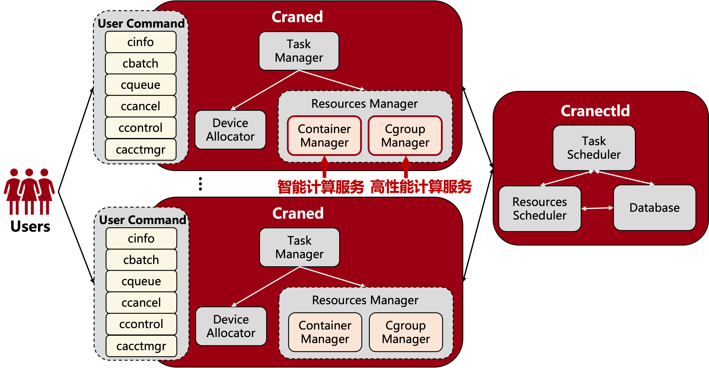
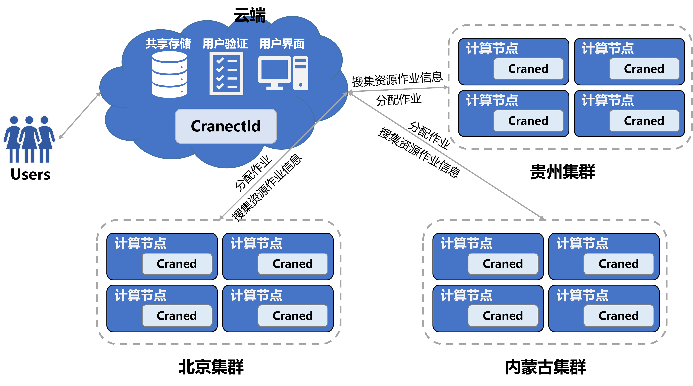

# Crane 简介 #
**鸣鹤（Crane）**是北京大学高性能计算校级公共平台自主研发的**分布式智算调度系统**，团队在总结高性能公共平台运行近六年的管理和维护经验之后，从高性能计算任务调度的资源管理、资源查看、作业提交、作业查询和资源隔离等作业调度系统最基本的需求出发，结合智能计算作业调度场景，采用C++、go等语言进行开发，完全自主研发的**融合高性能计算和智能计算调度为一体**的**开源**分布式智算调度系统。

**Crane文档地址**：[Crane Document](https://pkuhpc.github.io/Crane-document/)。

**Crane后端代码地址**：[Crane Code](https://github.com/PKUHPC/Crane)，**Crane前端代码地址**：[Crane Code](https://github.com/PKUHPC/Crane-FrontEnd)，欢迎开发者一起加入。

# Crane 设计理念 #
- **功能强大**：支持高性能计算 + 智能计算
- **高度可伸缩**：支持百万核心集群规模 + 可同时处理10万条作业
- **易使用**：用户友好 + 管理员易使用
- **安全**：通信加密 + 故障率低不丢作业
- **高度可容错**：无单点故障 + 快速故障恢复
- **易部署**

# Crane 架构 #

**Cranectld**是调度系统的“大脑”，负责集群节点生命周期的管理、作业队列的调度及管理、节点资源管理及调度，处理来自用户指令的作业提交、修改、查询等请求。

**Craned**是部署在计算节点上的守护进程，主要用来监控节点资源及作业状态，接受用户的各种指令，并将其发送给Cranectld，并向用户传送Cranectld的返回结果。

在设计Craned的时候，综合考量高性能计算和智能计算服务的特点与不同，在资源分配的时候，设计了Resouces Manager这个对象，当
- **用户提交高性能计算作业时**，调用Cgroup Manager这个组件，用来为高性能计算服务分配资源，并用Cgroup来隔离作业资源。
- **用户提交智能计算作业时**，调用Container Manager这个组件，基于K8S为智能计算作业分配资源并打包APP 容器，并对容器生命周期进行管理。

# Crane 应用场景 #
Crane支持高性能计算+智能计算的复杂分布式计算场景，结合“东数西算”时代背景，将分布于全国各地的集群通过一个云端联通，Crane通过调度算法将用户的作业提交到最“空闲”的集群上，充分利用各集群资源，减少用户排队时间。

