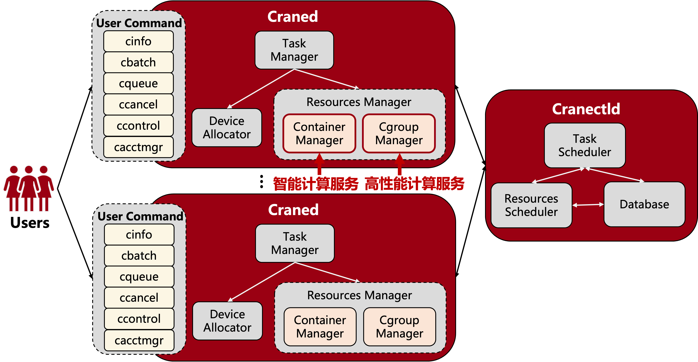
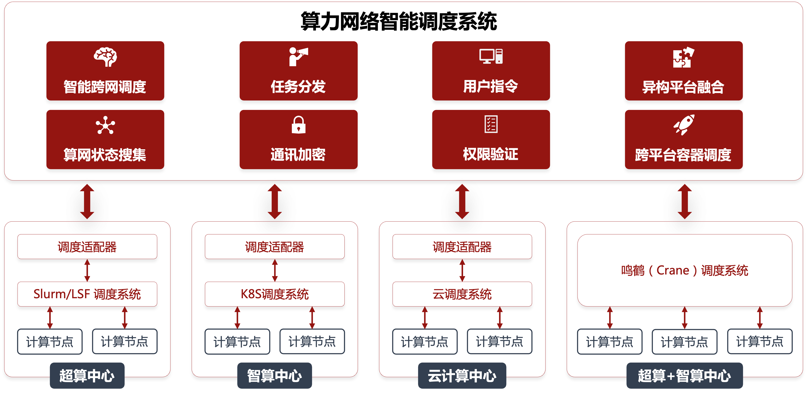

# CraneSched Introduction #

[[中文](./README.md) | ENG]

**CraneSched** is a **distributed intelligent scheduling system** independently developed by the
High-PerformanceComputing (HPC) Public Platform at Peking University. Drawing on nearly six years of management and
maintenance experience, the team designed CraneSched to meet the fundamental needs of HPC job scheduling: resource
management, resource monitoring, job submission, job querying, and resource isolation. By integrating scenarios from
both HPC and AIjob scheduling, and using C++ and Go for development, CraneSched is a **fully open-source system** that
**merges high-performance and intelligent computing scheduling** into one unified platform.

CraneSched consists of a frontend (mainly developed in Go) and a backend (mainly developed in C++). We welcome
developers to join and contribute!

**CraneSched Frontend Repository**: [CraneSched-FrontEnd](https://github.com/PKUHPC/CraneSched-FrontEnd)

**CraneSched Backend Repository**: [CraneSched](https://github.com/PKUHPC/CraneSched)

**CraneSched Documentation**: [CraneSched-Document](https://pkuhpc.github.io/CraneSched-document)

**CraneSched Demo Cluster** (Test account: demo_admin /
demo_admin): [CraneSched-Demo](https://hpc.pku.edu.cn/demo/cranesched)

# Design Philosophy #

**Powerful**: Supports both high-performance and intelligent computing job modes
**Resource-Efficient**: Handles over 100,000 job schedules per second with fast job-resource matching
**Highly Scalable**: Capable of managing clusters with millions of cores
**User-Friendly**: Simple user and admin commands
**Secure**: RBAC access control and encrypted communication
**Highly Fault-Tolerant**: Automatic job recovery, no single point of failure, rapid system state recovery
**Fully Open Source**: All source code is open and available

# Architecture #

**Cranectld**: The "brain" of the system, responsible for cluster node lifecycle management, job queue scheduling and
management, node resource management, and handling user commands for job submission, modification, and querying.

**Craned**: A daemon running on compute nodes, responsible for monitoring node resources and job status, receiving user
instructions, forwarding them to Cranectld, and returning results to users.

In CraneSched's design, considering the characteristics of both HPC and AI workloads, a **Resources Manager** object is
introduced:

- For **HPC jobs**, the **Cgroup Manager** allocates resources and isolates jobs using cgroups.
- For **AI jobs**, the **Container Manager** allocates resources based on Kubernetes (K8S), packages applications into
  containers, and manages their lifecycle.

# Application Scenarios #

CraneSched supports complex distributed computing scenarios combining HPC and AI workloads. In the context of China's "
East-to-West Computing" initiative, clusters across the country are interconnected via the cloud. CraneSched's
scheduling algorithms assign user jobs to the most "idle" cluster, maximizing resource utilization and minimizing user
wait times.

