# cacct 查看作业信息

**cacct可以查看队列中的作业信息。**

查看集群中所有队列的作业信息（包括所有状态），默认输出100条信息。

```Bash
cacct
```

**cacct运行结果展示**

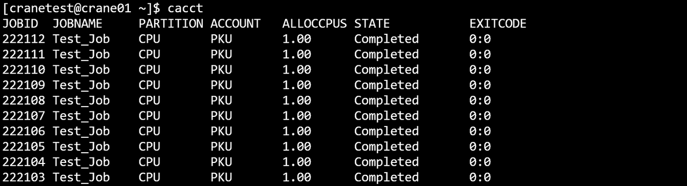

**主要输出项**

- **TaskId**：作业号
- **TaskName**: 作业名
- **Partition**：作业所在分区
- **Account**：作业所属账户
- **AllocCPUs**：作业分配的CPU数量
- **State**：作业状态
- **ExitCode**：作业状态码

#### **主要参数**

- **-A/--account string**：指定查询作业的所属账户，指定多个账户时用逗号隔开
- **-C/--config string：**配置文件路径(默认为 "/etc/crane/config.yaml")
- **-E/--end-time string**：指定查询该时间之前结束的作业，例：cacct -E=~2023-03-14T10:00:00
- **-o/--format string：**指定输出格式。由百分号（%）后接一个字符或字符串标识。 在 % 和格式字符/字符串之间用点（.）和数字，可指定字段的最小宽度。支持的格式标识符或字符串（不区分大小写）：
  - **%a/%Account：** 显示作业关联的账户
  - **%c/%AllocCpus：**显示作业已分配的 CPU 数量
  - **%e/%CpuPerNode：**显示作业每个节点请求的 CPU 数量
  - **%h/%ElapsedTime：**显示作业自启动以来的已用时间
  - **%j/%JobId：**显示作业 ID
  - **%k/%Comment：**显示作业的备注
  - **%l/%NodeList：**显示作业正在运行的节点列表
  - **%m/%TimeLimit：**显示作业的时间限制
  - **%n/%MemPerNode：**显示作业每个节点请求的内存量
  - **%N/%NodeNum：**显示作业请求的节点数量
  - **%n/%Name：**显示作业名称
  - **%P/%Partition：**显示作业运行所在的分区
  - **%p/%Priority：**显示作业的优先级
  - **%Q/%QOS**：显示作业的服务质量（QoS）级别
  - **%R/%Reason：**显示作业挂起的原因
  - **%r/%ReqNodes：**显示作业请求的节点
  - **%S/%StartTime：**显示作业的开始时间
  - **%s/%SubmitTime：**显示作业的提交时间
  - **%t/%State：**显示作业的当前状态
  - **%T/%JobType：**显示作业类型
  - **%u/%Uid**：**显示作业的 UID
  - **%U/%User：**显示提交作业的用户
  - **%x/%ExcludeNodes：**显示作业排除的节点
  - 每个格式标识符或字符串可用宽度说明符修改（如 "%.5j" ）。 若指定宽度，则会被格式化为至少达到该宽度。 若格式无效或无法识别，程序会报错并终止。 
    - **例：--format "%.5j %.20n %t"** 会输出作业 ID（最小宽度 5）、名称（最小宽度 20）和状态。
- **-F/-full**：显示完整信息
- **-h/--help**: 显示帮助
- **-j/--job string**：指定查询作业号，指定多个作业号时用逗号隔开。如 -j=2,3,4
  - **--json**：json格式输出命令执行结果
- **-m/--max-lines** **uint32**：指定输出结果的最大条数。如-m=500表示最多输出500行查询结果
- **-n/ --name string**：指定查询作业名，指定多个作业名时用逗号隔开
- **-N/--no header**：输出隐藏表头
- **-p/--partition string**：指定要查看的分区，多个分区名用逗号隔开，默认为全部
- **-q/--qos string**：指定要查看的Qos，多个Qos用逗号隔开，默认为全部
- **-S/--start-time string**：筛选开始时间在特定时间段内的作业，可使用闭区间（时间格式：2024-01-02T15:04:05~2024-01-11T11:12:41 ）或半开区间（时间格式：2024-01-02T15:04:05~ 或 ~2024-01-11T11:12:41 ）
- **-t/--state string**：指定要查看的作业状态，支持的状态：pending(p)（挂起 ）、running(r)（运行中 ）、completed(c)（已完成 ）、failed(f)（失败 ）、cancelled(x)（已取消 ）、time-limit-exceeded(t)（超时 ）、all（所有 ）。（默认 “all” ）
- **-s/--submit-time string**：筛选提交时间在特定时间段内的作业，可使用闭区间（时间格式：2024-01-02T15:04:05~2024-01-11T11:12:41 ）或半开区间（时间格式：2024-01-02T15:04:05~ 或 ~2024-01-11T11:12:41 ）
- **-u/--user string**：指定查询某个用户的作业，指定多个用户时用逗号隔开
- **-v/--version：**查询版本号
- 例：

```SQL
cacct
```


```SQL
cacct -h
```

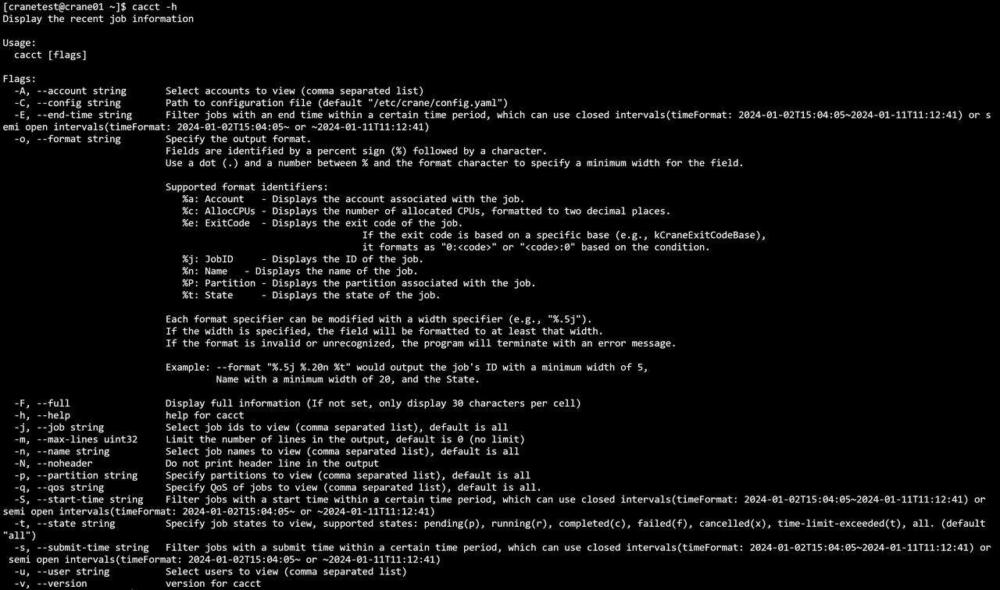

```SQL
cacct -N
```


```SQL
cacct -S=2024-07-22T10:00:00~2024-07-24T10:00:00
```

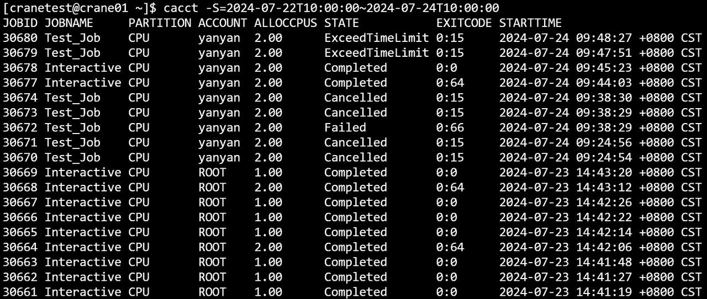

```SQL
cacct -E=2024-07-22T10:00:00~2024-07-24T10:00:00
```

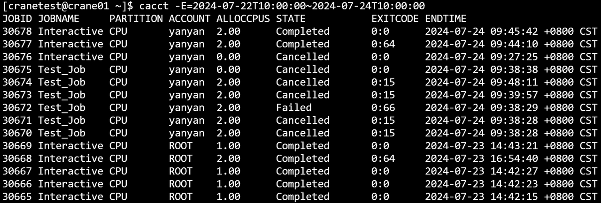

```SQL
cacct -j=30618,30619,30620
```


```SQL
cacct -u=cranetest
```


```SQL
cacct -A=CraneTest
```


```SQL
cacct -m=10
```


```C
cacct -p GPU
```

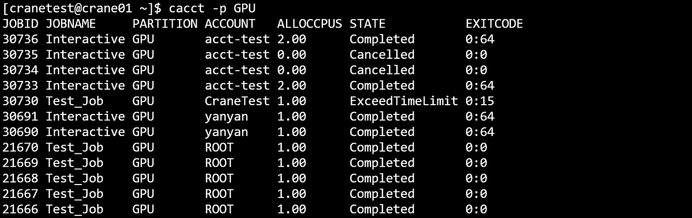

```C
cacct -n=Test_Job
```

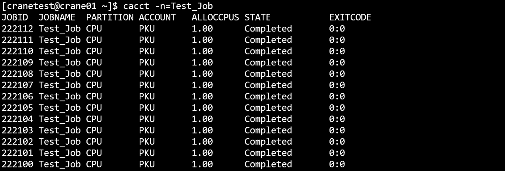

```SQL
cacct -o="%j %.10n %P %a %t"
```


```Bash
cacct -A ROOT -m 10
```

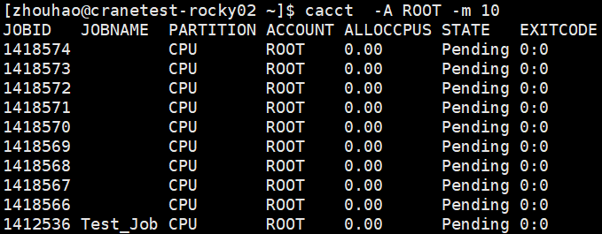

```Bash
cacct -m 10 -j 783925,783889 -t=c -F
```

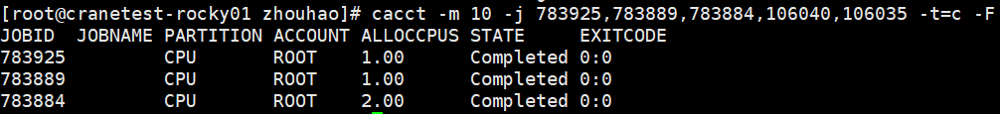

```Bash
cacct -n test
```

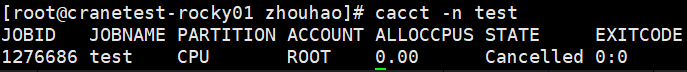


```Bash
cacct -q test_qos
```

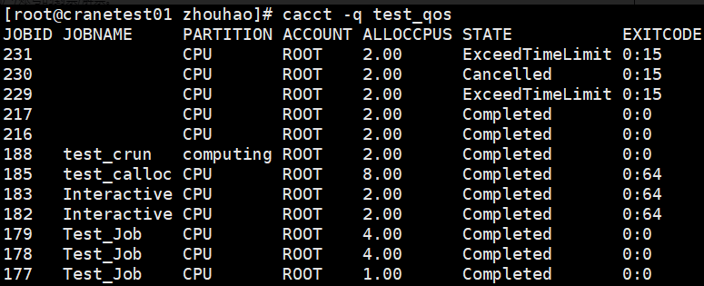
```Bash
cacct -m 10 -E=2024-10-08T10:00:00~2024-10-10T110:00:00 -p CPU -t c
```

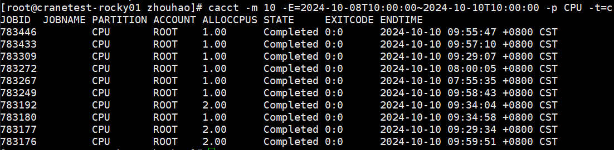