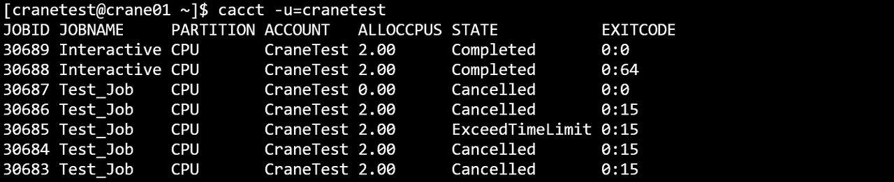
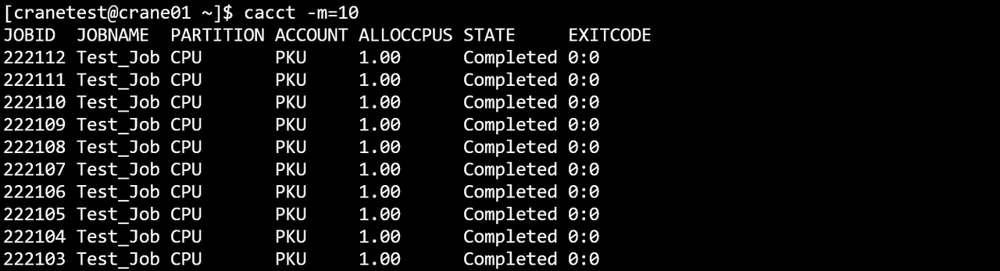

# cacct - View Job Accounting Information

**cacct displays accounting information for jobs in the cluster.**

View all job information in the cluster (all states), displaying up to 100 entries by default.

```bash
cacct
```

**cacct Execution Results**


## Output Fields

- **TaskId**: Job ID
- **TaskName**: Job name
- **Partition**: Job partition
- **Account**: Job account
- **AllocCPUs**: Number of allocated CPUs
- **State**: Job state
- **ExitCode**: Job exit code

## Command Line Options

### Filtering Options
- **-j, --job string**: Specify job IDs to query, multiple IDs separated by commas (e.g., `-j=2,3,4`)
- **-n, --name string**: Specify job names to query, multiple names separated by commas
- **-u, --user string**: Specify user(s) whose jobs to query, multiple users separated by commas
- **-A, --account string**: Specify account(s) to query, multiple accounts separated by commas
- **-p, --partition string**: Specify partition(s) to view, multiple partitions separated by commas (default: all)
- **-q, --qos string**: Specify QoS to view, multiple QoS separated by commas (default: all)

### Time Range Filtering
- **-s, --submit-time string**: Filter jobs by submission time range. Supports closed interval (format: `2024-01-02T15:04:05~2024-01-11T11:12:41`) or half-open interval (format: `2024-01-02T15:04:05~` or `~2024-01-11T11:12:41`)
- **-S, --start-time string**: Filter jobs by start time range. Same format as submit-time
- **-E, --end-time string**: Filter jobs by end time. Format: `~2023-03-14T10:00:00` for jobs ending before the specified time

### State Filtering
- **-t, --state string**: Specify job state(s) to view. Supported states:
  - `pending` or `p`: Pending jobs
  - `running` or `r`: Running jobs
  - `completed` or `c`: Completed jobs
  - `failed` or `f`: Failed jobs
  - `cancelled` or `x`: Cancelled jobs
  - `time-limit-exceeded` or `t`: Jobs that exceeded time limit
  - `all`: All states (default)

### Output Formatting
- **-o, --format string**: Specify output format using format specifiers starting with `%`. A width specifier can be added between `%` and the format character using a dot (`.`) and number. Supported format specifiers (case-insensitive):
  - **%a / %Account**: Display job account
  - **%c / %AllocCpus**: Display allocated CPU count
  - **%e / %ExitCode**: Display job exit code (special format: exitcode[:signal])
  - **%h / %ElapsedTime**: Display elapsed time since job start
  - **%j / %JobId**: Display job ID
  - **%k / %Comment**: Display job comment
  - **%l / %NodeList**: Display list of nodes running the job
  - **%m / %TimeLimit**: Display job time limit
  - **%n / %MemPerNode**: Display requested memory per node
  - **%N / %NodeNum**: Display number of requested nodes
  - **%n / %Name**: Display job name
  - **%P / %Partition**: Display job partition
  - **%p / %Priority**: Display job priority
  - **%Q / %QOS**: Display Quality of Service (QoS) level
  - **%R / %Reason**: Display reason for job pending
  - **%r / %ReqNodes**: Display requested nodes
  - **%S / %StartTime**: Display job start time
  - **%s / %SubmitTime**: Display job submission time
  - **%t / %State**: Display current job state
  - **%T / %JobType**: Display job type
  - **%u / %Uid**: Display job UID
  - **%U / %User**: Display user who submitted the job
  - **%x / %ExcludeNodes**: Display excluded nodes
  - Width specification: `%.5j` (right-aligned, min width 5) or `%5j` (left-aligned, min width 5)
  - Example: `--format "%.5j %.20n %t"` outputs job ID (min width 5), name (min width 20), and state

### Display Options
- **-F, --full**: Display full information (no field truncation)
- **-N, --no-header**: Hide table header in output
- **-m, --max-lines uint32**: Specify maximum number of output lines (e.g., `-m=500` for max 500 lines)
- **--json**: Output in JSON format

### Miscellaneous
- **-C, --config string**: Path to configuration file (default: `/etc/crane/config.yaml`)
- **-h, --help**: Display help information
- **-v, --version**: Display version number

## Usage Examples

### Basic Query

View all jobs:
```bash
cacct
```


### Help Information

Display help:
```bash
cacct -h
```


### Hide Header

Output without header:
```bash
cacct -N
```


### Time Range Filtering

Filter by start time range:
```bash
cacct -S=2024-07-22T10:00:00~2024-07-24T10:00:00
```


Filter by end time range:
```bash
cacct -E=2024-07-22T10:00:00~2024-07-24T10:00:00
```


### Job ID Filtering

Query specific job IDs:
```bash
cacct -j=30618,30619,30620
```


### User Filtering

Query jobs by user:
```bash
cacct -u=cranetest
```


### Account Filtering

Query jobs by account:
```bash
cacct -A=CraneTest
```


### Limit Output Lines

Limit to 10 lines:
```bash
cacct -m=10
```


### Partition Filtering

Query jobs in specific partition:
```bash
cacct -p GPU
```


### Job Name Filtering

Query by job name:
```bash
cacct -n=Test_Job
```


### Custom Format

Specify custom output format:
```bash
cacct -o="%j %.10n %P %a %t"
```


### Combined Filters

Combine account and max-lines:
```bash
cacct -A ROOT -m 10
```


Multiple filters with full output:
```bash
cacct -m 10 -j 783925,783889 -t=c -F
```


Query by name:
```bash
cacct -n test
```


Query by QoS:
```bash
cacct -q test_qos
```


Complex combined query:
```bash
cacct -m 10 -E=2024-10-08T10:00:00~2024-10-10T110:00:00 -p CPU -t c
```


## Advanced Features

### JSON Output

Get results in JSON format for parsing:
```bash
cacct --json -j 12345
```

### Time Range Queries

Query jobs submitted in a specific time range:
```bash
cacct -s=2024-01-01T00:00:00~2024-01-31T23:59:59
```

Query jobs that started after a specific time:
```bash
cacct -S=2024-01-15T00:00:00~
```

Query jobs that ended before a specific time:
```bash
cacct -E=~2024-01-31T23:59:59
```

### State Filtering Examples

View only completed jobs:
```bash
cacct -t completed
```

View failed and cancelled jobs:
```bash
cacct -t failed,cancelled
```

View jobs that exceeded time limit:
```bash
cacct -t time-limit-exceeded
```

### Format Specification Details

The format string supports width control:
- `%5j` - Left-aligned, minimum width 5
- `%.5j` - Right-aligned, minimum width 5

Example with multiple width specifications:
```bash
cacct -o="%.8j %20n %-10P %.15U %t"
```

## See Also

- [cqueue](cqueue.md) - View job queue (current/pending jobs)
- [cbatch](cbatch.md) - Submit batch jobs
- [ccancel](ccancel.md) - Cancel jobs
- [ceff](ceff.md) - View job efficiency statistics
