# cacctmgr 管理用户/账户信息 #

**cacctmgr 可以管理账户/用户信息，包括添加账户/用户、删除账户/用户、查找账户/用户。**

CraneSched作业调度系统中有四个用户角色： 

- **系统管理员（Admin）**：一般为root用户，可以增删查改任何账户和用户信息
- **平台管理员（Operator）**：对账户系统具有完全权限
- **账户调度员（Coordinator）**：对与自身同一账户下的用户以及对自身账户的子账户具有操作权限，包括添加用户
- **普通用户(None)**： 除了查询功能外不具备其他权限，能够查询与自身同一账户下的信息，不可以修改所有用户和账户信息

### **主要参数**

- **-h/--help**: 显示帮助
- **--json** 以 json 格式输出
- **-C/--config string**： 配置文件路径（默认为"/etc/crane/config.yaml"）
- **-v/ --version cacctmgr** 命令的版本

### **主要命令**

- **help**：显示帮助
- **add**: 添加实体（实体包括QoS、账户、用户）
- **block**：禁用该实体，使其无法使用
- **delete**：删除实体
- **modify**：修改实体
- **show**：显示一类实体的所有记录
- **unblock**：解除禁用
- **completion：**自动补全适用于指定 Shell 的脚本

# 1. 添加

## **1.1 添加qos**

### **主要参数**

- **-D/--description string**： qos描述信息

- **-h/--help**： 帮助

- **-c/--max_cpus_per_user uint32**： 默认为10

- **-J/--max_jobs_per_user uint32**

- **-T/--max_time_limit_per_task** **uint**： 以秒为单位的时间（默认3600）

- **-N/--name string**：qos的名称

- **-P/--priority uint32**：默认为1000

  - 例：

  - ```SQL
    cacctmgr add  qos -N=test-qos -D="test qos"
    ```

  - 

## 1.**2** **添加账户**

### **主要参数**

- **-Q/--default_qos string**： 账户默认qos
- **-D/--description string**：账号描述信息
- **-h/--help**： 帮助
- **-N/--name string**： 账户的名称
- **-P/--parent string：**此账户的父账户
- **-p/--partition strings**： 该账号可以访问的分区列表
- **-q/--qos_list strings**：账号可以访问的qos列表
- 例：（添加账户PKU并添加PKU的子账户ComputingCentre）

```SQL
cacctmgr add account -N=PKU -D=school -p=CPU,GPU -q=test-qos
```


```SQL
cacctmgr add account -N=ComputingCentre -D=department -P=PKU
```


## 1.**3** **添加用户**

系统管理员可以添加任意账户的用户， 账户管理员可以添加同一账号下的新用户。**添加的用户需要先有uid（先使用useradd在linux系统添加该用户）**。

### **主要参数**

- **-A/--account string**： 此用户所属的父账户

- **-c/--coordinate**：设置用户是否为父账号的账户调度员（coordinator）

- **-h/--help**： 帮助

- **-L/--level string**：设置用户权限(none/operator/admin) (默认为 "none")

- **-N/--name string**： 用户的名称

- **-p/--partition strings**： 该用户可以访问的分区列表

  - 例：

  - ```SQL
    useradd CS
    ```

  - ```Plaintext
    cacctmgr add user -N=CS -A=PKU -p=CPU,GPU -L=admin
    # -p参数指明用户可用分区为CPU和GPU（分区必须同时为父账户PKU的可用分区），分区的allowed_qos_list与default_qos信息不支持指定，默认从父账户PKU中继承
    ```

  - 

  - ```Plaintext
    cacctmgr add user -N=lab -A=ComputingCentre
    # 未指明-p参数，partition与qos信息都从父账户ComputingCentre中继承
    ```

  - 

# 2. 删除

## 2.1 **删除用户**

```Plaintext
cacctmgr delete user -N lab
```


## 2.2 **删除账户**

仅系统管理员可以删除账户，删除账户时会检查账户下是否还有子账户或者用户，如果有则不允许删除，防止产生游离的用户，需要将其子账户和用户都设置在新账户下。

```Plaintext
cacctmgr delete account -N ComputingCentre
```


## 2**.3 **删除qos

```Plaintext
cacctmgr delete qos -N test-qos
```


# 3. 禁用

## 3.1 **阻止用户或账户**

### **主要命令**

- **account**： 阻止账户
- **user**：阻止账户下的用户

```Plaintext
cacctmgr block user lab -A=ComputingCentre
```


```Plaintext
cacctmgr block account ComputingCentre
```


# 4. 解禁

## 4.1 解除阻止用户或账户

### **主要命令**

- **account**： 解除阻止账户
- **user**：解除阻止账户下的用户

```Plaintext
cacctmgr unblock user lab -A=ComputingCentre
```


```Plaintext
cacctmgr unblock account ComputingCentre
```


# 5. 查询

## 5.1 **查找用户**

所有用户均可以使用查询功能

```Plaintext
cacctmgr find user lab
```

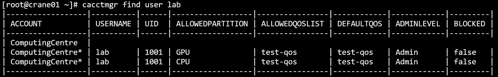

```Plaintext
cacctmgr find user CS
```

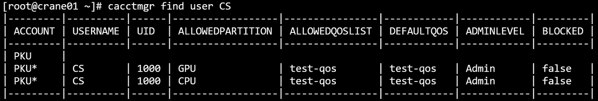

```Bash
cacctmgr show user
```

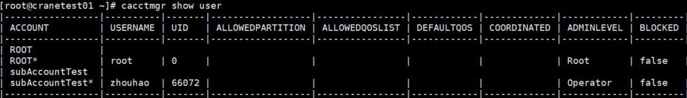

## 5.2 **查找账户**

```Plaintext
cacctmgr find account ComputingCentre
```

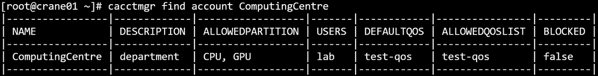

```Plaintext
cacctmgr find account PKU
```

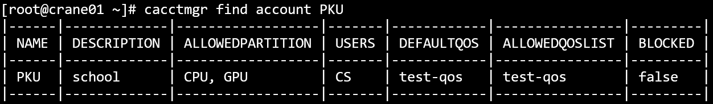

```Bash
cacctmgr show account
```

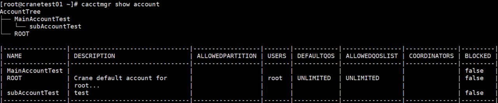

## 5.3 **查找qos**

```Plaintext
cacctmgr find qos test-qos
```

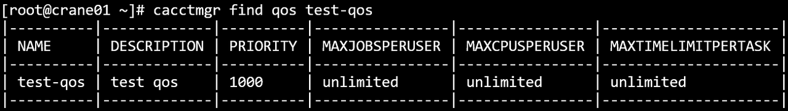

```Bash
cacctmgr show qos
```

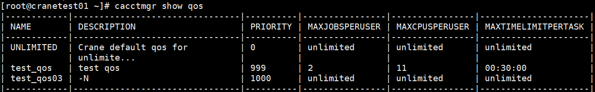

# 6. 修改

## 6.1 **修改账户**

系统管理员可以修改任意信息， 账户管理员可以修改本身账户的信息，但不能更改账户的父账户。

### **主要参数**

- **--add_allowed_partition string**：将新项添加到允许的分区列表

- **--add_allowed_qos_list strings**：将新项添加到允许的qos列表

- **-Q/--default_qos string**： 修改账户默认qos

- **--delete_allowed_partition string**：从允许的分区列表中删除特定项目

- **--delete_allowed_qos_list strings**：从允许的qos列表中删除特定项

- **-D/--description string**：修改账户的描述信息

- **-F/--force**： 强制操作

- **-h/--help**： 帮助

- **-N/--name string**：需要进行修改的账户名称

- **--set_allowed_partition strings**：设置允许的分区列表的内容

- **--set_allowed_qos_list strings**：设置允许的qos列表的内容

  - 例：

  - ```Plaintext
    cacctmgr modify account -N=ComputingCentre -D="Located in PKU" 
    ```

  - 

## 6.2 **修改用户**

系统管理员可以修改任意信息， 账户管理员可以修改同账户下用户的信息，但不能更改用户的账户。

### **主要参数**

- **-A/--account string**：设置用户使用的帐号

- **--add_allowed_partition strings**：将新项添加到允许的分区列表

- **--add_allowed_qos_list string**：将新项添加到允许的qos列表

- **-L/--admin_level string**：设置用户管理权限（none/operator/admin）

- **-Q/--default_qos string**： 修改账户默认qos

- **--delete_allowed_partition strings**：从允许的分区列表中删除特定项目

- **--delete_allowed_qos_list string**：从允许的qos列表中删除特定项目

- **-F/--force**： 强制操作

- **-h/--help**： 帮助

- **-N/--name string**：需要进行修改的用户名称

- **-D/--default-account** **string**：修改用户的默认账号

- **-p/--partition string**：被修改的分区，如果不显式设置该参数，默认修改所有分区

- **--set_allowed_partition strings**：设置允许的分区列表的内容

- **--set_allowed_qos_list strings**：设置允许的qos列表的内容

  - 例

    - ```SQL
      cacctmgr modify user -N=lab -A=ComputingCentre -L=operator --delete-allowed-partition GPU
      ```

    - 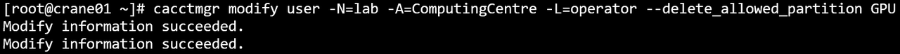

  - 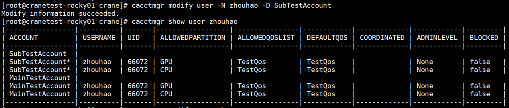

## 6.3 修改qos

### **主要参数**

- **-D/--description string**：修改qos的描述信息
- **-h/--help**： 帮助
- **-c/--max_cpus_per_user uint32**：(默认10)
- **-J/--max_jobs_per_user uint32**
- **-T/--max_time_limit_per_task** **uint**：以秒为单位的时间（默认 3600）
- **-N/--name string**： 需要进行修改的qos名称
- **-P/--priority uint32**：(默认1000)

# 7**. 显示**

## 7.1 显示**账户树**

系统管理员会显示数据库所有根账户的账户树， 账户管理员和用户会显示本身账户的账户树。

```Plaintext
cacctmgr show accounts
```

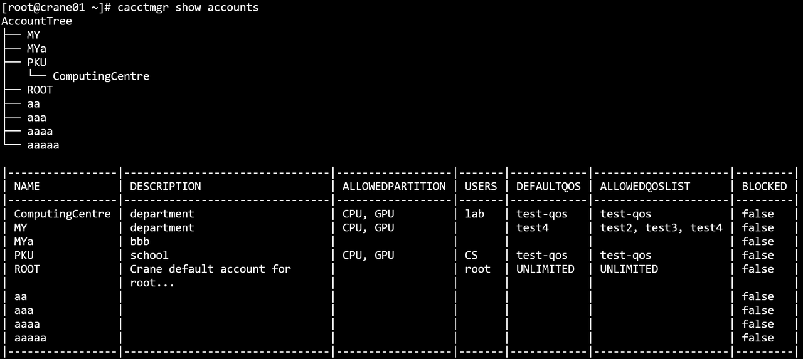

## 7.2 显示用户

系统管理员会显示所有用户， 账户管理员和用户会显示同一账户下的所有用户。

```Plaintext
cacctmgr show users
```

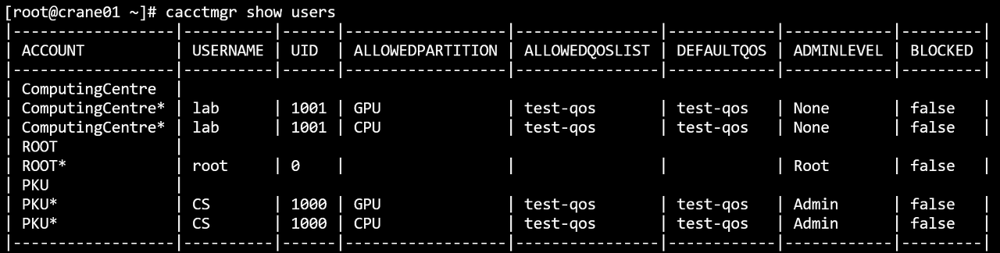
