# calloc 提交交互式任务

calloc 使用命令行指定的参数申请资源，任务启动时，会进入新的用户终端，用户需要自行登陆到计算节点并启动任务。calloc需要在有cfored运行的节点上启动。

calloc 只支持通过命令行指定请求参数，支持的命令行选项：

- **-h/--help**: 显示帮助
- **-A/--account string**：提交作业的账户
- **-D/--chdir string**：任务工作路径
- **-C/--config string**：配置文件路径(默认 "/etc/crane/config.yaml")
- **-c/--cpus-per-task** **float**: 每个节点申请的CPU核心数
  - **--debug-level string：**可用的调试级别：trace（跟踪）、debug（调试）、info（信息，默认值为 “info” ）
- **-x/--exclude string：**从分配中排除特定节点（以逗号分隔的列表 ）
  - **--export string：**传播环境变量 
  - **--extra-attr string：**作业的额外属性（JSON 格式 ）
  - **--get-user-env：**加载用户的登录环境变量 
  - **--gres string：**每个任务所需的通用资源（Gres），格式：“gpu:a100:1” 或 “gpu:1” 
- **-J/--job-name string：**作业名称 
  - **--mail-type string：**当特定事件发生时通过邮件通知用户，支持的值：NONE（无）、BEGIN（开始）、END（结束）、FAIL（失败）、TIMELIMIT（达到时间限制）、ALL（所有，默认值为 NONE ） 
  - **--mail-user string：**通知接收者的邮件地址 
  - **--mem string：**最大实际内存量，支持 GB（G，g）、MB（M，m）、KB（K，k）和 Bytes（B）为单位，默认单位是 MB 
- **-w/--nodelist string：**要分配给作业的节点（以逗号分隔的列表 ）
- **-N/--nodes uint32：**要在其上运行作业的节点数量（默认值为 1 ）
  - **--ntasks-per-node uint32：**在每个节点上要调用的任务数量（默认值为 1 ）
- -**p/--partition string**：请求的分区 
- **-q/ --qos string：**作业使用的服务质量（QoS ） 
- **-r/ --reservation string：**使用预留资源 
- **-t/ --time string：**时间限制，格式：“day - hours:minutes:seconds”（如 5 - 0:0:1 表示 5 天 1 秒 ）或 “hours:minutes:seconds”（如 10:1:2 表示 10 小时 1 分钟 2 秒 ） 
- **-v/ --version**：calloc 命令的版本 
- 例：

```Plain
calloc -h
```

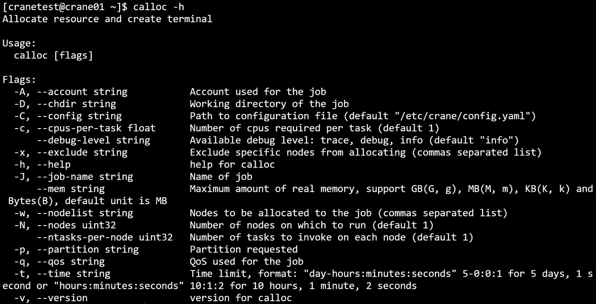

退出calloc新启动的终端将结束任务。

- 例：在CPU分区，申请两个节点，一个CPU核心，200M内存

```C
calloc -c 1 --mem 200M -p CPU -N 2 
```

运行结果：

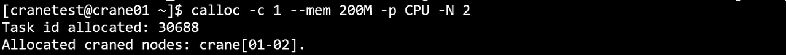

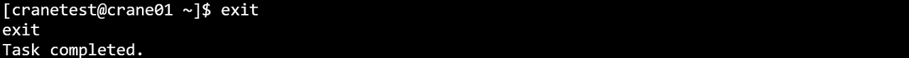
- 例：在GPU分区下，申请一个节点，每个节点上运行两个任务，申请节点的候选列表为crane02,crane03，且任务提交在acct-yan账户下

```C
calloc -A acct-test --ntasks-per-node 2 -w crane02,crane03 -p GPU -N 1
```

运行结果：

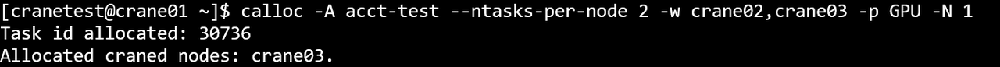

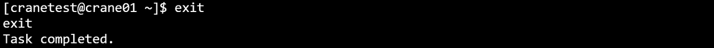

- 例：在CPU分区下，申请200M内存，任务运行最长时间为25分钟25秒，且任务运行在test-qos下

```C
calloc --mem 200M -p CPU -q test-qos -t 00:25:25
```

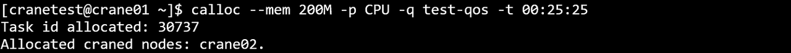
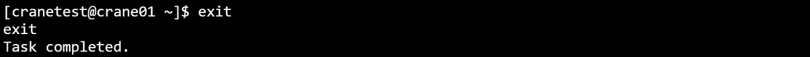

```Bash
calloc -D /path
```

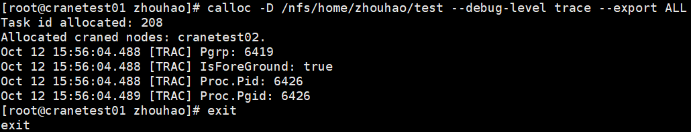

```Bash
calloc --debug-level trace
```

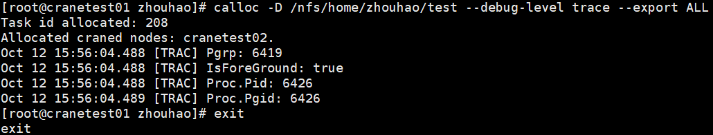

```Bash
calloc -x cranetest02
```

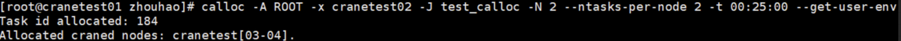

```Bash
calloc --get-user-env
```

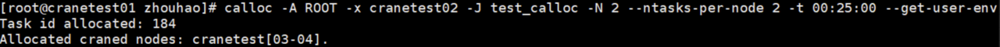

```Bash
calloc -J job_name
```

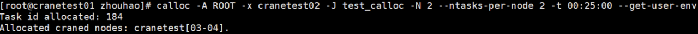