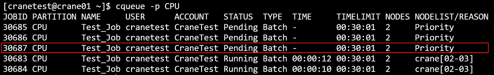
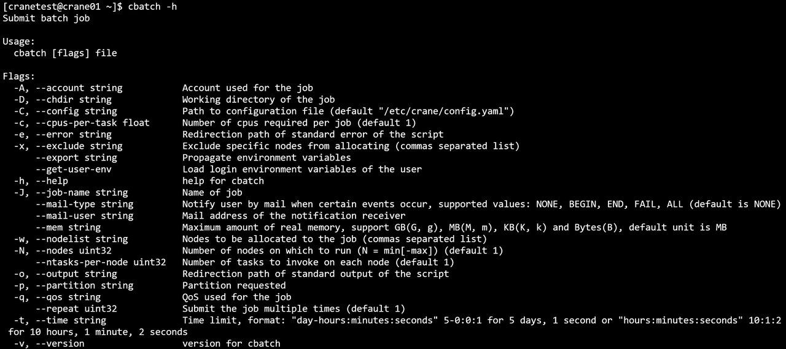
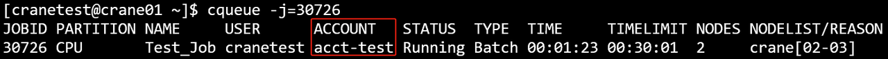
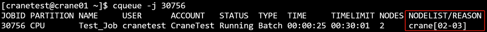
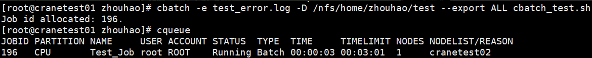
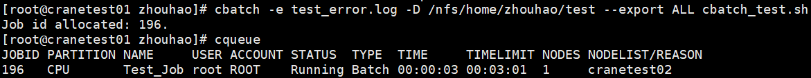
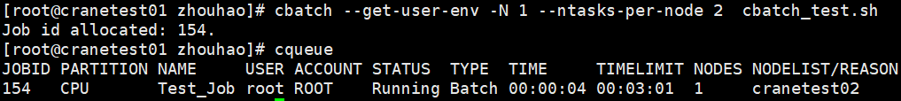
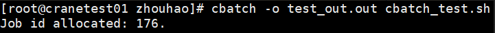
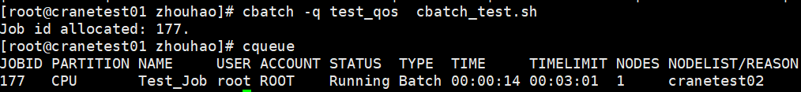
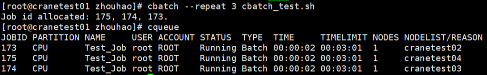

# cbatch 提交批处理作业 #

**cbatch主要是将用户描述整个计算过程的脚本传递给作业调度系统，并为作业分配作业号，等待作业调度系统为其分配资源并执行。**

CraneSched系统中必须有用户和账号才能提交作业，添加用户和账户请参考[cacctmgr教程](https://e26ruh1viz.feishu.cn/wiki/wikcn3TaZVHvVsA2Wwk171RVBex)。

首先介绍一个简单的单节点作业的例子:

下列作业将申请一个节点，一个CPU核心，并在计算节点上运行hostname并退出

~~~bash
#!/bin/bash
#CBATCH --ntasks-per-node 1
#CBATCH --nodes 1
#CBATCH -c 1
#CBATCH --mem 20M
#CBATCH --time 0:3:1
#CBATCH -o job.out
#CBATCH -p CPU
#CBATCH -J Test_Job

hostname
~~~

假设上面作业脚本的文件名为cbatch_test.sh，通过cbatch命令提交：

~~~bash
cbatch cbatch_test.sh
~~~

**cbatch运行结果展示**




**主要参数：**

- **-h/--help**: 显示帮助
- **-A/--account string**：提交作业的账户
- **-D/--chdir string**：任务工作路径
- **-C/--config string**：配置文件路径(默认 "/etc/crane/config.yaml")
- **-c/--cpus-per-task** **float**: 每个节点申请的CPU核心数
- **-e/--error string：**指定脚本错误日志定向路径
- **-x/--exclude string ：**功能是从分配中排除特定节点（用逗号分隔的列表 ），用于节点分配管控场景，指定不想参与分配的节点。
  - **--export string ：**作用为传播环境变量，在涉及环境变量传递，让变量在相关任务、作业等执行环境中生效时使用。
  - **--extra-attr string ：**可设置作业的额外属性（json格式 ），用于给作业附加自定义的属性信息，方便识别、管理等。
  - **--get-user-env ：**会加载用户的登录环境变量，让作业等执行时能使用用户登录时的环境变量配置。
  - **--gres string ：**指定每个任务所需的通用资源，格式如 gpu:a100:1（指定使用 1 块 a100 型号 GPU ）或 gpu:1（指定使用 1 块 GPU ，不限具体型号 ），用于 GPU 等资源分配场景。
- **-J/--job-name string**：作业名
  - **--json**：以 JSON 格式输出
  - **--mail-type string：**当特定事件发生时，向用户发送邮件通知，支持的值有：无（NONE）、开始（BEGIN）、结束（END）、失败（FAIL）、达到时间限制（TIMELIMIT）、所有事件（ALL）（默认是无（NONE) ）
  - **--mail-user string：**通知接收者的邮件地址
  - **--mem string：**最大实际内存量，支持 GB（G，g）、MB（M，m）、KB（K，k）和字节（B）为单位，默认单位是 MB
- **-w/--nodelist string ：**要分配给作业的节点（逗号分隔的列表 ）
- **-N/--nodes uint32 ：**作业要运行的节点数量（格式 N = min[-max] ，默认 1 ）
  - **--ntasks-per-node uint32 ：**每个节点要调用的任务数量（默认 1 ）
  - **--open-mode string ：**设置打开输出和错误文件的模式，支持的值：append（追加 ）、truncate（截断 ，默认 ）
- **-o/ --output** **string** ：脚本标准输出的重定向路径
- **-p/ --partition string** ：请求的分区
- **-q/--qos** **string** ：作业使用的服务质量（QoS ）
  - **--repeat uint32** ：多次提交作业（默认 1 ）
- **-r/--reservation string ：**使用预留资源
- **-t /--time string ：**时间限制 ，格式："day-hours:minutes:seconds"（如 5-0:0:1 表示 5 天 1 秒 ）或 "hours:minutes:seconds"（如 10:1:2 表示 10 小时 1 分钟 2 秒 ）
- **-v /--version ：**cbatch 的版本
  - **--wrap string ：**将命令字符串包装到 sh 脚本中并提交

例：

```Plain
cbatch cbatch_test.sh
```


```Plain
cbatch -h
```


```Plain
cbatch -A=acct-test cbatch_test.sh
```



```Plain
cbatch -x crane01,crane02 cbatch_test.sh
```


```Plain
cbatch -J testjob01 cbatch_test.sh
```


```Plain
cbatch -w crane01,crane03 cbatch_test.sh
```


```Plain
cbatch -p GPU cbatch_test.sh
```


```Plain
cbatch -t 00:25:25 cbatch_test.sh
```


```C
cbatch -c 2 cbatch_test.sh
```


```C
cbatch --mem 123M cbatch_test.sh
```


```C
cbatch -N 2 --ntasks-per-node 2 cbatch_test.sh
```




```Bash
cbatch -D /path test.sh
```


```Bash
cbatch -e error.log test.sh
```


```Bash
cbatch --export ALL test.sh
```


```Bash
cbatch --get-user-env test.sh
```


```Bash
cbatch -o output.out test.sh
```


```Bash
cbatch -q qos_test test.sh
```


```Bash
cbatch --repeat 3 test.sh
```


#### 常用环境变量

| 变量名                 | 说明               |
| ---------------------- | ------------------ |
| **CRANE_JOB_NODELIST** | 作业分配的节点列表 |
| **%j**                 | 作业号             |

**下面介绍提交一个跨节点多核心的例子：**

c下列作业将在三个节点上运行，每个节点使用4个CPU核心。

```Plaintext
#!/bin/bash
#CBATCH -o crane_test%j.out
#CBATCH -p CPU
#CBATCH -J "crane_test"
#CBATCH --nodes 3
#CBATCH --ntasks-per-node 4
#CBATCH -c 4
#CBATCH --time 50:00:00

# 生成作业分配的节点的machinefile
echo "$CRANE_JOB_NODELIST" | tr ";" "\n" > crane.hosts

#加载MPI运行环境
module load mpich/4.0 

#执行跨节点并行任务
mpirun -n 13 -machinefile crane.hosts helloWorld > log
```