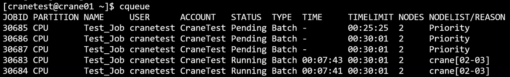
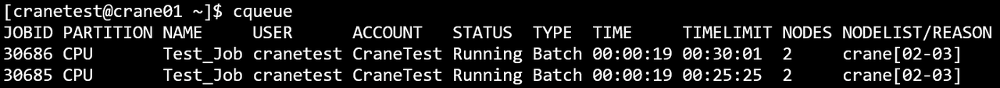
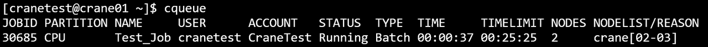
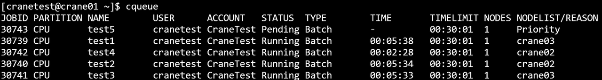
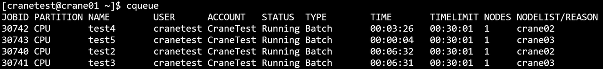
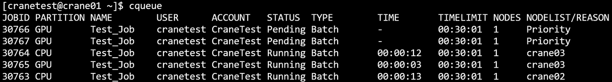
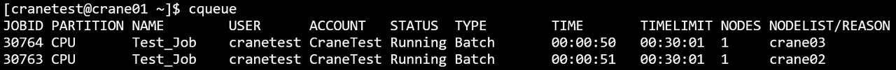
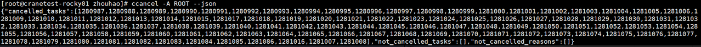
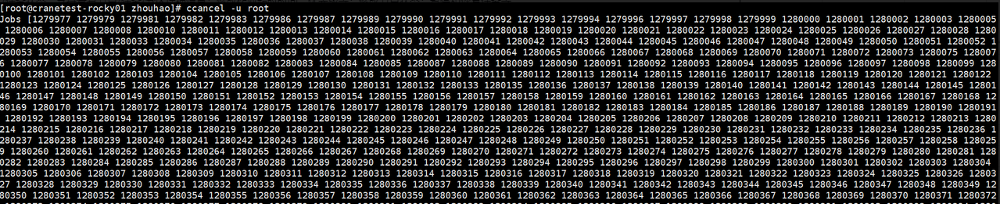

# ccancel 取消作业 #

**ccancel可以终止正在运行或者在排队中的作业。**

#### **主要参数**

- **-h/--help**: 显示帮助
- **-A/--account string**：取消账户下的任务
- **-C/--config string**：配置文件路径(默认 "/etc/crane/config.yaml")
- **-n/--name string**：取消指定任务名的任务
- **-w/--nodes strings**：取消指定节点上运行的任务
- **-p/--partition string**：取消指定分区上运行的任务
- **-t/--state string**：取消某状态的任务。有效的任务状态是 PENDING(PD)、RUNNING(R)。任务状态不区分大小写
- **-u/--user string**：取消特定用户提交的任务
- **-v/--version：**查询版本号

例：


```SQL
ccancel -w crane02
```


```SQL
ccancel -t Pending
```


- 取消作业号为30686的作业：

```Plaintext
ccancel 30686
```

**ccancel运行结果展示**




- 取消作业名为test1的作业：

```C
ccancel -n test1
```

**ccancel运行结果展示**





- 取消CPU分区上的作业

```C
ccancel -p GPU
```




```Bash
ccancel -A PKU
```


```Bash
ccancel -u ROOT
```


取消作业之后，如果被分配节点上没有用户的其他作业，作业调度系统会终止用户在所分配节点的所有进程，并取消用户在所分配节点上的ssh权限。
