# ccontrol 查看分区和节点状态 #

**ccontrol可以查看分区和节点的状态。**

**主要命令**

- **help**：显示帮助
- **show**：显示实体的状态，默认为所有记录
- **update**：修改作业/分区/节点信息
- **hold**：暂停作业调度
- **release**：继续作业调度
- **completion**：为指定的shell生成自动补全脚本
- **create：**创建一个新实体
- **delete：**删除指定的实体

**支持的命令行选项：**

- **-h/--help**: 显示帮助
- **--json**：json格式输出命令执行结果
- **-v/--version：**查询版本号
- **-C/--config string**：配置文件路径(默认 "/etc/crane/config.yaml")

# **1. 查看**

支持的命令行选项：

- **config:** 查询配置信息
- **job：**查询作业信息
- **node：**查询节点信息
- **partition**：查看集群分区情况

```Bash
ccontrol show -h
```

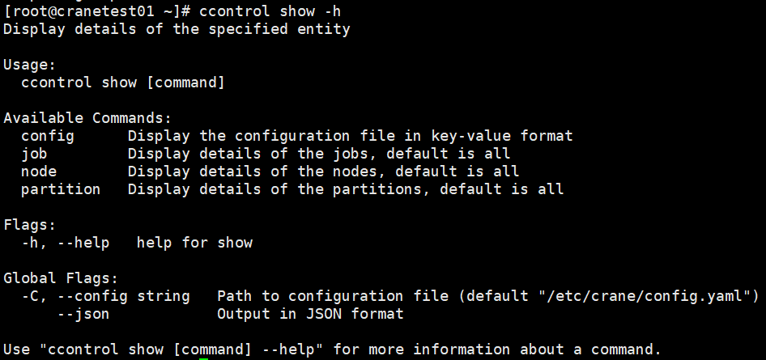

## **1. 1 查看分区状态**

```Plaintext
ccontrol show partition
```

**ccontrol show partition运行结果展示**

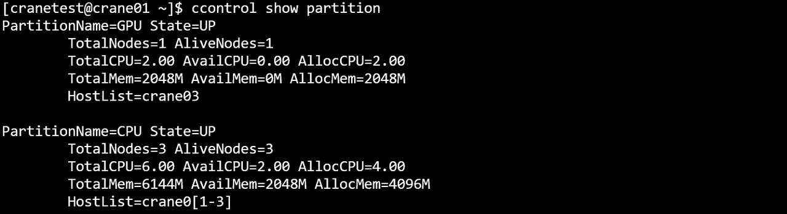
#### **主要输出项**

- **PartitionName**：分区名
- **State**：分区状态
- **TotalNodes**：分区节点数目
- **AliveNodes**：分区中可运行的节点数目
- **TotalCpus**：分区中所有节点总CPU数目
- **AvailCpus**：分区中所有可以使用的CPU数目
- **AllocCpus**：分区中已经被分配的CPU数目
- **FreeCpus**：分区中空闲的CPU数目
- **TotalMem**：分区节点的总内存
- **AvailMem**：分区中当前可以使用的内存大小
- **AllocMem**：分区中已分配的内存大小
- **FreeMem**：分区中空闲的内存大小
- **HostList**：分区中所有节点的节点名列表

## **1.2 查看节点状态**

```Plaintext
ccontrol show node
```

**ccontrol show node运行结果展示**

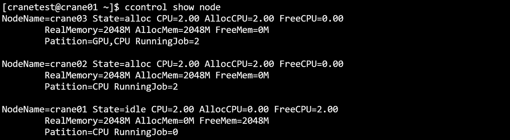

#### **主要输出项**

- **NodeName**：节点名
- **State**：节点状态
  - **IDLE**： 节点空闲，可使用
  - **DOWN**： 节点宕机，不可用
- **CPUs**：节点CPU数目
- **AllocCpus**：节点已分配的CPU数目
- **FreeCpus**：节点空闲的CPU数目
- **RealMemory**：节点的实际内存大小
- **AllocMem**：节点已经分配的内存大小
- **FreeMem**：节点空闲的内存大小
- **Patition**：节点所属分区
- **RunningTask**：节点上正在运行的作业数量

## **1.3 查看作业状态**

```Plain
ccontrol show job
```

ccontrol show job 运行结果展示

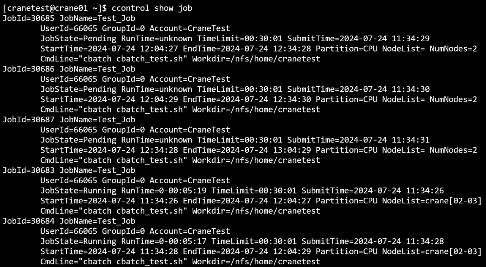

主要输出项

- **JobId：**作业号
- **JobName：**作业名
- **UserId：**作业所属用户
- **GroupId：**分组id
- **Account：**作业所属账户
- **JobState：**作业状态
- **RunTime：**作业运行时间
- **TimeLimit：**作业运行时间限制
- **SubmitTime：**作业提交时间
- **StartTime：**作业开始时间
- **EndTime：**作业结束时间
- **Partition：**作业所属分区
- **Nodelist：**作业运行的节点
- **NumNodes：**节点数量

# 2. 修改

支持的命令行选项：

- **job：**查询作业信息
- **node：**查询节点信息

```Bash
ccontrol update -h
```

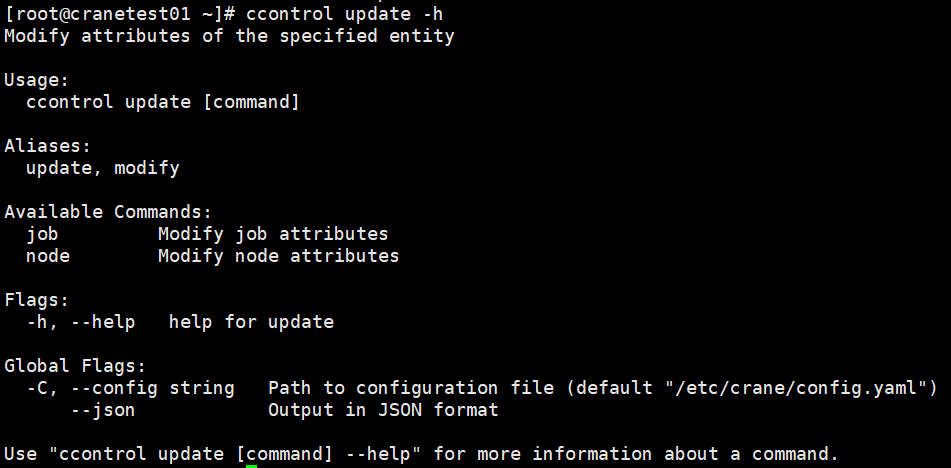

## 2.1 **修改作业信息**

支持的命令行选项：

- **-h/--help**: 显示帮助
- **-J/--job-name string：**作业名
- **-P/--priority float**： 作业优先级
- **-T/--time-limit string：**作业超时时长

```Bash
ccontrol update job -h
```

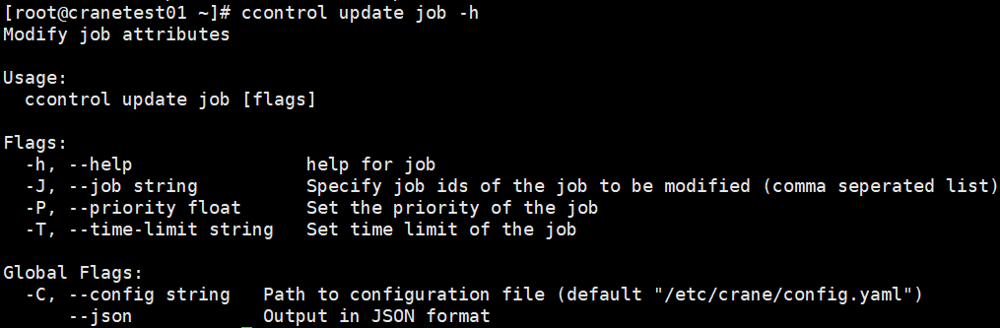

```Go
ccontrol update job -J 30685 -T 0:25:25
```

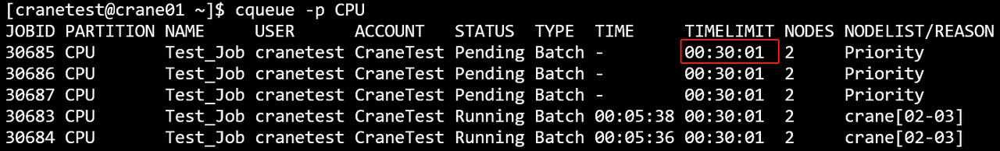

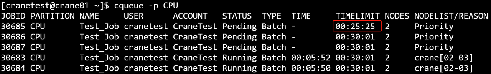

```Bash
ccontrol update job -J 191 -P 2.0
```

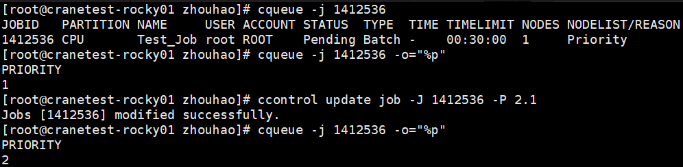

## 2**.2 修改节点信息**

支持的命令行选项：

- **-h/--help**: 显示帮助
- **-n/--name string：**节点名
- **-r/--reason string**： 设置修改原因
- **-t/--state string：**修改节点状态

```Bash
ccontrol update node -h
```

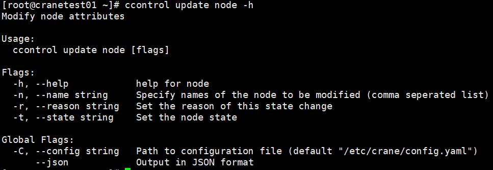
```Go
ccontrol update node -n crane01 -t drain -r improving performance
```

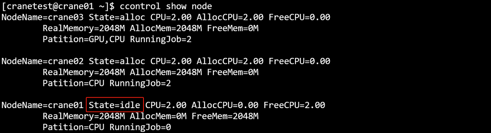


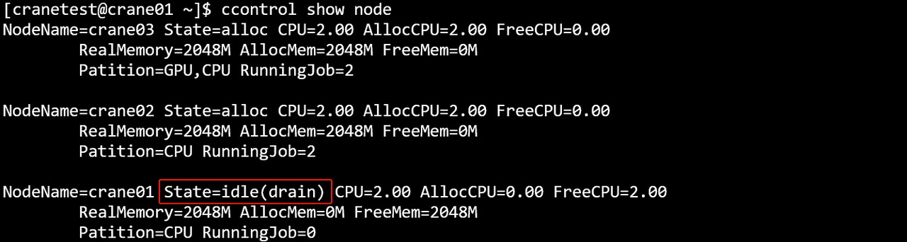

主要参数：

- **-c/--cpu**：节点的核心数**（-h列表无该参数）**
- **-M/--memory**：节点的内存大小，默认是MB**（-h列表无该参数）**
- **-n/--name**：节点名称
- **-P/--partition**：节点所属的分区**（-h列表无该参数）**

以下参数和上面参数不能一起设置，下面参数用于修改节点状态

- **-r/--reason**：设置状态改变原因
- **-t/--state**：设置节点状态

# 3. 暂停/恢复

## 3.1 **暂停作业调度**

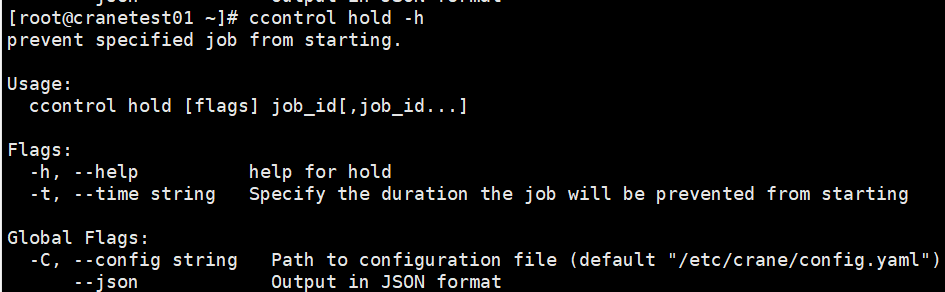

主要参数：

- **--time-limit/-T：**修改时间限制

```Plain
ccontrol hold 30751           #暂停调度编号为30751的任务
ccontrol hold 30751 -t 0:25:25  #暂停调度编号为30751的任务25分钟25秒钟（随后解除暂停）
```

- hold 接受 job_id 的方式与 ccancel 相同，要求为逗号分隔的任务编号。
- 只能 hold pending 任务
- 如果此前有设置解除暂停的定时器，该操作会取消原有的定时器。
- 使用 cqueue 查询时，如果任务被 hold，Node(Reason) 一列会显示 "Held"。

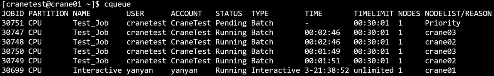


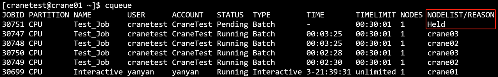

## 3.2 **继续作业调度**

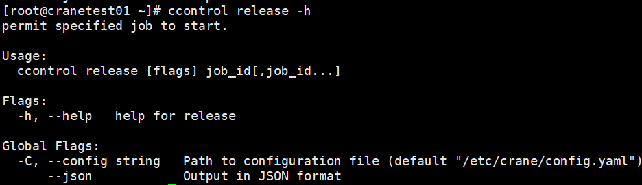

```Plain
ccontrol release 30751
```

- 如果此前有设置解除暂停的定时器，该操作会取消原有的定时器。
- 只能 release pending 任务1


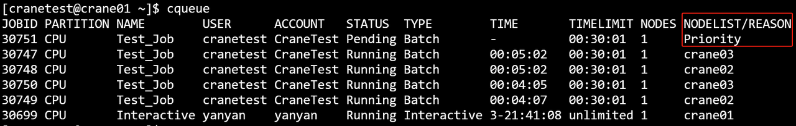

# 4**. completion**

**主要命令**：

- **bash**：为bash生成自动补全脚本
- **fish**：为fish生成自动补全脚本
- **powershell**：为powershell生成自动补全脚本
- **zsh**：为zsh生成自动补全脚本

**支持的命令行选项：**

- **-h/--help:** 显示帮助
- **-C/--config string：**配置文件路径(默认 "/etc/crane/config.yaml")
  - **--json：**json格式输出命令执行结果
