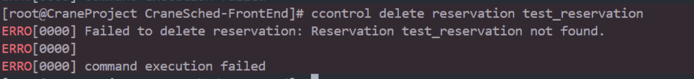

# ccontrol语法

### 命令主要结构

**ccontrol可以查看分区和节点的状态。**

**主要命令**

- **help**：显示帮助
- **show**：显示实体的状态，默认为所有记录
- **update**：修改作业/分区/节点信息
- **hold**：暂停作业调度
- **release**：继续作业调度
- **create：**创建一个新实体
- **delete：**删除指定的实体

**支持的命令行选项：**

- **-h/--help**: 显示帮助
- **--json**：json格式输出命令执行结果
- **-v/--version：**查询版本号
- **-C/--config string**：配置文件路径(默认 "/etc/crane/config.yaml")

### 各命令使用方式

#### 查看

1. **查看分区状态**

无可选参数

eg:

```Plain
ccontrol show partition
```

**运行截图**：


1. **查看节点状态**

无可选参数

eg:

```Plain
ccontrol show node
```

**运行截图**：


1. **查看作业状态**

无可选参数

eg:

```Plain
ccontrol show job
```

**运行截图**：


1. **查看预定状态**

无可选参数

eg：

```Plain
ccontrol show reservation
```

**运行截图**：


#### 修改

1. **修改作业信息**

可选参数：

- priority：优先级
- timelimit：时间限制(采用时间格式)

eg：

```Plain
ccontrol update jobid=11 priority=1 timelimit=01:00:00
```

**运行截图**：


1. **修改节点信息**

必填参数：

- state：状态
- reason：原因

eg:

```Plain
ccontrol update nodename=test_node state=drain reason="test"
```

**运行截图**：


1. **修改分区信息**

可选参数：

- accounts：允许用户
- deniedaccounts：拒绝的用户

eg：

```Plain
ccontrol update partition=test accounts=test_user
```

**运行截图**：


#### 暂停/恢复

1. **暂停作业**

可选参数：

- timelimit:时间限制(采用时间格式)

eg:

```Plain
ccontrol hold 1 timelimit=01:00:00
```

**运行截图**：


1. **恢复作业**

无可选参数

eg:

```Plain
ccontrol release 1
```

**运行截图**：


#### 创建/删除

1. **创建预订**

必选参数：

- starttime：开始时间（采用日期|时间格式）
- duration：长度(采用时间格式)
- account：使用账户

可选参数：

- partition：使用分区
- nodes：使用节点
- user：使用用户

eg：

```Plain
ccontrol create reservation test_reservation duration=01:00:00 partition=test_partition nodes=test_node account=test_account
```

**注意：**这里user支持=+和=-的用法，当=+表示允许用户，当=-的时候表示删除某用户

**运行截图**：


1. **删除预订**

无可选参数

eg:

```Plain
ccontrol delete reservation test_reservation
```

**运行截图**：



### 删除的命令

由于删除了cobra框架，现在completion自动补全代码命令已经无法使用

### 文件结构

help.go：由于删除了cobra框架，现在help命令的输出编写在help.go中

ccontrol.go：向后端通信的函数实现

CmdArgParser.go：命令解析文件，将使用解析到的命令行数据来调用ccontrol.go的函数

parser.go：解析器函数，定义数据结构与解析规则