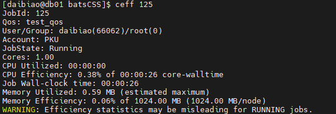
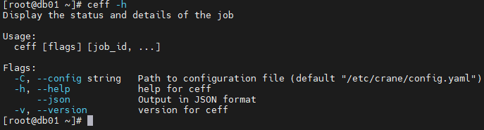
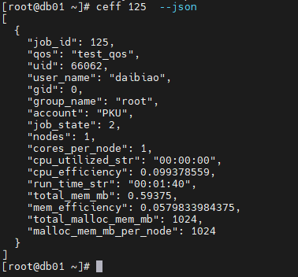

# ceff 查看作业运行实况

ceff**用来显示作业运行过程中的实时情况。**

查看任务实时情况：

```Shell
ceff 作业名,作业名
```

**ceff运行结果展示**



**主要输出项**

- **JobId**: 作业的唯一标识符。
- **Qos**: 作业运行所在的集群名称。
- **User/Group**: 提交作业的用户和用户组。
- **Account**：账户名
- **State**: 作业的当前状态（例如，COMPLETED、FAILED、CANCELLED 等）。
- **Cores**: 作业使用的核心数量。
- **Nodes**: 作业分配的节点数量。
- **Cores per node**: 每个节点分配的核心数量。
- **CPU** **Utilized**: 作业实际使用的 CPU 时间。
- **CPU** **Efficiency**: CPU 使用效率，通常表示为作业实际使用的 CPU 时间占分配的核心墙时间的百分比。
- **Job Wall-clock time**: 作业的墙钟时间，即作业从开始到结束的总时间。
- **Memory Utilized**: 作业实际使用的内存量。
- **Memory Efficiency**: 内存使用效率，通常表示为作业实际使用的内存量占分配内存的百分比。

#### **主要参数**

- **-h/--help**: 显示帮助
- **-C/--config string：**配置文件路径(默认为 "/etc/crane/config.yaml")
- **--****json** **输出后端返回任务信息**
- **-v, --version** 显示ceff 的版本

例：

```SQL
ceff -h
```



```SQL
ceff 作业id --json
```

