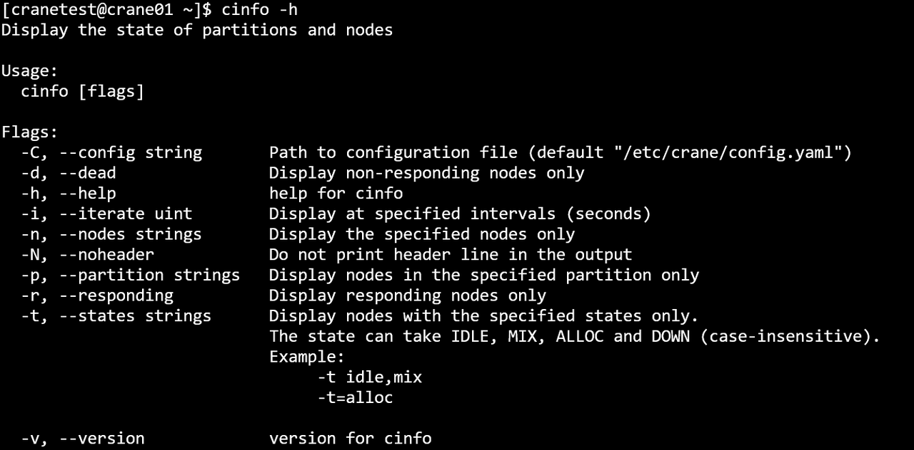
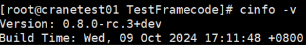

# cinfo 查看节点与分区状态 #

**cinfo可查询各分区节点的队列资源信息。**

查看分区节点状态：
~~~bash
cinfo
~~~

**cinfo运行结果展示**


**主要输出项**
- **PARTITION**：分区名
- **AVAIL**： 分区状态
  - up:  可用
  - down:不可用
- **NODES**：节点数
- **STATE**： 节点状态
  - **idle**： 空闲
  - mix： 节点部分核心可以使用
  - alloc： 节点已被占用
  - down： 节点不可用
- **NODELIST**： 节点列表

**主要参数**
- **-h/--help**: 显示帮助
- **-C/--config string**：配置文件路径(默认为 "/etc/crane/config.yaml")
- **-d/--dead**：只显示无响应节点
- **-i/--iterate uint**：指定间隔秒数刷新查询结果。如 -i=3表示每隔三秒输出一次查询结果
- **-o/--format string** 指定输出格式
  - **% p /% Partition** —— 显示当前环境中的所有分区
  - **% a/% Avail** —— 显示节点的状态
  - **% n/% Nodes** —— 显示分区节点的数量
  - **% s/% State** —— 显示分区节点的状态
  - **% l/% NodeList** —— 显示分区中的所有节点列表

每个格式标识符或字符串都可以用宽度说明符修改（例如，“%.5j” ）。如果指定了宽度，字段将被格式化为至少达到该宽度。如果格式无效或无法识别，程序将报错并终止。

- **--json**：json格式输出命令执行结果
- **-n/--nodes string**：显示指定节点信息，多个节点用逗号隔开。例：cinfo -n crane01,crane02
- **-N/--noheader**：输出隐藏表头
- **-p/--partition string**：显示指定分区信息，多个分区用逗号隔开。例：cinfo -p CPU,GPU
- **-r/--responding**：只显示有响应节点
- **-t/--states string**：仅显示状态的信息。状态可以为(不区分大小写): IDLE, MIX, ALLOC和DOWN
- **-v/--version**：查询版本号

例：

```
cinfo
```


```
cinfo -h
```


```
cinfo -N
```


```
cinfo -d
```


```
cinfo -i 3
```


```
cinfo -n crane01,crane02,crane03
```


```SQL
cinfo -p GPU,CPU
```


```SQL
cinfo -r
```


```SQL
cinfo -t IDLE
```


```Bash
cinfo -v
```
