# cqueue 查看作业队列#

**cqueue可以查看队列中的作业信息。**

查看集群中所有队列的作业信息（包括状态pending、running、cancelled），默认输出100条信息。

~~~bash
cqueue
~~~

**cqueue运行结果展示**

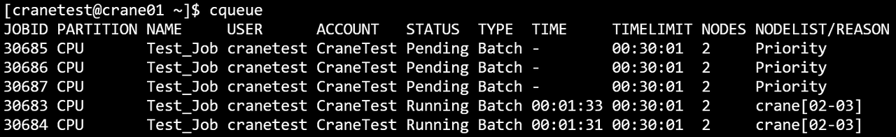

- **主要输出项**
  - **JobId**：作业号
  - **Partition**：作业所在分区
  - **Name**: 作业名
  - **User**：作业所属用户
  - **Account**：作业所属账户
  - **Status**：作业状态
  - **Type**： 作业类型
  - **TimeLimit**：作业时间限制
  - **Nodes**：作业所分配节点数
  - **NodeList**： 作业运行的节点名

#### **主要参数**

- **-A/--Account** **string**：指定查询作业所属账户，指定多个账户时用逗号隔开
- **-C/--config** **string**：配置文件路径
- **-o/--format** **string**：指定输出格式。由百分号（%）后接一个字符或字符串标识。 在 % 和格式字符/字符串之间用点（.）和数字，可指定字段的最小宽度。支持的格式标识符或字符串（不区分大小写）：
  - **%a/%Account：** 显示作业关联的账户
  - **%c/%AllocCpus：**显示作业已分配的 CPU 数量
  - **%e/%CpuPerNode：**显示作业每个节点请求的 CPU 数量
  - **%h/%ElapsedTime：**显示作业自启动以来的已用时间
  - **%j/%JobId：**显示作业 ID
  - **%k/%Comment：**显示作业的备注
  - **%l/%NodeList：**显示作业正在运行的节点列表
  - **%m/%TimeLimit：**显示作业的时间限制
  - **%n/%MemPerNode：**显示作业每个节点请求的内存量
  - **%N/%NodeNum：**显示作业请求的节点数量
  - **%n/%Name：**显示作业名称
  - **%P/%Partition：**显示作业运行所在的分区
  - **%p/%Priority：**显示作业的优先级
  - **%Q/%QOS**：显示作业的服务质量（QoS）级别
  - **%R/%Reason：**显示作业挂起的原因
  - **%r/%ReqNodes：**显示作业请求的节点
  - **%S/%StartTime：**显示作业的开始时间
  - **%s/%SubmitTime：**显示作业的提交时间
  - **%t/%State：**显示作业的当前状态
  - **%T/%JobType：**显示作业类型
  - **%u/%Uid：显示作业的 UID**
  - **%U/%User：**显示提交作业的用户
  - **%x/%ExcludeNodes：**显示作业排除的节点
  - 每个格式标识符或字符串可用宽度说明符修改（如 "%.5j" ）。 若指定宽度，则会被格式化为至少达到该宽度。 若格式无效或无法识别，程序会报错并终止。 
    - 例：**--format "%.5j %.20n %t"** 会输出作业 ID（最小宽度 5）、名称（最小宽度 20）和状态。
- **-F/--full**: 显示完整的内容，如果未指定，默认每项输出30个字符
- **-h/--help**: 显示帮助
- **-i/--iterate** **uint**：指定间隔秒数刷新查询结果。如 -i=3表示每隔三秒输出一次查询结果
- **-j/--job** **string**：指定查询作业号，指定多个作业号时用逗号隔开。如 -j=2,3,4
  - **--json：**json格式输出命令执行结果
- **-m/--MaxVisibleLines** **uint32**：指定输出结果的最大条数。如-m=500表示最多输出500行查询结果
- **-n/--name** **string**：指定查询作业名，指定多个作业名时用逗号隔开
- **-N/--noHeader**：输出隐藏表头
- **-p/--partition** **string**：指定查询作业所在分区，指定多个分区时用逗号隔开
- **-q/--qos** **string**：指定查询作业的QoS，指定多个QoS时用逗号隔开
  - **--self：**查看当前用户提交的作业
- **-S/--start**：显示作业的开始时间（pending作业显示预期开始时间）
- **-t/--state** **string**：指定查询作业状态，指定多个状态时用逗号隔开
- **-u/--user** **string**：指定查询作业所属用户，指定多个用户时用逗号隔开
- **-v/--version：**查询版本号

例：

```SQL
cqueue -h
```
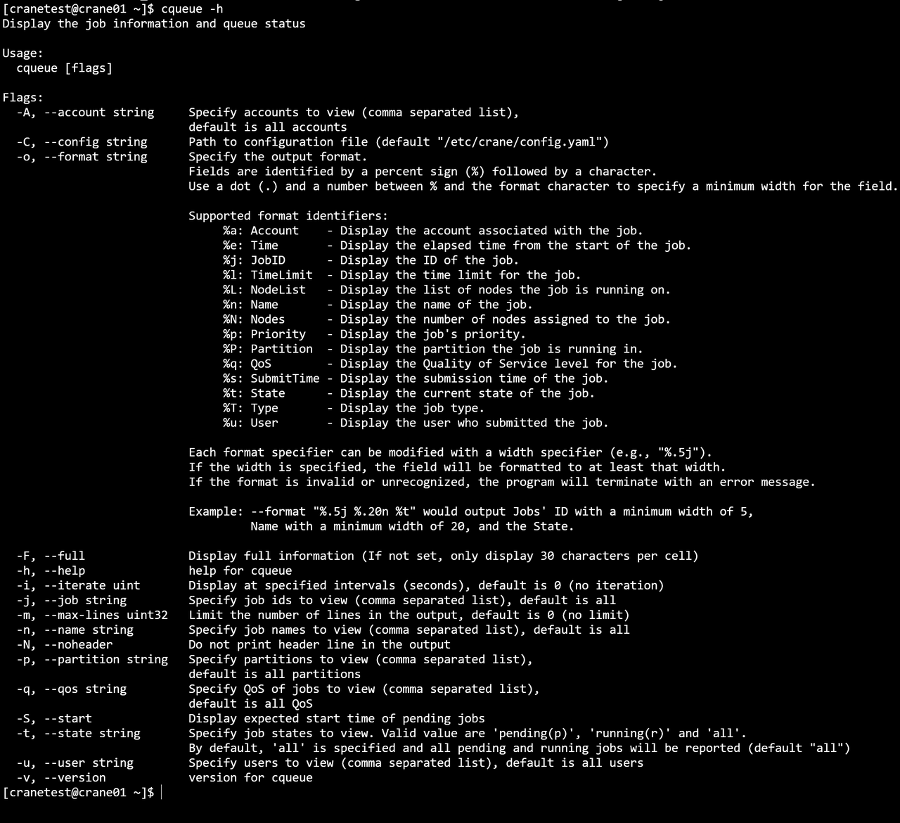

```SQL
cqueue -N
```


```SQL
cqueue -S
```
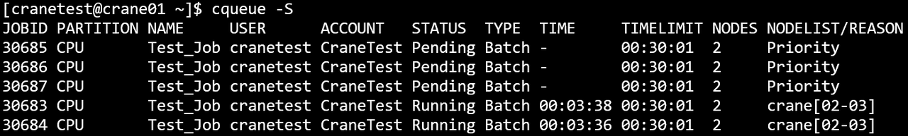

```SQL
cqueue -j 30674,30675
```


```SQL
cqueue -t Pending
```
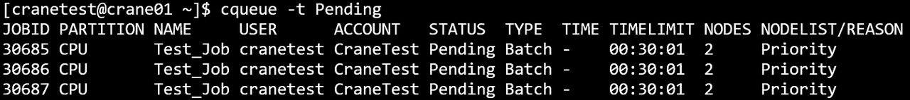

```Bash
cqueue -t r
```
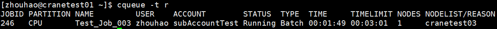

```SQL
cqueue -u cranetest
```
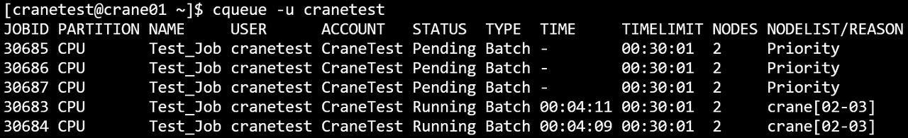

```SQL
cqueue -A CraneTest
```
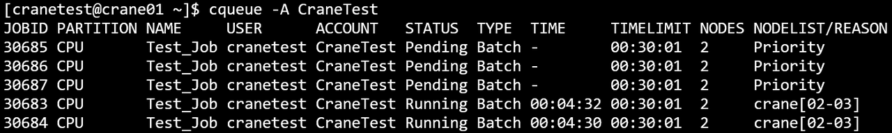

```SQL
cqueue -i 3
```
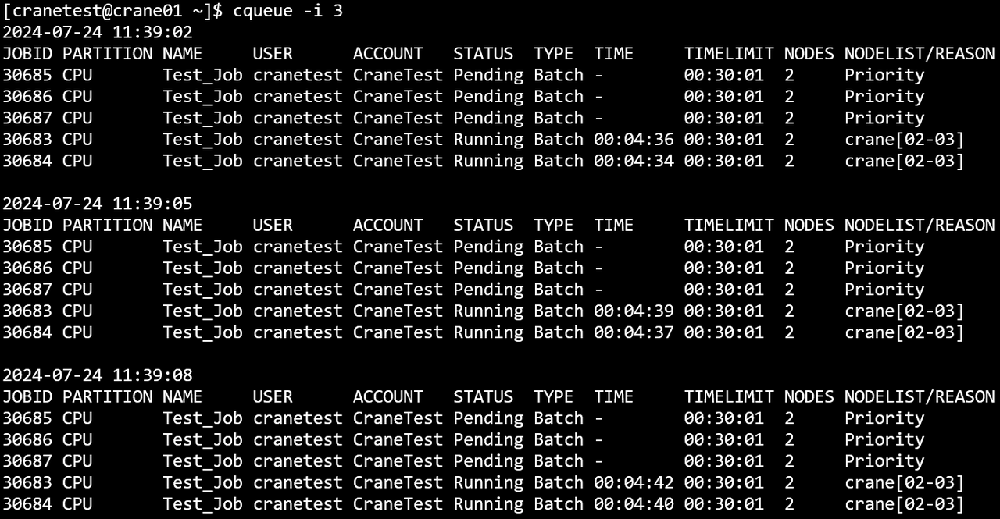

```SQL
cqueue -p CPU
```
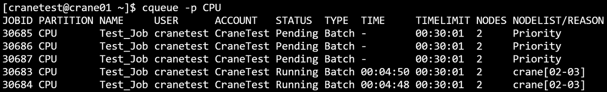

```SQL
cqueue -m 3
```
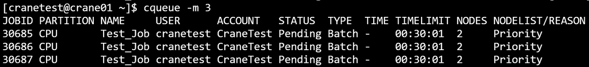

```SQL
cqueue -o="%n %u %.5j %.5t %.3T %.5T"
```


format中的指定列的对应缩写对照：

- j-TaskId；n-Name；t-State；p-Partition；u-User；a-Account；T-Type；I-NodeIndex；l-TimeLimit；N-Nodes

```Bash
cqueue -n test
```
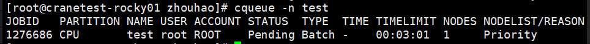

```Bash
cqueue -N
```
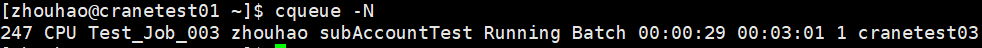

```Bash
cqueue -q test_qos
```
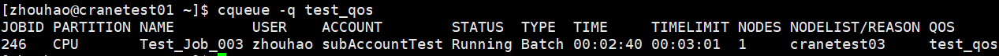

```Bash
cqueue --self
```
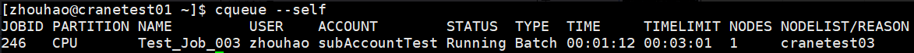

```Bash
cqueue -t Running -S 2024-01-02T15:04:05~2024-01-11T11:12:41
```
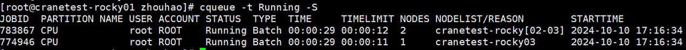