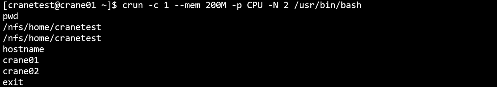
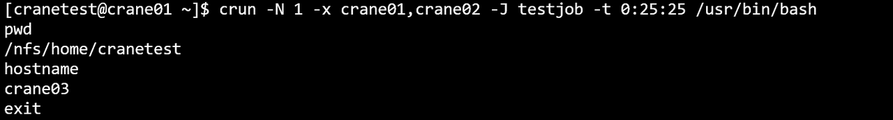
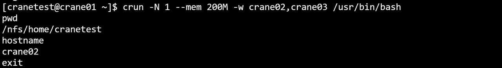
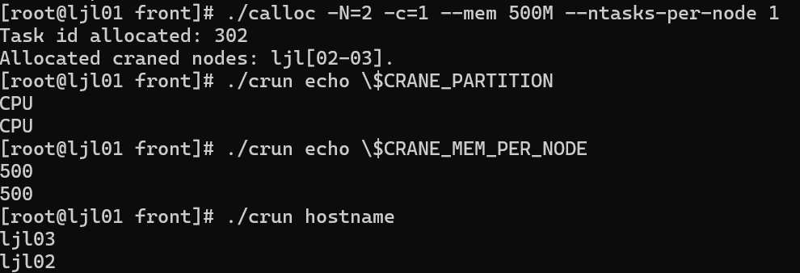
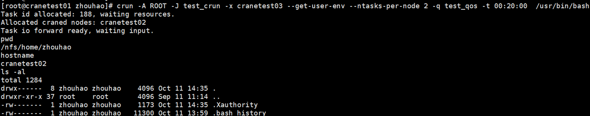
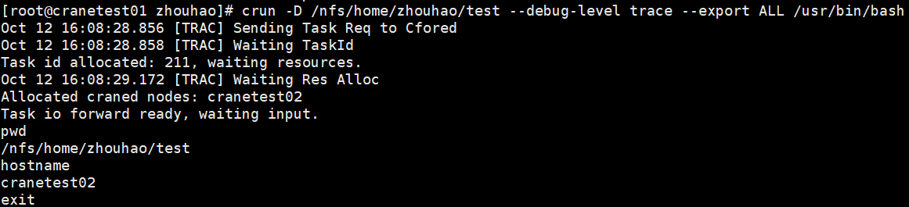
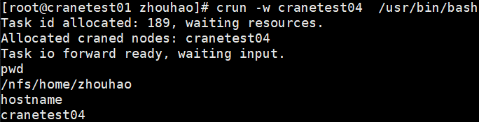

# crun 提交交互式任务

crun使用命令行指定的参数申请资源并在计算节点启动指定的任务，用户的输入将被转发到计算节点上对应的任务，任务的输出将被转发回用户终端。crun需要在有cfored运行的节点上启动。

crun只支持通过命令行指定请求参数，支持的命令行选项：

- **-h/--help**: 显示帮助
- **-A/--account string**：提交作业的账户
- **-D/--chdir string**：任务工作路径
- **-C/--config string**：配置文件路径(默认 "/etc/crane/config.yaml")
- **-c/--cpus-per-task** **float**：每个任务所需的 CPU 数量（默认值为 1）
  - **--debug-level string：**可用的调试级别：trace、debug、info（默认值为 "info"）
- **-x/--exclude string：**从分配中排除特定节点（以逗号分隔的列表）
  - **--export string：**传播环境变量
  - **--extra-attr string：**作业的额外属性（JSON 格式）
  - **--get-user-env：**加载用户的登录环境变量
  - **--gres string：**每个任务所需的通用资源，格式："gpu:a100:1" 或 "gpu:1"
- **-J, --job-name string：**作业名称
  - **--mail-type string：**当特定事件发生时通过邮件通知用户，支持的值：NONE、BEGIN、END、FAIL、TIMELIMIT、ALL（默认值为 NONE）
  - **--mail-user string：**通知接收者的邮件地址
  - **--mem string：**最大实际内存量，支持 GB(G, g)、MB(M, m)、KB(K, k) 和 Bytes(B)，默认单位是 MB
- **-w/--nodelist string：**要分配给作业的节点（以逗号分隔的列表）
- **-N/--nodes uint32:** 要在其上运行作业的节点数量（格式为 N = min[-max]，默认值为 1）
  - **--ntasks-per-node uint32：**每个节点上要调用的任务数量（默认值为 1）
- **-p/--partition string:**请求的分区
  - **--pty:**使用伪终端运行
- **-q/--qos string:**作业使用的服务质量（QoS）
- **-r/--reservation string：**使用预留资源
- **-t/--time string：**时间限制，格式："day-hours:minutes:seconds"（如 5-0:0:1 表示 5 天 1 秒）或 "hours:minutes:seconds"（如 10:1:2 表示 10 小时 1 分钟 2 秒）
- **-v/--version:crun** 的版本
  - **--x11:**启用 X11 支持，默认值为 false。如果未配合 --x11-forwarding 使用，则直接使用 X11（不安全）
  - **--x11-forwarding:**由 CraneSched 启用 X11 转发（安全），默认值为 false
- 例：在CPU分区，申请两个节点，一个CPU核心，200M内存，并运行bash程序：

```C
crun -c 1 --mem 200M -p CPU -N 2 /usr/bin/bash
```

运行结果：



- 例：申请一个节点，且节点不能是crane01,crane02，任务名称为testjob，运行时间限制为0:25:25，并运行bash程序：



- 例：在GPU分区申请一个节点和200M运行内存，节点只能在crane02、crane03中选择，并运行bash程序：



crun还可以在calloc任务内嵌套启动，将自动继承calloc任务的所有资源。不需要指定除需要运行的程序外其他参数。



```Bash
crun -A ROOT -J test_crun -x cranetest03 --get-user-env --ntasks-per-node 2 -q test_qos -t 00:20:00 /usr/bin/bash
```



```Bash
crun -D --debug-level trace --export ALL /path /usr/bin/bash
```



```Bash
crun -w cranetest04 /usr/bin/bash
```



```Bash
crun --x11 xclock
```


向crun启动的程序传递参数

Pass arguments to your programe launched by crun:

```Plain
crun -c 1 -- your_programe --your_args
// or
crun -c 1 "your_programe --your_args"
```