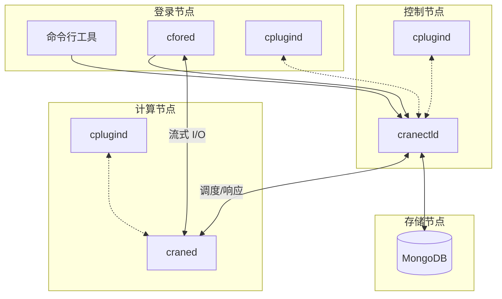

# CraneSched 部署指南

欢迎阅读 CraneSched 部署文档。本指南将带您了解如何使用 CraneSched 作业调度系统搭建高性能计算集群。

!!! tip "推荐操作系统"
    我们强烈推荐使用 **Rocky Linux 9** 进行生产部署，因为它具有稳定性、长期支持和现代化的系统组件。

## 您将部署的内容

CraneSched 由三个主要组件组成：

| 组件 | 描述 | 位置 |
|------|------|------|
| **后端** | `cranectld`（调度器）+ `craned`（工作节点守护进程）| 控制节点和计算节点 |
| **前端** | CLI（`cbatch`、`cqueue` 等）+ 其他服务（`cfored`、`cplugind`）| 按需部署 |
| **数据库** | MongoDB，用于存储作业、账户和使用数据 | 控制节点/存储节点 |

下图展示了 CraneSched 组件在不同节点类型上的典型部署方式。

## 快速开始

对于简单的单节点测试环境：

1. 安装后端：按照 [Rocky Linux 9 指南](./backend/Rocky9.md) （步骤 1-5）
2. 配置数据库：按照 [数据库配置指南](./configuration/database.md)
3. 配置集群：编辑 `/etc/crane/config.yaml` （参见 [配置指南](./configuration/config.md)）
4. 启动服务：`systemctl start cranectld craned` （以及根据需要启动其他前端服务）

**对于生产环境的多节点集群**，请遵循下面的完整部署流程。

---

## 部署流程

### 步骤 1：构建后端组件

选择您的操作系统并按照相应的指南操作：

- :material-flag: **[RHEL 8+ / Fedora 37+](./backend/Rocky9.md)**

    ---
    
    生产环境推荐。包括环境设置、工具链安装和从源码构建。

- :material-flag-outline: **[Debian 11+ / Ubuntu 20.04+](./backend/Ubuntu.md)**

    ---
    
    支持但不正式推荐。

- :material-alert-circle: **[CentOS 7](./backend/CentOS7.md)**

    ---
    
    遗留支持（已停止维护）。仅用于现有部署。

所有指南都涵盖系统准备、依赖项和编译。构建完成后：

- **[打包指南](./backend/packaging.md)** - 创建 RPM/DEB 软件包以便于跨节点分发

### 步骤 2：配置数据库

MongoDB 存储作业历史记录、用户账户和资源使用数据。

- **[数据库配置](./configuration/database.md)**

在控制节点上安装 MongoDB，配置身份验证并连接 CraneSched。

### 步骤 3：配置集群

定义集群拓扑、节点资源和调度策略。

- **[集群配置](./configuration/config.md)**

了解如何编辑 `/etc/crane/config.yaml` 来配置：

- 集群名称和控制节点
- 节点定义（CPU、内存、GPU）
- 分区和调度优先级
- 网络设置和高级选项

### 步骤 4：部署到节点

对于多节点集群，高效地分发二进制文件和配置。

- **[多节点部署](./configuration/multi-node.md)**

使用 SCP、PDSH 或包管理器在集群中部署 CraneSched。

### 步骤 5：安装前端工具

部署面向用户的工具和服务，用于作业提交和管理。

- **[前端部署](./frontend/frontend.md)**

安装基于 Go 的前端组件：`cbatch`、`cqueue`、`cinfo`、`cacct` 和支持守护进程。

---

## 可选功能

### 插件系统

使用插件扩展 CraneSched，用于监控、通知等。

- **[插件指南](./frontend/plugins.md)** - 邮件通知、资源监控、能源跟踪

### 访问控制

限制仅授权作业可以通过 SSH 访问计算节点。

- **[PAM 模块](./configuration/pam.md)** - 配置基于 PAM 的访问控制

### 高级设备管理

在使用 cgroup v2 的系统上通过 eBPF 启用 GPU 和设备隔离。

- **[eBPF 支持](./backend/eBPF.md)** - 使用 eBPF 设备控制的 GRES 支持

---

## 获取帮助

- 查看各个指南的故障排除部分
- 查看 [Rocky 9](./backend/Rocky9.md) 和 [配置](./configuration/config.md) 指南中的配置示例
- 验证服务是否正在运行：`systemctl status cranectld craned`
- 检查日志：`/var/log/crane/` 或 `journalctl -u cranectld`
