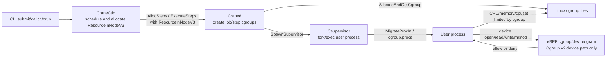
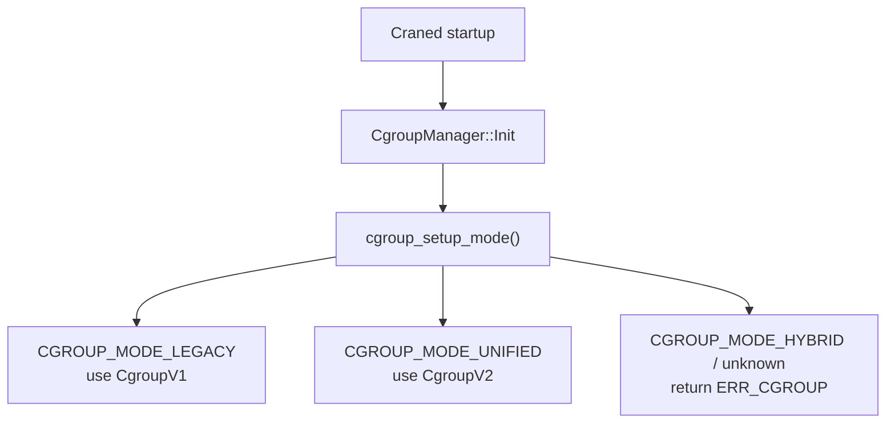
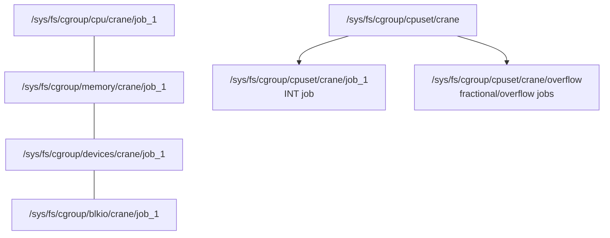
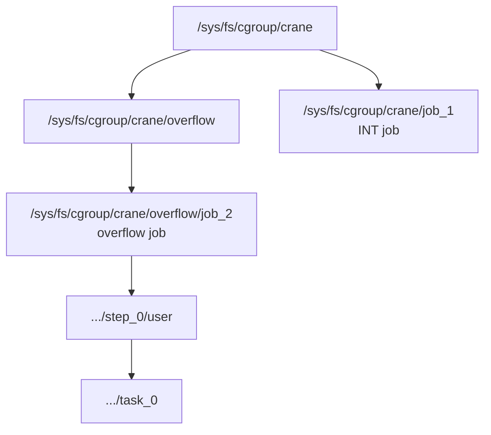
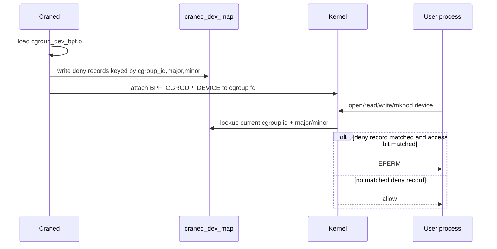
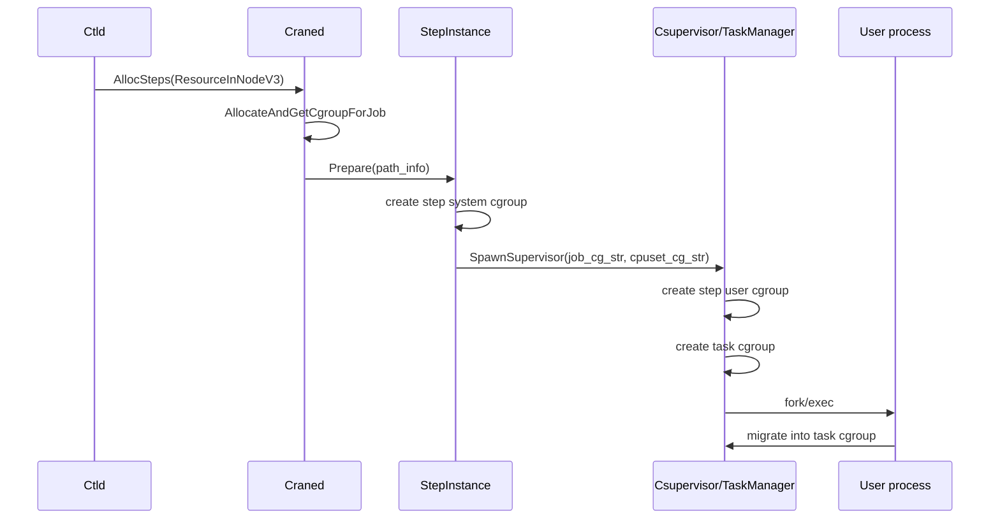

# Cgroup 资源限制设计说明

本文面向 CraneSched 内部开发，说明 Craned 当前如何通过 Cgroup v1、
Cgroup v2 和 eBPF 实现任务资源限制。本文只描述当前实现和开发口径，
不定义新的用户接口。

## 设计口径

CraneSched 的内部默认构建/部署口径是开启 Cgroup v2 支持和 eBPF 能力：

- `CRANE_ENABLE_CGROUP_V2` 表示编译期具备识别和使用 Cgroup v2 的能力。
- `CRANE_ENABLE_BPF` 表示编译期具备在 Cgroup v2 路径使用 eBPF 做设备访问控制的能力。
- 节点运行时实际走 Cgroup v1 还是 Cgroup v2，由该节点的系统 cgroup mode 决定。
- Cgroup v2 只是开启支持，不意味着所有节点都强制运行 unified hierarchy。
- eBPF 只服务于 Cgroup v2 的设备控制；Cgroup v1 仍走内核 `devices` controller。

因此兼容策略是：

```text
同一套 craned 二进制
  -> 启动时检测节点 cgroup mode
  -> legacy mode: 使用 Cgroup v1 实现
  -> unified mode: 使用 Cgroup v2 实现，设备限制使用 eBPF
  -> hybrid/unknown: 当前视为不支持
```

核心代码入口：

| 主题 | 入口 |
|---|---|
| cgroup 版本检测和 controller 初始化 | `src/Craned/Common/CgroupManager.cpp` `CgroupManager::Init` |
| cgroup 抽象接口 | `src/Craned/Common/CgroupManager.h` `CgroupInterface` / `CgroupV1` / `CgroupV2` |
| 资源写入 | `src/Craned/Common/CgroupManager.cpp` `ResourceInNodeV3Allocator::Allocate` |
| job cgroup 路径选择 | `CgroupManager::MakeCgroupPathInfo` |
| eBPF 设备程序 | `src/Misc/BPF/cgroup_dev_bpf.c` |
| 设备元数据 | `src/Craned/Common/DeviceManager.*` |
| step/task 进程迁移 | `src/Craned/Core/StepInstance.cpp`、`src/Craned/Supervisor/TaskManager.cpp` |

## 总体链路

调度器只决定资源分配结果；真正的资源隔离发生在 Craned 本地。



资源模型从 proto 和公共类型进入 Craned：

- `ResourceInNodeV3.cpu_ids` / `cpu_count`: CPU 绑定和 CPU quota。
- `ResourceInNodeV3.memory_bytes`: 物理内存硬限制。
- `ResourceInNodeV3.memory_sw_bytes`: swap/soft memory 相关限制。
- `ResourceInNodeV3.gres`: 已分配的 GRES slot，用于计算允许访问哪些设备。

`CgroupManager::AllocateAndGetCgroup` 是主要入口。它完成：

1. 按当前 cgroup 版本创建或打开 cgroup。
2. recovery 场景下只恢复句柄和 eBPF 元数据，不重新触发插件和资源写入。
3. 非 recovery 场景下执行最小内存修正。
4. 调用 `ResourceInNodeV3Allocator::Allocate` 写 CPU、memory、device 限制。

## 运行时版本分派

`CgroupManager::Init` 在 Craned 启动时调用 `cgroup_setup_mode()` 判断节点模式：

| `cgroup_setup_mode()` | CraneSched 行为 |
|---|---|
| `CGROUP_MODE_LEGACY` | 设置为 `CGROUP_V1` |
| `CGROUP_MODE_UNIFIED` | 设置为 `CGROUP_V2` |
| `CGROUP_MODE_HYBRID` | 设置为 `UNDEFINED`，当前不支持 |
| unknown | 当前不支持 |



Cgroup v1 会从系统 controller 信息中检查 `memory`、`freezer`、`blkio`、
`cpu`、`devices`、`cpuset` 等 controller。Cgroup v2 不依赖
`/proc/cgroups` 的 v1 语义，而是读取 root cgroup 上可用的 controller，
检查 `cpu`、`memory`、`io`、`cpuset`、`pids`。

## Cgroup 层级模型

### Cgroup v1

Cgroup v1 是多 hierarchy 模型。CPU、memory、devices、cpuset 等 controller
可以挂在不同 hierarchy 上。CraneSched 的实现中，job 的 CPU/memory/devices
cgroup 与 cpuset cgroup 需要分开理解。



v1 的重要实现约束：

- `CG_V1_BASE_CONTROLLERS` 包含 CPU、memory、freezer、devices、blkio。
- 普通 job 的 cpu/memory/devices cgroup 使用 `crane/job_<id>`。
- cpuset 不包含在 v1 base controllers 中，而由 CPU pool 逻辑单独管理。
- INT job 可以在自己的 cpuset cgroup 中绑定具体 CPU。
- overflow/fractional CPU job 会迁移到 `crane/overflow` cpuset。
- v1 cpuset 写入前必须先设置 `cpuset.mems`，否则写 `cpuset.cpus` 可能失败。

### Cgroup v2

Cgroup v2 是 unified hierarchy。CPU、memory、io、cpuset 等 controller
在同一个目录树中生效。



v2 的重要实现约束：

- `CG_V2_REQUIRED_CONTROLLERS` 包含 CPU、memory、io、cpuset。
- `CgroupV2` 创建时会记录 cgroup inode，作为 eBPF map key 的 cgroup id。
- v2 不需要单独的 cpuset 迁移路径；cpuset 写在 unified hierarchy 的 cgroup 上。
- overflow job 在 v2 中会放在 `crane/overflow/job_<id>` 下，以继承 overflow cpuset。

## 资源限制映射

`ResourceInNodeV3Allocator::Allocate` 是 CPU、memory、GRES 资源落地的统一入口。

### CPU

CPU 限制分两层：

- CPU quota: 限制可用 CPU 时间，所有 `cpu_count > 0` 的资源都会写。
- CPU binding: 只有整数 CPU 集合，即 `CpuSet::IsInteger()` 为真时写 cpuset。

| 资源 | Cgroup v1 | Cgroup v2 |
|---|---|---|
| CPU quota | `cpu.cfs_quota_us` + `cpu.cfs_period_us` | `cpu.max` |
| CPU weight/share | `cpu.shares` | `cpu.weight` |
| CPU binding | `cpuset.cpus` in cpuset hierarchy | `cpuset.cpus` in unified hierarchy |

v1/v2 的 quota 计算都使用固定 period `1 << 16`，quota 按
`period * cpu_count` 计算。因此 fractional CPU 通过 quota 表达，INT CPU
额外写 cpuset。

### Memory

| 资源 | Cgroup v1 | Cgroup v2 |
|---|---|---|
| hard memory limit | `memory.limit_in_bytes` | `memory.max` |
| swap/memsw limit | `memory.memsw.limit_in_bytes` | `memory.swap.max` |
| soft/high limit | `memory.soft_limit_in_bytes` | `memory.high` |

`AllocateAndGetCgroup` 支持 `min_mem`。当资源中的 memory 小于 `min_mem` 时，
会把 memory 和 swap memory 都抬到 `min_mem`。当前常用于 step user cgroup，
避免极小内存限制导致运行环境初始化失败。

OOM 统计也按版本分派：

- Cgroup v2: 读取 cgroup 目录下的 `memory.events`，解析 `oom` 和 `oom_kill`。
- Cgroup v1: 读取 memory hierarchy 下的 `memory.oom_control`，当前只解析
  `oom_kill`。

### Block I/O

| 资源 | Cgroup v1 | Cgroup v2 |
|---|---|---|
| I/O weight | `blkio.weight` | `io.weight` |

当前 I/O 限制接口存在，但主要任务资源隔离路径集中在 CPU、memory、cpuset 和 device。

## 设备限制和 GRES

设备限制的输入来自节点配置中的 GRES 设备定义。`DeviceManager` 会把每个设备 slot
解析成一个或多个设备文件元数据：

```text
slot id
  -> device name/type
  -> device file path list
  -> major/minor/op_type
  -> optional env injector / CDI / CNI metadata
```

作业调度后，`ResourceInNodeV3.gres` 里保存实际分配到的 slot。Craned 在写设备限制时：

1. 收集本 job/step/task 请求的所有 slot。
2. 遍历本节点已注册设备 `g_this_node_device`。
3. 对未被分配的 slot 写 deny 规则。
4. 如果节点没有注册设备，直接跳过设备限制。

这里的语义是 deny-list：没有分配到的设备被禁止访问，分配到的设备不写 deny。
因此即使作业没有请求任何 GRES，只要节点配置了设备，也应该对全部已知设备写 deny，
防止无 GRES 作业访问 GPU 等专用设备。

### Cgroup v1 设备限制

Cgroup v1 直接写 `devices.deny`：

```text
c <major>:<minor> rwm
b <major>:<minor> rwm
```

`CgroupV1::SetDeviceAccess` 会把未分配 slot 的每个设备文件转换成 deny 字符串，
并通过 libcgroup 写入 `devices.deny`。

### Cgroup v2 + eBPF 设备限制

Cgroup v2 没有 v1 那样的 `devices.allow` / `devices.deny` 文件。设备访问控制通过
`BPF_CGROUP_DEVICE` 类型的 eBPF 程序实现。



当前 eBPF 程序位于 `src/Misc/BPF/cgroup_dev_bpf.c`，section 为 `cgroup/dev`。
它读取 `bpf_cgroup_dev_ctx` 中的：

- device major
- device minor
- access type: read/write/mknod
- device type: char/block

BPF map key/value：

| 结构 | 字段 | 说明 |
|---|---|---|
| `BpfKey` | `cgroup_id` | 当前 cgroup id，v2 中由 cgroup inode 保存 |
| `BpfKey` | `major` / `minor` | 设备号 |
| `BpfDeviceMeta` | `permission` | 当前只使用 `DENY` |
| `BpfDeviceMeta` | `access` | deny 的 read/write/mknod bit |
| `BpfDeviceMeta` | `type` | char/block device type |

特殊 key `(0, 0, 0)` 用于传递 BPF debug logging 开关。

eBPF 生命周期：

- `BpfRuntimeInfo::InitializeBpfObj` 打开并加载
  `/usr/local/lib64/bpf/cgroup_dev_bpf.o`。
- 找到程序 `craned_device_access` 和 map `craned_dev_map`。
- `CgroupV2::SetDeviceAccess` 把 deny 规则写入 map，并 attach 到目标 cgroup。
- `CgroupV2::Destroy` 删除本 cgroup 写入的 map entries，并在最后关闭 BPF object。
- recovery 时，Craned 会扫描现有 cgroup 和 BPF map，清理 Ctld 中不存在的 job/step
  对应 map entries。

如果构建未启用 eBPF，Cgroup v2 路径无法提供设备隔离。当前策略是：

- 作业没有请求设备时，记录 warning 并继续。
- 作业请求了设备时，返回失败，因为无法保证设备隔离。

## Job、Step 和 Task cgroup 生命周期

CraneSched 的 cgroup 层级与 job/step/task 对齐：

```text
job cgroup
  -> step system cgroup
  -> step user cgroup
      -> task cgroup
```

主要创建位置：

| 层级 | 创建位置 | 说明 |
|---|---|---|
| job cgroup | Craned job allocation/recovery | 保存 job 级资源和路径信息 |
| step system cgroup | `StepInstance::Prepare` | supervisor/system step 使用 |
| step user cgroup | `TaskManager` step launch / daemon SSH migrate | 用户进程父 cgroup |
| task cgroup | `ProcInstance::Prepare` | 具体任务进程 cgroup |



进程迁移使用 `CgroupInterface::MigrateProcIn`，底层调用 libcgroup
`cgroup_attach_task_pid`。Cgroup v1 的 overflow cpuset 还需要额外调用
`CgroupManager::MigrateToCpuset`，把进程写入 cpuset hierarchy 的
`cgroup.procs`。Cgroup v2 不需要这个额外步骤。

销毁路径使用 `CgroupManager::KillAndDestroyCgroup` 或各对象自己的 cleanup：

1. 检查 cgroup 是否为空。
2. 最多尝试多次向 cgroup 内进程发送 `SIGKILL`。
3. 调用 `Destroy` 删除 cgroup。
4. Cgroup v2 额外清理对应 eBPF map entries。

## CPU Pool 和 overflow

CraneSched 把 CPU 分配分成两类：

- INT job: 分配到具体 CPU id，可写 cpuset 做硬绑定。
- overflow/fractional job: 分配的是 CPU quota，不绑定独占 CPU id。

`CgroupManager::MakeCgroupPathInfo` 根据 `CpuSet::IsInteger()` 生成路径：

| 版本 | INT job | overflow/fractional job |
|---|---|---|
| Cgroup v1 | `cg_str=job_<id>`，`cpuset_cg_str=job_<id>` | `cg_str=job_<id>`，`cpuset_cg_str=overflow` |
| Cgroup v2 | `cg_str=job_<id>` | `cg_str=overflow/job_<id>` |

v1 中 cpuset 和其他 controller 分离，所以 overflow job 的 cpu/memory/devices
仍在 `crane/job_<id>`，但进程的 cpuset 迁移到 `crane/overflow`。

v2 中 unified hierarchy 可以把 overflow job 放在 `crane/overflow/job_<id>`，
直接继承 overflow cpuset。

`InitCpuPool` 会初始化 overflow pool：

- 记录节点 CPU bitset。
- v1 下初始化 `/sys/fs/cgroup/cpuset/crane` 和
  `/sys/fs/cgroup/cpuset/crane/overflow`。
- 创建持久的 `crane/overflow` cgroup。
- v2 下直接在 `crane/overflow` 写 cpuset。

INT job 分配时会从 overflow pool 中 claim CPU；释放时再归还，并重写 overflow
cpuset。

## 构建和部署注意事项

内部默认构建应开启：

```bash
cmake -G Ninja -DCRANE_ENABLE_CGROUP_V2=ON -DCRANE_ENABLE_BPF=ON -S . -B build
cmake --build build
```

eBPF 构建要求：

- 主工程可以使用 GCC 14+ 或 Clang 19+。
- eBPF 程序必须使用 Clang 19+ 编译。
- `CRANE_ENABLE_BPF=ON` 要求 `CRANE_ENABLE_CGROUP_V2=ON`。
- BPF object 安装路径是 `/usr/local/lib64/bpf/cgroup_dev_bpf.o`。
- BPF map pin 路径是 `/sys/fs/bpf/craned_dev_map`。

Cgroup v2 节点需要确保 root cgroup 对子 cgroup 启用了必要 controller：

```bash
cat /sys/fs/cgroup/cgroup.subtree_control
echo '+cpuset +cpu +io +memory +pids' > /sys/fs/cgroup/cgroup.subtree_control
```

如果 Craned 启动时报 `Failed to create overflow cgroup` 或
`Failed to initialize CPU pool`，优先检查 `cpuset` 和 `io` 是否已启用。

如果 BPF object 加载失败，检查：

```bash
test -f /usr/local/lib64/bpf/cgroup_dev_bpf.o
mount | grep bpf
ls -l /sys/fs/bpf
```

## 开发验证建议

### 判断运行时版本

查看 Craned 日志中的 controller 初始化和 cgroup 错误。也可以在节点上检查系统模式：

```bash
stat -fc %T /sys/fs/cgroup
```

常见结果：

- `cgroup2fs`: unified mode，CraneSched 走 Cgroup v2。
- `tmpfs` 加多个 controller mount: legacy mode，CraneSched 走 Cgroup v1。

### 验证 CPU 和内存限制

Cgroup v2:

```bash
find /sys/fs/cgroup/crane -maxdepth 4 -type d
cat /sys/fs/cgroup/crane/job_<id>/cpu.max
cat /sys/fs/cgroup/crane/job_<id>/memory.max
cat /sys/fs/cgroup/crane/job_<id>/memory.events
```

Cgroup v1:

```bash
cat /sys/fs/cgroup/cpu/crane/job_<id>/cpu.cfs_quota_us
cat /sys/fs/cgroup/cpu/crane/job_<id>/cpu.cfs_period_us
cat /sys/fs/cgroup/memory/crane/job_<id>/memory.limit_in_bytes
cat /sys/fs/cgroup/memory/crane/job_<id>/memory.oom_control
```

### 验证设备限制

准备一个配置了 GRES 的节点，提交不请求 GRES 的作业，在作业内访问该设备：

```bash
ls -l /dev/nvidia0
python3 -c 'open("/dev/nvidia0", "rb").read(1)'
```

预期：

- Cgroup v1: 访问被 `devices.deny` 拒绝。
- Cgroup v2 + eBPF: 访问由 `BPF_CGROUP_DEVICE` 程序拒绝。
- Cgroup v2 但未启用 eBPF: 无法保证设备隔离，应视为部署或构建不符合默认口径。

### 验证 recovery 清理

Craned recovery 会扫描仍存在的 cgroup 和 eBPF map：

- Ctld 仍认为 running 的 job/step: 尝试恢复 cgroup 句柄。
- Ctld 不存在的 job/step: kill 并删除残留 cgroup。
- Cgroup v2 + eBPF: 同步清理残留 map entries。

可以通过重启 Craned 后检查：

```bash
find /sys/fs/cgroup/crane -maxdepth 4 -type d
bpftool map show pinned /sys/fs/bpf/craned_dev_map
```

`bpftool` 只作为调试工具，不是 Craned 正常运行依赖。

## 已知边界

- 当前不支持 hybrid cgroup mode。
- Cgroup v2 的设备限制依赖 eBPF；没有 eBPF 时无法提供等价于 v1
  `devices.deny` 的隔离能力。
- v1 cpuset 是单独 hierarchy，不能把 v1 的 cpuset 路径和 cpu/memory/devices
  路径混为同一个目录。
- v2 overflow job 使用 `overflow/job_<id>` 路径，v1 overflow job 的主 cgroup
  仍是 `job_<id>`，只是进程额外迁移到 overflow cpuset。
- GRES 设备限制是基于 Craned 启动时解析出的设备 major/minor；设备文件变化后需要
  重新加载配置或重启相关服务才能保证元数据一致。
- BPF map 以 cgroup id 和设备号为 key；残留 cgroup 或残留 map entry 都需要在
  recovery/cleanup 中收敛。

## 飞书上传建议

- Markdown 正文可直接粘贴到飞书文档。
- Mermaid 图如果飞书渲染不稳定，建议从 Markdown 预览导出为 SVG/PNG 后上传。
- 上传后保留每张图下方的代码入口说明，方便开发者从图跳回实现。
