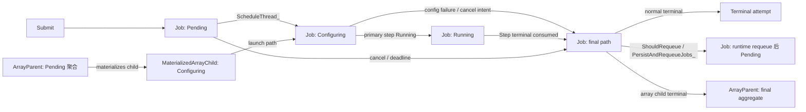
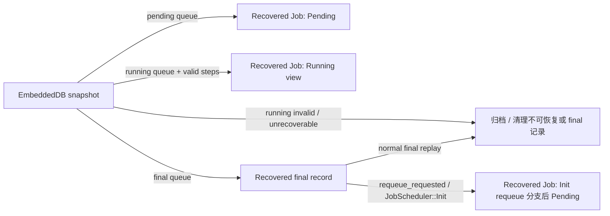

# Job 状态机

本文描述 `JobInCtld` 的状态机。Step 内部状态机只作为 Job 的输入引用；daemon、
primary、common step 的逐节点汇聚、cleanup 和 terminal 产生规则属于
`docs/design/step-state-machine.md`。

写作约束见 `docs/design/job-step-state-machine-overview.md`。本文中的
`Pending`、`Configuring`、`Running`、`Completed` 等状态均以 `JobInCtld` 为
状态主体，不能直接套用到 Step。

## 范围

本文主讲：

- Job submit/recovery 如何进入 pending 视图。
- scheduler 如何把 pending job 推向 configuring/running。
- Step terminal event 如何驱动 Job final path。
- normal completion、cancel、deadline、manual requeue、automatic requeue。
- 资源、账号、license、dependency event、EmbeddedDB/MongoDB 持久化。
- Array parent/child 的 materialization、child terminal 聚合和 parent finalize。
- pending/running map、node-to-job index、array meta、deadline timer queue 的
  ownership。
- inbound/outbound RPC、内部队列事件，以及同步/异步执行边界。
- ctld 重启后的 recovery 与 runtime path 差异。

本文不主讲：

- daemon/common/primary step 内部 transition。
- Craned supervisor/cgroup cleanup 的内部细节。
- Step terminal event 的逐节点汇总规则。

## 状态存储

Job 状态同时存在于持久化数据和运行时索引中：

| 存储位置 | 内容 | 说明 |
|---|---|---|
| `RuntimeAttrOfJob.status` | Job 当前状态 | EmbeddedDB variable db 的恢复分类依据 |
| `JobToCtld` | 提交时固定字段 | EmbeddedDB fixed db |
| `m_pending_job_map_` | 等待调度的 Job 或 array parent | submit/recovery/requeue/cancel/deadline 会写 |
| `m_running_job_map_` | 已开始配置或运行的 Job | scheduler、cancel、status-change final path 会写 |
| `m_node_to_jobs_map_` | node -> running job ids | scheduler 建索引，final/cancel failure path 清理 |
| `ArrayManager` / `ArrayMeta` | array parent/child 聚合 | parent 注册、child materialize、child terminal、recovery accounting |
| MongoDB | 已结束 Job 归档 | normal final、requeue attempt archive、recovery final replay |

EmbeddedDB snapshot 按 `RuntimeAttrOfJob.status` 分成 pending/running/final：

- `Pending` -> pending queue。
- `Running`、`Suspended`、`Starting`、`Configuring`、`Completing` -> running queue。
- 其他状态 -> final queue。

这只是 recovery 输入分类，不等价于 runtime transition。

## 主图

主状态图只描述 runtime Job 层的迁移。Recovery 不在这张图中，因为 recovery 是
从持久化状态重建 runtime view，不是 runtime transition replay。RPC、DB 写入和
异步动作在后续 transition 表中展开。

Recovery 单独表示为：

## 转换摘要

| 转换 | 入口 RPC/event | 处理入口 | 执行模式 | 主要操作 |
|---|---|---|---|---|
| submit -> `Pending` | `SubmitBatchJob` / `SubmitBatchJobs` | `SubmitJobToScheduler` -> `SubmitJobAsync` -> `CleanSubmitJobQueueCb_` | RPC thread 等待 future；实际 queue drain 是异步/批处理 | 校验、预留 submit QoS、追加 EmbeddedDB pending 记录、插入 `m_pending_job_map_`、注册 array parent、创建 deadline timer |
| `Pending` -> `Configuring` | scheduler tick | `ScheduleThread_` | scheduler 线程；`AllocJobs`/`AllocSteps` task 被 detach，但 scheduler 用 latch 等结果 | node select、分配 account/license/node/reservation 资源、设置 runtime status 为 `Configuring`、追加 daemon step、调用 Craned allocation RPC |
| `Configuring` -> `Running` | Step status queue | `CleanJobStatusChangeQueueCb_` 消费 primary step 的 running side effect | 异步 status queue；DB 后续批量持久化 | Step 文档负责 daemon/primary 细节；primary step running 后 Job status 变为 `Running` |
| `Running`/`Configuring` -> final path | `StepStatusChange` 或 synthetic status event | `StepStatusChangeAsync` -> `CleanJobStatusChangeQueueCb_` | enqueue + async handle；final processing 批处理 | 消费 step terminal 结果，设置 Job final status/exit/end time，释放 scheduler 资源，选择 normal final 或 requeue |
| pending cancel/deadline -> final path | `CancelJob` RPC 或 deadline timer | `CancelPendingOrRunningJob` / `CancelDeadlineJobCb_` -> `CleanCancelJobQueueCb_` | 调用方入队；cancel queue 异步 drain | 移除 pending job，设置 terminal status，释放 submit QoS，触发 dependency event，归档 |
| running cancel -> 后续 final path | `CancelJob` RPC | `CancelRunningJobNoLock_` -> `TerminateRunningStepNoLock_` | enqueue termination；final status 等待后续 `StepStatusChange` | 通过 Craned 终止 primary/common step；`CancelJob` RPC 不是 Job final barrier |
| manual requeue intent | `RequeueJob` RPC | `RequeueJob` | RPC 同步持久化 intent；实际 requeue 等待 final path | 校验 running job、权限、类型和配置；设置 `requeue_requested`；终止 primary 或在 configuring 中延后 |
| runtime final path -> requeue 后 `Pending` | Step terminal 或 synthetic status event | `PersistAndRequeueJobs_` | 同步 DB/archive/reset，然后插入 pending map | 归档当前 attempt，重置 step id counter，`ResetForRequeue`，更新 runtime attr，必要时内存中 hold，重建 deadline timer |
| recovery final replay -> requeue 后 `Pending` | ctld 启动时 final queue 中带 `requeue_requested` | `JobScheduler::Init` requeue 分支 | 同步启动期重建 | 归档当前记录，重置 step id counter，`ResetForRequeue`，更新 runtime attr，必要时内存中 hold，插入 pending |
| array parent -> child `Configuring` | scheduler tick | `ArrayManager::MaterializeChildForAllocation` from `ScheduleThread_` | scheduler 线程 | parent 保持 pending；materialized child 跳过 pending 阶段并进入 launch path |
| array child terminal -> parent aggregate | child normal final | `ArrayManager::OnChildTerminal` / `ProcessFinalParents` | 在 scheduler/status lock 内收集，释放锁后持久化 | 更新 parent accounting；完成时 finalize parent；持久化 parent archive 和 plugin hook |
| recovery -> runtime view 或 archive | ctld startup | `JobScheduler::Init` | 同步启动期重建 | 从 EmbeddedDB 重建 pending/running/final queue；恢复 step；重建 array accounting；失败/归档不可恢复对象 |

`CtldForInternalServiceImpl::StepStatusChange` 只通过
`StepStatusChangeAsync` 入队并返回 `ok=true`。这个 reply 不表示 Job 已经 final、
archive 或 requeue 落地。

## 提交到 Pending

普通 batch submit 通过 `CraneCtldServiceImpl::SubmitBatchJob` 或
`SubmitBatchJobs` 进入。

Runtime 流程：

1. RPC handler 根据 `JobToCtld` 构造 `JobInCtld`。
2. 可选 Lua submit hook 在调度准入前运行。
3. `SubmitJobToScheduler` 校验 uid/user/account/partition，填充 optional 字段，
   获取 job attributes，并执行 job validity 检查。
4. submit 侧 QoS 使用量通过 `TryMallocMetaSubmitResource` 和 `UserAddJob`
   预留。
5. `SubmitJobAsync` 将 job 入队并返回 future。
6. `CleanSubmitJobQueueCb_` drain queue，设置状态为 `Pending`，通过
   `AppendJobsToPendingAndAdvanceJobIds` 写入 EmbeddedDB，插入
   `m_pending_job_map_`，必要时注册 array parent，按配置创建 deadline timer，
   最后 resolve submit promise。

执行模式：

- 外部 RPC 会等待 future，因此从 CLI 视角看，submit 会同步等待 job id 或错误。
- 实际 map/DB mutation 进入 submit thread 后排队批处理。
- deadline timer 创建通过 `m_job_deadline_timer_create_queue_` 异步完成。

失败收敛：

- validation failure 会在入队前直接返回错误。
- pending queue 容量拒绝会释放 submit QoS，并用错误完成 promise。
- EmbeddedDB append failure 会释放 submit QoS，并返回
  `ERR_DB_INSERT_FAILED`.
- DB append 后发现 missing dependency 时，会 purge 刚创建的 EmbeddedDB entry，
  并拒绝该 job。

## Pending 到 Configuring

`ScheduleThread_` 负责 runtime 中从 `m_pending_job_map_` 到 launch attempt 的迁移。

Guard：

- job 未被 hold。
- begin time 已到。
- dependencies 已满足。
- 如果 pending 对象是 array parent，则 array parent 可以 materialize 下一个 child。
- node selection 已产生 allocation，且 resource-reduction 检查仍通过。
- license 和 account running resources 可以分配。

主要操作：

1. `NodeSelect` 从 pending/running 视图选择候选 job。
2. 对 array parent，`MaterializeChildForAllocation` 构造真实 child
   `JobInCtld`；child 跳过 pending 阶段。
3. 填充 launch job 字段：start/end time、allocated nodes/resources、licenses、
   allocated regex、`Configuring` status。
4. 分配 node/reservation resources，并填充 `m_node_to_jobs_map_`。
5. Job runtime attr 写入 EmbeddedDB variable transaction。
6. 创建 daemon step 并 append 到 step DB。
7. Ctld 向 Craned 发送 `AllocJobs` 和 daemon-step `AllocSteps`。
8. 成功创建的 job 移入 `m_running_job_map_`；失败的 launch attempt 被标记为
   `Failed`，释放资源并归档。

RPC 与同步性：

- `AllocJobs` 和初始 daemon `AllocSteps` 在 worker-pool detached task 中运行，
  但 scheduler 会等待 latch，再决定本批 launch 成功或失败。
- status processing 中后续 step-level RPC 不同：它们通常是 fire-and-forget，
  通过后续 status report 或 synthetic failure 收敛。

当前实现 caveat：

- runtime attr 会在 Craned allocation RPC 完成前先持久化为 `Configuring`。
- 源码中对 running-map insertion 与耗时 RPC 的顺序留有 FIXME。本文将其记录为
  当前行为，而不是理想 invariant。

## Configuring 到 Running

该转换由 Step 状态变化产生：

- daemon step setup 先完成。
- primary step 随后创建并分配。
- primary step 到达 running 后，`CommonStepInCtld::StepStatusChange` 将所属
  Job 更新为 `Running`。

Job 文档边界：

- Job 文档只负责说明 `JobInCtld.status` 变为 `Running` 这一可观察事实，以及
  runtime attr 后续由 `CleanJobStatusChangeQueueCb_` 持久化。
- daemon node configured count、primary step allocation、cleanup、terminal report
  ordering 等细节属于 Step 文档。

## Final 路径

当 `CleanJobStatusChangeQueueCb_` 收到一个返回 Job final status 的 step-level
结果时，Job final path 开始。

因此，入口 `StepStatusChange` RPC 只是 event-delivery 边界，不是 Job finalization
barrier。真正的 Job finalization 由后续 status-change queue cleaner 完成。

在 pending/running/index lock 下的主要操作：

1. 查找 running Job；unknown job 只记录 warning 并忽略。
2. 将 status event 分发给 daemon step 或 common step。
3. 如果 step 返回 Job final status，则设置 Job status、exit code 和 end time。
4. 为 Craned 准备 `FreeJobs`。
5. 计算 `ShouldRequeue`。
6. 删除 node-to-job index，并释放 node/reservation resources。
7. 分流到 normal completion path 或 requeue path。
8. 从 `m_running_job_map_` 删除该 Job。

普通结束路径：

- 非 array child 触发 dependency events。
- 释放 account meta resource 和 licenses。
- 如有配置，使用 detached task 运行 CraneCtld epilog。
- 对 array child 调用 `ArrayManager::OnChildTerminal`。
- 持久化 step runtime changes，处理 final steps，持久化 job runtime changes，
  归档到 MongoDB，purge EmbeddedDB active records，并运行 plugin hook。

Requeue 路径：

- 释放 running account resources，但保留 submit count。
- 释放 licenses。
- 不触发 dependency events。
- 对 requeued attempt 不调用 `ArrayManager::OnChildTerminal`。
- 先持久化 terminal runtime attr，再由 `PersistAndRequeueJobs_` 归档该 attempt，
  并 reset 回 pending。

出站 action 与顺序：

- step/job status processing 产生的 `AllocSteps`、`FreeSteps`、`ExecuteSteps`、
  `TerminateSteps`、`FreeJobs` 会通过 worker-pool detached task 分发。
- 部分 outbound step RPC failure 会通过 synthetic
  `StepStatusChangeWithReasonAsync` 回流。
- EmbeddedDB 写入发生在 outbound RPC task 调度之后：step runtime transaction、
  final step processing、job runtime transaction、final job processing，随后进入
  requeue 或 array-parent final processing。

## Requeue

`JobInCtld::ShouldRequeue` 只允许 Batch job requeue，并拒绝 `no_requeue`。
之后再考虑 manual `requeue_requested`、system-level `EC_CRANED_DOWN`/`EC_RPC_ERR`
和显式 `requeue_if_failed`。

手动 requeue：

- 入口 RPC 是 `RequeueJob`。
- 只接受 running job；pending/final/nonexistent job 会被拒绝。
- array parent requeue 会被拒绝；materialized running child 按普通 running Job
  处理。
- mutation 前会检查权限、interactive job、`no_requeue`、cluster/job requeue
  allowance。
- `requeue_requested` 会在 termination 前写入 EmbeddedDB。
- 如果当前 Job status 是 `Configuring`，还会设置 `cancel_requested`，并把操作延后
  交给 configuring 状态机收敛。
- 否则通过 `TerminateRunningStepNoLock_` 将 primary step termination 入队。

实际 requeue：

1. final path 保存该 terminal attempt 的状态。
2. `PersistAndRequeueJobs_` 将 attempt 插入 MongoDB。
3. 重置 EmbeddedDB step id counter。
4. `ResetForRequeue` 清理 runtime execution fields、step pointers、allocated
   nodes/resources/licenses、primary status、exit code、cancel/requeue intent，
   并将 Job status 设置为 `Pending`。
5. 更新 EmbeddedDB 中的 runtime attr。
6. 如果 `RequeueCount >= MaxRequeueCount`，则在内存中 hold 该 job。
7. 必要时重建 deadline timer。
8. 将 job 重新插入 `m_pending_job_map_`。

当前持久化 caveat：`PersistAndRequeueJobs_` 会先更新 reset 后的 pending
runtime attr，然后才调用 `SetHeld(true)`。`JobScheduler::Init` 的 recovery 分支
也遵循相同模式。因此本文将 held-on-limit 视为当前内存行为，而不是同一次 DB 写入中
已确认持久化的字段。

失败收敛：

- 如果 intent 持久化失败，RPC 会恢复内存中的 intent 字段并返回失败。
- 如果 archive 后 requeue DB reset/update 失败，active EmbeddedDB record 会被 purge，
  该 job 会从 runtime 中丢弃。

## Cancel 与 Deadline

Pending 阶段 cancel：

- `CancelJob` 在 pending/running lock 下解析 selector，检查 filter 和权限。
- pending job 会从 `m_pending_job_map_` 移出，并作为
  `CancelPendingJobQueueElem`.
- `CleanCancelJobQueueCb_` 设置 terminal status，释放 submit QoS，触发 dependency
  events，必要时处理 interactive callback，然后归档。

Running 阶段 cancel：

- 如果 job 仍处于 `Configuring`，`CancelRunningJobNoLock_` 只设置
  `cancel_requested`。
- 否则通过入队 `CancelRunningJobQueueElem` 终止 primary step 或选中的 common
  steps。
- `CleanCancelJobQueueCb_` 按 Craned 和 terminate source 批量发送
  `TerminateSteps`。
- final Job status 仍通过 Step terminal events 到达；cancel RPC 不是 Job
  finalization barrier。

Deadline：

- deadline timer 将 job id 入队到 `m_job_deadline_timer_queue_`。
- `CancelDeadlineJobCb_` 将 pending job 转换成带 `Deadline` status 的
  `CancelPendingJobQueueElem`。
- array parent deadline 会入队 `CancelArrayParentQueueElem`。
- running job 在 cancel 过程中超时时，生成 synthetic status 时可能将 final
  timestamp clamp 到预期 timeout。

## Array 生命周期

Array parent 保存在 `m_pending_job_map_` 中，并注册到 `ArrayManager`。parent
不是 Step container。存储状态和展示状态可以不同：parent 仍以 `Pending` 存储时，
只要至少一个 child 已启动，`EffectiveDisplayStatus()` 就可以将其展示为
`Running`。

调度 array parent 时可能 materialize 一个 child：

- `PrepareParentForMaterialization` 检查是否还能 spawn 新 child。
- `MaterializeChildForAllocation` 构造真实 child `JobInCtld`。
- child 跳过 pending phase，因为 node selection 已经给出了 allocation。
- child launch 成功后，`OnChildStarted` 标记 parent start/accounting state。

Array child 结束聚合：

- normal child terminal 会调用 `OnChildTerminal`。
- parent finalization 在持有 scheduler/status locks 时收集；释放锁后由
  `ProcessFinalParents` 持久化 parent archive 并触发 plugin hook。
- requeued child 不会为该 attempt 通知 `OnChildTerminal`，因为从 array parent
  视角看，它还没有真正完成。

Recovery 专属 array 规则：

- recovered running children 会按 parent 分组，并在 parent registration 后校验。
- recovered pending array children 在当前 direct-to-running 设计下被视为 invalid，
  会 fail/archive，并在可能时记录 parent accounting。
- recovered terminal children 使用 `TrackRecoveredTerminalChild`，不走普通
  runtime `OnChildTerminal`。

## Recovery

`JobScheduler::Init` 从 EmbeddedDB 重建 runtime state。Recovery 不是 runtime
transition replay。

Running queue 恢复：

- 从 fixed/runtime attrs 重建 `JobInCtld`。
- invalid job 或 interactive job 会标记为 `Failed` 并归档，除非 `ShouldRequeue`
  允许 reset 到 pending。
- valid batch job 暂存在 `recovered_running_jobs`，直到 step snapshot 处理完成。
- array children 按 parent 分组，后续再校验。

Pending queue 恢复：

- 重建 `JobInCtld`，校验 attributes 和 job validity。
- interactive pending jobs 会 fail。
- 在 direct-to-running 设计中，pending array children 是 invalid。
- valid pending jobs 通过
  `RequeueRecoveredJobIntoPendingQueueLock_`.
- deadline timers 会重建。

Final queue 恢复：

- 如果设置了 `requeue_requested`，则归档当前状态、reset job、更新 runtime attr，
  并插入 pending。
- 否则确认 MongoDB 中已有 final record，然后 purge EmbeddedDB active record。

Step snapshot 恢复：

- 没有可恢复 step 的 running job 会标记为 failed 并归档。
- completed step records 会移动到 final step storage。
- step 细节由 Step 状态机文档覆盖；Job recovery 只消费 recovered job 是否能保持
  running，或必须 fail/archive。

## DB 与 RPC 顺序

| 路径 | DB 顺序 | RPC/action 模式 |
|---|---|---|
| submit accepted | 先 `AppendJobsToPendingAndAdvanceJobIds`，再插入 pending map | submit RPC 等待 future；timer 创建异步 |
| schedule launch | job runtime attr -> daemon step append -> Craned `AllocJobs`/`AllocSteps` | detached RPC task，scheduler 等待 latch |
| status final normal | step runtime attr -> process final steps -> job runtime attr -> MongoDB archive -> EmbeddedDB purge | cleanup/execute/free RPC task 是 fire-and-forget |
| status final requeue | 先 terminal runtime attr，再 MongoDB archive -> step id reset -> pending runtime attr update -> pending-map insert | deadline timer 异步重建 |
| pending cancel/deadline | terminal runtime attr -> MongoDB archive -> EmbeddedDB purge | cancel queue 异步；optional callback detached |
| array parent final | parent active record 先从 pending map splice 出来，释放锁后 parent archive/purge/plugin | plugin hook 通过现有 plugin client 异步 |
| recovery | 读取 EmbeddedDB snapshot -> 按需 MongoDB insert/archive -> EmbeddedDB purge/update | startup 同步；不假设 normal runtime RPC replay |

## 幂等与过期事件

- status-change queue 中的 unknown Job 会记录 warning 并忽略。
- known Job 中的 unknown Step 会记录 warning 并忽略。
- intent 持久化后的重复 manual requeue，在 job 仍 running 时本质上是再次接受同一
  intent；真正 reset 只在 final path 运行时发生。
- `Configuring` 期间的 cancel/requeue 只记录 intent，并等待 step state 收敛。
- recovered final queue record 插入前会先检查 MongoDB。
- Job 离开 running map 后到达的 runtime status event 会被视为 stale 并忽略。

## 未决问题与已知边界

- Scheduling 当前有一个 FIXME，涉及 jobs 进入 running map 与耗时 Craned RPC 的
  先后关系。本文记录当前行为，但不声明 early status report 不可能发生。
- Step recovery 细节需要 Step 文档继续明确哪些 step state 可恢复，哪些会强制 Job
  failure。
- Array pending child recovery 在当前 direct-to-running 设计下视为 invalid；未来
  array 设计变化时需要同步更新本节。

## 代码锚点

- `src/CraneCtld/RpcService/CtldGrpcServer.cpp:691` `SubmitBatchJob`
- `src/CraneCtld/RpcService/CtldGrpcServer.cpp:790` `SubmitBatchJobs`
- `src/CraneCtld/RpcService/CtldGrpcServer.cpp:39` `StepStatusChange`
- `src/CraneCtld/JobScheduler.cpp:3354` `SubmitJobToScheduler`
- `src/CraneCtld/JobScheduler.cpp:4941` `CleanSubmitJobQueueCb_`
- `src/CraneCtld/JobScheduler.cpp:1305` `ScheduleThread_`
- `src/CraneCtld/JobScheduler.cpp:3527` `CancelPendingOrRunningJob`
- `src/CraneCtld/JobScheduler.cpp:4695` `CleanCancelJobQueueCb_`
- `src/CraneCtld/JobScheduler.cpp:2095` `CreateDeadlineTimerCb_`
- `src/CraneCtld/JobScheduler.cpp:2150` `CancelDeadlineJobCb_`
- `src/CraneCtld/JobScheduler.cpp:3838` `RequeueJob`
- `src/CraneCtld/JobScheduler.cpp:5227` `StepStatusChangeAsync`
- `src/CraneCtld/JobScheduler.cpp:5251` `CleanJobStatusChangeQueueCb_`
- `src/CraneCtld/JobScheduler.cpp:6801` `ProcessFinalJobs_`
- `src/CraneCtld/JobScheduler.cpp:6875` `PersistAndRequeueJobs_`
- `src/CraneCtld/CtldPublicDefs.cpp:1642` `JobInCtld::ShouldRequeue`
- `src/CraneCtld/CtldPublicDefs.cpp:1659` `JobInCtld::ResetForRequeue`
- `src/CraneCtld/Array.cpp:682` `PrepareParentForMaterialization`
- `src/CraneCtld/Array.cpp:701` `MaterializeChildForAllocation`
- `src/CraneCtld/Array.cpp:643` `OnChildTerminal`
- `src/CraneCtld/Array.cpp:446` `TrackRecoveredTerminalChild`
- `src/CraneCtld/Database/EmbeddedDbClient.cpp:818` `RetrieveLastSnapshot`
