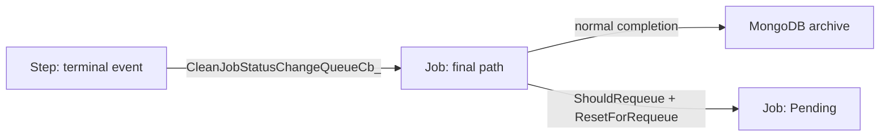

# Job/Step 状态机总览与写作契约

本文是 Job 与 Step 状态机文档的入口和写作契约。本文档集以状态机为主线：
总览文档定义状态词表、事件模型和写作契约；Job 文档描述 `JobInCtld` 如何在
调度、取消、requeue、array、recovery、archive 中迁移；Step 文档描述
daemon/primary/common step 如何从 Craned/supervisor 事件汇聚出 Job 可消费的
terminal 信号。

## 文档导航

- `docs/design/job-state-machine.md`: Job 状态机。主讲 `JobInCtld` 的状态、
  调度、资源、持久化、array 聚合、requeue、archive 和 recovery。
- `docs/design/step-state-machine.md`: Step 状态机。主讲 daemon/common/primary
  step 的状态、Craned 状态上报、cleanup 和 terminal 汇总。
- `docs/design/job-step-state-machine-plan.md`: 执行计划、agent/session 拆分和
  交付顺序。

## 状态主体

CraneSched 的 `JobStatus` 定义在 `protos/PublicDefs.proto`，当前枚举值包括：

```text
Pending
Running
Completed
Failed
ExceedTimeLimit
Cancelled
OutOfMemory
Configuring
Starting
Completing
Suspended
Deadline
Invalid
```

这些名字同时出现在 Job runtime attr 和 Step runtime attr 中，但它们只是共享词表，
不是共享状态机。文档必须先声明状态主体：

| 状态主体 | 文档 | 说明 |
|---|---|---|
| `JobInCtld` | Job 状态机 | Job 的调度、资源、DB、array、requeue、dependency 和 final/archive |
| `DaemonStepInCtld` | Step 状态机 | job-level daemon step，负责 job 环境 setup/cleanup 的门闩 |
| `PrimaryStep` | Step 状态机 | `CommonStepInCtld` 的 primary 实例，驱动 Job 进入 Running 并提供 primary final status |
| `CommonStepInCtld` | Step 状态机 | 用户创建的 common step，以及 primary step 共享的通用 step 状态机主体 |
| Craned local step state | Step 状态机 | Craned 侧 supervisor/cgroup cleanup 后产生 `StepStatusChange` |
| Array parent aggregate | Job 状态机 | parent 不是 Step 状态机主体，聚合由 `ArrayManager` 维护 |
| Materialized array child | Job 状态机 | child 是真实 `JobInCtld`，Step 文档只把它当普通 Job 的 step 容器引用 |

禁止把同名状态直接串成一个全局状态机。例如 `Completing` 在 Job final path、
daemon step cleanup 和 common step cleanup 中含义不同，必须按 subject 分开说明。

## 事件来源

后续文档描述 transition 时，事件来源必须从以下集合中选择或扩展：

| 事件来源 | 典型入口 | 归属 |
|---|---|---|
| User RPC | submit/cancel/requeue/hold/release | Job 文档主讲，Step 文档只描述对 step 的影响 |
| Scheduler | `ScheduleThread_`、`StepScheduleThread_` | Job/Step 各讲各自主体 |
| Craned RPC / StepStatusChange | `StepStatusChangeAsync`、`CleanJobStatusChangeQueueCb_` | Step 生产，Job 消费 |
| Timer | deadline、time limit、异步 timer queue | Job 文档主讲 |
| ArrayManager | child materialize、child terminal、parent finalize | Job 文档主讲 |
| Recovery / DB replay | `JobScheduler::Init`、EmbeddedDB snapshot、step snapshot | Job/Step 都要单列 recovery section |
| Synthetic / internal event | ctld prolog internal node、Craned down synthetic failure、cancel/requeue intent 后的 deferred transition | 产生者所在文档主讲，消费者只引用 |
| DB maintenance | reset/purge/history maintenance | 只有影响状态机时才写，不能当 runtime drain 描述 |

`Synthetic / internal event` 必须显式标注，不能写成真实 Craned 上报。例如：

- ctld prolog 完成事件使用 internal node identity 进入 daemon step。
- Craned down 或 RPC failure 可以由 ctld 合成 `StepStatusChange`。
- `cancel_requested` / `requeue_requested` 是 intent 写入，真正 transition 由后续
  step/job 状态机收敛。
- DB replay 派生出的失败归档、pending 重建和 array accounting 不是 runtime event
  原样重放。

## 跨文档归属

| 主题 | 主文档 | 引用边界 |
|---|---|---|
| Step terminal event 如何产生 | Step | Job 只引用 terminal event 的结果 |
| Job 如何消费 terminal event 并 final/requeue/archive | Job | Step 只说事件交给 Job final path |
| daemon/primary/common step 协作 | Step | Job 只引用 `AllStepsFinished()` 和 primary final status |
| 资源、账号、license、dependency event | Job | Step 不展开这些副作用 |
| Array child/parent 聚合 | Job | Step 不主讲 array parent 状态 |
| Recovery 入口和 DB snapshot 分类 | Job | Step 文档只讲 step recovery 与 job running recovery 的交接 |
| Craned supervisor/cgroup cleanup | Step | Job 只说明 cleanup 完成后才能 final |

禁止重复定义：

- Overview 只保留术语、桥接图和写作契约，不重新解释完整 Job 或 Step 状态机。
- Step 文档只定义 terminal event 如何产生、汇聚、去重、触发 cleanup。
- Job 文档只定义如何消费 `AllStepsFinished()`、primary final status、daemon final
  status，并进入 final/requeue/archive。
- Array parent aggregate、materialized child、pending child、terminal child 不和普通
  Job 状态机混写；Job 文档单独建小节说明，Step 文档只引用 materialized child 的
  Step 容器语义。

## Transition 写作模板

每个正式 transition 至少覆盖以下字段。可以用表格，也可以用同名小节。

| 字段 | 必须回答的问题 |
|---|---|
| 状态主体 | 这是 Job、daemon step、primary step、common step，还是 Craned local state？ |
| 存储状态 | 状态存在哪里？`RuntimeAttrOfJob`、`RuntimeAttrOfStep`、内存 map、array meta，还是 Craned 本地结构？ |
| 事件来源 | 谁触发？User RPC、scheduler、Craned report、timer、ArrayManager、recovery？ |
| 入站 RPC/event | 如果由 RPC 或队列事件进入，RPC/message 名称是什么？是否是 synthetic/internal event？ |
| 处理入口 | 主要代码入口是什么？ |
| 守卫条件 | transition 发生前必须满足哪些条件？ |
| 锁和 map ownership | 需要持有哪些锁？读写哪些 map/index？例如 pending/running map、step map、array meta。 |
| 副作用 | 会发 RPC、释放资源、触发 hook、更新 array/account/license/dependency 吗？ |
| 出站 RPC/action | 是否会向 Craned 发 `AllocSteps`、`ExecuteSteps`、`TerminateSteps`、`FreeSteps`、`FreeJobs`，或触发 timer/hook？ |
| 执行模式 | 这条 transition 是同步完成、enqueue 后异步处理、detach task/fire-and-forget，还是等待后续状态上报收敛？ |
| 持久化写入 | 会写 EmbeddedDB、MongoDB、step db、job db 吗？写入顺序是什么？ |
| DB 更新顺序 | 如果同时写 step/job/array/archive，必须说明顺序和失败后收敛路径。 |
| 幂等性 | 重复事件如何处理？重复 RPC、重复 status report、重复 recovery 是否安全？ |
| 过期/乱序处理 | 迟到、未知 job/step、旧状态事件如何收敛？ |
| 失败收敛 | DB 写失败、RPC 失败、Craned down、ctld 重启时最终落到哪个状态？ |
| 可观测结果 | 用户能从 `cqueue`、`ccontrol`、日志、DB 或测试中看到什么结果？ |
| 可观测性/测试 | 关键日志、CLI 表现、已有或需要补充的测试是什么？ |

## Runtime 与 Recovery 边界

runtime 路径和 recovery 路径必须分开写：

- runtime 路径可以依赖 scheduler 线程、status-change queue、Craned 连接、timer
  async handle 和正在运行的内存索引。
- recovery 路径从 `JobScheduler::Init` 进入，先根据 EmbeddedDB snapshot 重建
  pending/running/final 视图，再恢复 step snapshot 和 array accounting。
- Recovery 不是重放 runtime transition。恢复期的目标是从持久化状态重建 runtime
  view，或把无法恢复的对象收敛到失败归档。
- Recovery 不能默认复用 runtime transition 的所有副作用。凡是涉及异步 handle、
  Craned RPC、scheduler loop、timer queue 或 array parent finalize 的地方，都要
  明确说明 recovery 中是否允许、延后、跳过或转换成失败归档。
- Recovery 不能假设 scheduler thread、deadline async handle、Craned 连接和
  status-change queue 已经可用。运行时 Mermaid 边不能直接作为 recovery 事实依据。
- DB snapshot 中的 pending/running/final 分类由 runtime attr status 决定；这只是
  recovery 输入分类，不等价于 runtime transition。

## 代码入口地图

后续文档以当前分支的这些入口为第一批锚点：

建议阅读顺序：

1. 先读 proto/status vocabulary，确认共享词表。
2. 再读 Ctld job lifecycle，确认 Job 如何调度、final、requeue、recovery。
3. 再读 Ctld step aggregation，确认 daemon/common/primary step 如何汇总 terminal。
4. 再读 Craned status producer，确认 status 是真实上报还是 synthetic/internal。
5. 最后读 array 和 persistence，确认 parent/child 聚合和 DB/archive 边界。

| 主题 | 入口 |
|---|---|
| 共享状态词表 | `protos/PublicDefs.proto:108` `enum JobStatus` |
| Job/Step 数据结构 | `src/CraneCtld/CtldPublicDefs.h`、`src/CraneCtld/CtldPublicDefs.cpp` |
| Job recovery | `src/CraneCtld/JobScheduler.cpp:175` `JobScheduler::Init` |
| EmbeddedDB snapshot 分类 | `src/CraneCtld/Database/EmbeddedDbClient.cpp:818` `RetrieveLastSnapshot` |
| 主调度循环 | `src/CraneCtld/JobScheduler.cpp:1305` `ScheduleThread_` |
| Step 调度循环 | `src/CraneCtld/JobScheduler.cpp:1970` `StepScheduleThread_` |
| 手动 requeue | `src/CraneCtld/JobScheduler.cpp:3838` `RequeueJob` |
| Job final/status queue | `src/CraneCtld/JobScheduler.cpp:5227` `StepStatusChangeAsync`、`:5251` `CleanJobStatusChangeQueueCb_` |
| Job requeue reset/archive | `src/CraneCtld/JobScheduler.cpp:6875` `PersistAndRequeueJobs_` |
| Job requeue 判断 | `src/CraneCtld/CtldPublicDefs.cpp:1642` `JobInCtld::ShouldRequeue` |
| Job requeue reset 字段 | `src/CraneCtld/CtldPublicDefs.cpp:1659` `JobInCtld::ResetForRequeue` |
| Daemon step 状态机 | `src/CraneCtld/CtldPublicDefs.cpp:612` `DaemonStepInCtld::StepStatusChange` |
| Common/primary step 状态机 | `src/CraneCtld/CtldPublicDefs.cpp:1232` `CommonStepInCtld::StepStatusChange` |
| Craned 本地 status queue | `src/Craned/Core/JobManager.cpp:1594` `EvCleanStepStatusChangeQueueCb_` |
| Craned Completing/terminal 生成 | `src/Craned/Core/JobManager.cpp:1695` `SendCompletingAndTerminal_` |
| Craned 上报 Ctld | `src/Craned/Core/CtldClient.cpp:1120` `SendStatusChanges_` |
| Array materialization | `src/CraneCtld/Array.cpp:682` `PrepareParentForMaterialization`、`:701` `MaterializeChildForAllocation` |
| Array child terminal | `src/CraneCtld/Array.cpp:643` `OnChildTerminal` |
| Array recovery tracking | `src/CraneCtld/Array.cpp:446` `TrackRecoveredTerminalChild` |

行号只作为当前草稿锚点。正式发布前必须在目标分支上重新核对。

## Mermaid / Feishu 规范

- 每张图只描述一个层级：总览图、Job 图、Step 图、requeue 子图、recovery 子图分开。
- 每篇正式文档最多一张主状态图；DB/RPC/hook/timer 等副作用用 sequence 图或表格
  展开，不塞进主状态图。
- 主状态图回答“什么时候从 A 到 B”。transition 表和 sequence 图回答“这条边背后
  有哪些 RPC、做了什么操作、同步还是异步、失败如何收敛”。
- 节点名必须带 subject，例如 `Job: Pending`、`DaemonStep: Completing`、
  `PrimaryStep: Running`。
- 边上的 label 使用 `event / handler / key side effect` 这种短格式。
- 不在图中塞完整错误处理；错误收敛用旁边表格说明。
- Mermaid 源码必须保留在 Markdown 中。若 Feishu 渲染效果不稳定，M5 再导出
  SVG/PNG。
- 图标题应稳定，便于后续代码变更后按标题查找并重画。

示例：



## 后续文档验收清单

- 是否明确状态主体？
- 是否按 transition 模板覆盖副作用、持久化和错误收敛？
- 是否避免把同名 `JobStatus` 当成同一个状态机？
- 是否区分 runtime 和 recovery？
- 是否只在主文档展开本主题，跨文档只做引用？
- 是否有独立 Mermaid 图和对应文字说明？
- 是否标注未决问题，而不是把未确认行为写成事实？
