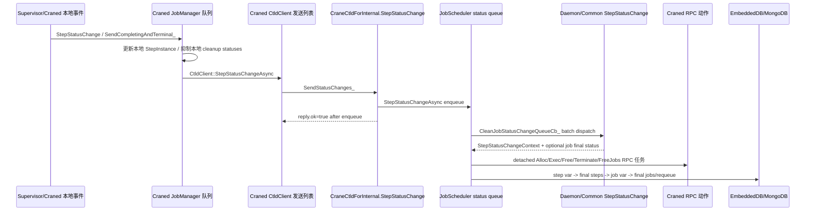

# Step 状态机

本文描述 CraneSched 的 Step 状态机。这里的 `Configuring`、`Running`、
`Completing`、`Completed` 等状态均以 Step 为状态主体，不把
`JobStatus` 当成 Job/Step/Craned 共用的一套状态机。

写作边界见 `docs/design/job-step-state-machine-overview.md`。Job final、
requeue、archive、array parent aggregate 只在本文中作为 Step terminal 交接
的下游引用，完整流程见 `docs/design/job-state-machine.md`。

## 范围

本文主讲：

- `DaemonStepInCtld::StepStatusChange` 的配置、运行、cleanup 和 terminal 汇聚。
- `CommonStepInCtld::StepStatusChange`，包括 primary step 与普通 common step。
- Craned 本地如何从 supervisor/cgroup cleanup 产生 `StepStatusChange`。
- Ctld status queue 如何批量消费 `StepStatusChange` 并驱动 Step 状态机。
- `StepStatusChangeContext` 中的 outbound action、同步/异步边界和 DB 写入顺序。
- ctld prolog internal event、Craned down synthetic event、`Configuring` 期间的
  cancel intent。
- Step recovery 如何从 EmbeddedDB step snapshot 恢复。

本文不主讲：

- Job final path 的资源释放、dependency、archive、requeue、array parent finalize。
- pending job 调度、账号/License/QoS 的完整状态迁移。
- MongoDB Job archive 的完整写入语义。

## 状态主体与存储

| 状态主体 | 存储状态 | 说明 |
|---|---|---|
| `DaemonStepInCtld` | `RuntimeAttrOfStep`、`JobInCtld::DaemonStep()` | job-level daemon step，负责 job 环境 setup/cleanup 门闩。 |
| Primary step | `RuntimeAttrOfStep`、`JobInCtld::PrimaryStep()`、`primary_step_status` | `CommonStepInCtld` 的 primary 实例。进入 `Running` 时把 Job 推到 `Running`；terminal 后保存 primary final status。 |
| Common step | `RuntimeAttrOfStep`、`JobInCtld::Steps()` | 用户提交的普通 step，共用 `CommonStepInCtld` 状态机。 |
| Craned local step | `JobInstance::step_map`、`StepInstance::status`、`pending_terminal_status` | 本地 supervisor/cgroup 状态，不直接等于 Ctld Step persisted state。 |
| Ctld status queue | `m_job_status_change_queue_` | `StepStatusChangeAsync` 只入队，`CleanJobStatusChangeQueueCb_` 才调用 Step 状态机。 |
| Craned send queue | `CtldClient::m_step_status_change_list_` | 转发给 Ctld 的待发送 list，RPC 失败会 splice 回 list 重试。 |

`StepInCtld` 的持久化字段来自 `RuntimeAttrOfStep`：`status`、
`error_status`、`error_exit_code`、`exit_code`、`craned_ids`、
`execution_nodes`、`configuring_nodes`、`running_nodes`、
`completing_nodes`、`start_time/end_time` 等。`RecoverFromDb` 直接恢复这些
snapshot 字段，不重放 runtime transition。

## 主图

主状态图只回答 Step 何时迁移。RPC、DB 和 cleanup ordering 在后续表格展开。

```mermaid
flowchart LR
  daemon_cfg["DaemonStep: Configuring"]
  daemon_run["DaemonStep: Running"]
  daemon_comp["DaemonStep: Completing"]
  daemon_term["DaemonStep: terminal"]

  primary_cfg["PrimaryStep: Configuring"]
  primary_run["PrimaryStep: Running"]
  primary_comp["PrimaryStep: Completing"]
  primary_term["PrimaryStep: terminal"]

  common_cfg["CommonStep: Configuring"]
  common_run["CommonStep: Running"]
  common_comp["CommonStep: Completing"]
  common_term["CommonStep: terminal"]
  common_released["CommonStep: released"]

  running_handoff["交接: 更新 Job Running"]
  final_handoff["交接: 返回 Job final signal"]

  daemon_cfg -->|所有 daemon nodes configured + ctld prolog ok| daemon_run
  daemon_cfg -->|配置失败或 cancel intent| daemon_comp
  daemon_run -->|所有 daemon nodes Completing| daemon_comp
  daemon_comp -->|所有 daemon nodes terminal| daemon_term

  daemon_run -->|创建 primary + AllocSteps| primary_cfg
  primary_cfg -->|所有 execution nodes Starting| primary_run
  primary_run -->|primary 更新 Job runtime attr| running_handoff
  primary_cfg -->|配置失败或 cancel intent| primary_comp
  primary_run -->|所有 execution nodes Completing| primary_comp
  primary_comp -->|所有 execution nodes terminal| primary_term
  primary_term -->|触发 daemon FreeSteps| daemon_comp

  common_cfg -->|所有 execution nodes Starting| common_run
  common_cfg -->|配置失败| common_comp
  common_run -->|所有 execution nodes Completing| common_comp
  common_comp -->|所有 execution nodes terminal| common_term

  daemon_term -->|AllStepsFinished + primary final status| final_handoff
  primary_term -->|等待 daemon terminal| daemon_comp
  common_term -->|仅 release| common_released
```

## 事件管线

Step status 先在 Craned 本地生产，再进入 Ctld status queue，最后由 Ctld
`StepStatusChangeContext` 产生 outbound action。

`StepStatusChangeReply.ok=true` 只表示 Ctld RPC handler 已接受并入队，不表示 Step
已完成、Job 已 final、archive 已完成或 requeue 已落地。

## Craned 状态生产

### 本地队列

`JobManager::ActivateStepStatusChangeAsync_` 构造 `StepStatusChangeQueueElem`，
写入 `m_step_status_change_queue_` 并触发 `m_step_status_change_async_handle_`。
入口包括：

- supervisor 通过 Craned `StepStatusChange` RPC 上报。
- `SendCompletingAndTerminal_` 主动生成 `Completing` 与 terminal 两个事件。
- alloc/prepare/spawn/prolog/terminate/time-limit 查询等本地失败路径。

`SendCompletingAndTerminal_` 的语义是两阶段：

1. 先发 `Completing`，并把 terminal status 放在本地
   `final_status` 字段中，用于记录 cleanup 后应转发的最终状态。
2. 再发 terminal status，表示 cleanup 完成后需要给 Ctld 的最终状态。

注意：`final_status` 在 `StepStatusChangeRequest` proto 中存在，但当前 Ctld RPC
handler 未读取它。它在 Craned 本地队列中主要用于把 `Completing` 和后续 terminal
cleanup 串起来。

### 转发或抑制

`EvCleanStepStatusChangeQueueCb_` 消费 Craned 本地 queue：

- 如果本地 `StepInstance` 仍在 `m_completing_step_retry_map_` 或 `job->step_map`，
  先调用 `GotNewStatus` 更新 Craned local state。
- 当事件携带 pending terminal 时，写入 `step->pending_terminal_status`，等待
  cleanup 完成后再转发 terminal。
- 如果 `step->silent_cleanup` 为 true，不转发给 Ctld。
- daemon terminal 会被本地 cleanup path 消费，`should_forward &= !daemon_terminal`；
  cleanup 完成后由 daemon cleanup task 再转发 terminal。
- 普通可转发事件清空 `final_status` 后进入
  `CtldClient::StepStatusChangeAsync`。

这个边界使 Craned 能先完成本地 supervisor/cgroup 清理，再让 Ctld 把 Step 视为
terminal。

### 重试与 RPC Ack

`CtldClient::StepStatusChangeAsync` 只在 `m_step_status_change_mtx_` 下把事件追加到
`m_step_status_change_list_`。`AsyncSendThread_` 在 gRPC channel ready 后 splice
整段 list 到局部变量并调用 `SendStatusChanges_`。

`SendStatusChanges_` 逐条同步调用 Ctld 的 `StepStatusChange` RPC：

- RPC 成功时 `changes.pop_front()`，只说明 Ctld 已入队。
- RPC 失败且 Craned 未停止时，把未发送的 `changes` splice 回
  `m_step_status_change_list_` 头部，后续重试。
- Craned 正在停止时失败会丢弃剩余 status change，这是当前实现行为。

## Ctld 状态队列

`CtldForInternalServiceImpl::StepStatusChange` 做两件事：检查 server ready，然后调用
`JobScheduler::StepStatusChangeAsync`。`StepStatusChangeAsync` 只 enqueue
`JobStatusChangeArg` 并触发 async handle，不调用 Step 状态机。

`CleanJobStatusChangeQueueCb_` 批量消费 queue：

1. 在 `m_pending_job_map_mtx_`、`m_running_job_map_mtx_`、
   `m_job_indexes_mtx_` 下遍历 status。
2. 只查 `m_running_job_map_`；未知 Job 或未知 Step 被 warning 后忽略。
3. daemon step 调 `DaemonStepInCtld::StepStatusChange`，其他 step 调
   `CommonStepInCtld::StepStatusChange`。
4. Step handler 不直接发 RPC，而是把动作写入 `StepStatusChangeContext`。
5. 如果 Step handler 返回 Job final status，Ctld status cleaner 把 Job 交给 Job
   final path；本文只描述 handoff，不展开 final path。

### Context 动作

| Context 字段 | 生产者 | 后续动作 | 执行模式 |
|---|---|---|---|
| `craned_step_alloc_map` | daemon `Configuring -> Running` | `AllocSteps` primary step | RPC worker `detach_task`；失败可合成 status |
| `craned_step_exec_map` | common/primary `Configuring -> Running` | `ExecuteSteps` | RPC worker `detach_task`；失败合成 `Failed` status |
| `craned_step_free_map` | daemon/common cleanup、primary terminal | `FreeSteps` | RPC worker `detach_task`；等待 Craned 后续 terminal 收敛 |
| `craned_cancel_steps` | common configure failure、cancel intent、primary completing | `TerminateSteps` | RPC worker `detach_task`；等待后续 `Completing`/terminal |
| `craned_jobs_to_free` | Job final handoff | `FreeJobs` | RPC worker `detach_task`；Job final 下游动作 |
| `pending_append_steps_jobs` | daemon `Configuring -> Running` | append primary step 到 EmbeddedDB | status cleaner 批量同步 DB 写；失败合成 daemon `Failed` |
| `rn_step_raw_ptrs` | Step runtime state changed | 更新 step runtime attr | status cleaner 批量 DB transaction |
| `step_raw_ptrs` / `step_ptrs` | terminal step release | final step transfer | update step attr -> Mongo step -> purge active step |
| `rn_job_raw_ptrs` | primary Running、primary terminal、Job final handoff | 更新 job runtime attr | status cleaner 批量 DB transaction |

当前顺序：先处理 Step transition 和 Job handoff，再发 detached Craned RPC；随后写
step variable DB，处理 final steps，再写 job variable DB，最后进入 Job final
archive/requeue/array parent finalize。Step 文档只把 Job final 视为下游。

## 转换矩阵

| 转换 | 入口 RPC/event | 处理入口 | 出站 RPC/action | 执行模式 | DB 顺序 / 失败收敛 |
|---|---|---|---|---|---|
| `DaemonStep: Configuring -> Running` | Craned daemon `Running` report，加可选 ctld prolog internal `Running` | `DaemonStepInCtld::StepStatusChange` | 创建 primary step；入队 `AllocSteps(primary)` | Ctld status queue 批处理；primary step append 后 `AllocSteps` detached | 先 append primary step；append 失败会合成 daemon `Failed`，并移除 pending primary alloc |
| `DaemonStep: Configuring -> Completing` | daemon `Failed`/`Cancelled` report、ctld prolog internal failure，或 deferred cancel intent | 同上 | 入队 `FreeSteps(daemon)`；必要时触发 interactive early-failure callback | status queue 批处理；`FreeSteps` detached；等待 terminal status | daemon runtime attr 写为 `Completing`；terminal 后转移 final daemon step |
| `DaemonStep: Running -> Completing` | 所有 daemon nodes 上报 `Completing` | 同上 | 入队 `FreeSteps(daemon)` | status queue 批处理；`FreeSteps` detached；等待 terminal | 所有 daemon terminal report 到达前，不产生 Job final handoff |
| `DaemonStep: Completing -> terminal` | 所有 daemon nodes 上报 terminal status | 同上 | release daemon step；可能返回 Job final status | queue cleaner 中同步释放；只有 `AllStepsFinished()` 或 primary 缺失时才进入下游 Job final | final step attr -> Mongo step -> purge active step；Job final/requeue/archive 由下游处理 |
| `PrimaryStep: Configuring -> Running` | 所有 execution nodes 上报 `Starting` | `CommonStepInCtld::StepStatusChange` | 入队 `ExecuteSteps(primary)`；设置 Job `Running` | status queue 批处理；`ExecuteSteps` detached；exec RPC 失败可合成 status | outbound task 调度后写 step attr 和 Job runtime attr |
| `CommonStep: Configuring -> Running` | 所有 execution nodes 上报 `Starting` | 同上 | 入队 `ExecuteSteps(common)` | status queue 批处理；detached RPC；exec RPC 失败可合成 status | step runtime attr 写入 step var transaction |
| `Primary/Common: Configuring -> Completing` | 一个或多个节点上报非 `Starting`，且所有配置 report 到齐 | 同上 | 对其他节点发 `TerminateSteps`，全部 completing 后通过 `FreeSteps` cleanup | terminate detached；等待 `Completing`/terminal | configure failure 保存为 `PrevErrorStatus`；final status 在 terminal release 时决定 |
| `Primary/Common: Running -> Completing` | 所有 execution nodes 上报 `Completing` | 同上 | `FreeSteps(step)`；primary 还会 cancel 其他 common steps | cleanup RPC detached；等待 terminal | step status `Completing` 在 final release 前持久化 |
| `CommonStep: Completing -> terminal` | 所有 execution nodes 上报 terminal | 同上 | 从 Job 中 erase common step | queue cleaner 中同步 release | final step attr -> Mongo step -> purge active step；除非所有 steps 已结束，否则不产生 Job final |
| `PrimaryStep: Completing -> terminal` | 所有 execution nodes 上报 terminal | 同上 | 保存 primary final status；release primary；入队 daemon `FreeSteps` | daemon cleanup detached；等待 daemon terminal | primary final status 写入 Job runtime attr；Job final handoff 等待 daemon/common terminal |
| `Craned local status -> Ctld queue` | supervisor `StepStatusChange`、local failure 或 `SendCompletingAndTerminal_` | `EvCleanStepStatusChangeQueueCb_` 和 `CtldClient::SendStatusChanges_` | forward/suppress status；RPC 到 `CraneCtldForInternal.StepStatusChange` | Craned local queue/list；unary RPC retry list；Ctld enqueue | RPC ack 只表示 enqueue；send failure 会回插 list，除非 Craned 正在停止 |

## Daemon Step 状态机

`DaemonStepInCtld::StepStatusChange` 是 daemon step 的 Ctld 侧状态机。

### `Configuring`

入口事件：

- Craned 对 daemon step 上报 `Running`、`Failed` 或 `Cancelled`。
- ctld prolog thread 使用 `kCtldPrologInternalNodeIndex` 合成 internal event：
  成功为 `Running`，失败为 `Cancelled` + `EC_PROLOG_ERR`。
- running job 在 `Configuring` 中被取消时，`CancelRunningJobNoLock_` 只写
  `job->cancel_requested`；真正 transition 等 daemon step 所有配置事件到齐。

处理逻辑：

- 普通 Craned event 调 `NodeConfigured(craned_id)`。
- ctld prolog internal event 调 `SetCtldPrologPending(false)`，不计入真实 Craned
  node。
- `Failed`/`Cancelled` 写入 `PrevErrorStatus` 和 `PrevErrorExitCode`。

Guard：

- `AllNodesConfigured()` 和 `PrologComplete()` 同时成立后才离开
  `Configuring`。

出站动作与收敛：

| 场景 | 出站动作 | 执行模式 | DB 顺序 / 失败收敛 |
|---|---|---|---|
| 全部配置成功且无 cancel intent | 创建 primary step，填充 `craned_step_alloc_map`，加入 `pending_append_steps_jobs` | `AllocSteps` 后续由 detached task 发送；primary step append 由 cleaner 批量写 DB | 先 `AppendSteps(primary)`，成功后才保留 `AllocSteps`；append 失败合成 daemon `Failed` status 并移除待发 primary allocation |
| 有配置失败 | 设置 daemon `Completing`，对所有 daemon execution nodes 写 `craned_step_free_map` | `FreeSteps` detached；等待 Craned terminal 收敛 | runtime attr 进入 step var DB；terminal 后 final step transfer |
| cancel intent during `Configuring` | 把 daemon error status 设为 `Cancelled`、exit code 设为 `EC_TERMINATED`，进入 cleanup | 与配置失败相同 | 最终 daemon terminal 若 primary 从未创建，直接把 `Cancelled` 交给 Job final path |

### `Running` / `Completing`

入口事件：

- daemon node 上报 `Completing`：表示 daemon supervisor/process 阶段结束，cleanup
  还未被 Ctld 判定完成。
- daemon node 上报 terminal：表示该节点 cleanup 已完成。

处理逻辑：

- `Completing` 调 `StepOnNodeCompleting(craned_id)`。
- 第一次达到 `AllNodesCompleting()` 时触发 `StartCleanup`，把 daemon step 状态设为
  `Completing`，对所有 daemon execution nodes 发 `FreeSteps`。
- terminal status 如果不是 `Completed`，记录为 daemon error status。
- 每个 terminal 调 `StepOnNodeFinish(craned_id)`；`AllNodesFinished()` 后触发
  `ReleaseAndReturnFinalStatus`。

出站动作与收敛：

| 转换 | 入口事件 | 出站动作 | 执行模式 | DB 顺序 / 失败收敛 |
|---|---|---|---|---|
| `Running -> Completing` | 所有 daemon nodes 上报 `Completing` | `FreeSteps(daemon)` | detached RPC；terminal 由 Craned cleanup 后再上报 | step runtime attr 先写 EmbeddedDB；若 `FreeSteps` RPC 失败只记录错误，当前没有直接合成 terminal |
| `Completing -> terminal` | 所有 daemon nodes 上报 final status | release daemon step；可能返回 Job final status | 同步释放内存 owner，后续 final step DB/Mongo/purge | daemon final status 写 step attr，再 `ProcessFinalSteps_` 插入 Mongo 并 purge active step |

`ReleaseAndReturnFinalStatus` 的 Job handoff 规则：

- 如果 `PrimaryStepStatus()` 仍是 `Invalid`，说明 primary step 未创建，daemon final
  status 直接作为 Job final status 返回。
- 如果 `job->AllStepsFinished()`，返回 primary final status 和 exit code。
- 否则只释放 daemon step，等待其他 step terminal。

## Primary/Common Step 状态机

`CommonStepInCtld::StepStatusChange` 同时覆盖 primary step 和普通 common step。
primary 的差异只出现在 Job running update、primary terminal handoff 和 daemon cleanup
触发。

### `Configuring -> Running`

入口事件：

- Craned 对 step 上报 `Starting`，表示本节点 supervisor ready。
- 非 `Starting` 的状态在 `Configuring` 中被视为 configure failure。

处理逻辑：

- 每个配置事件先 `NodeConfigured(craned_id)`。
- 全部节点配置成功后，step 状态设为 `Running`，清空 error status，设置
  `RunningNodes(ExecutionNodes())`。
- primary step 额外调用 `job->SetStatus(Running)`，并把 Job 放入
  `rn_job_raw_ptrs`。

出站动作与收敛：

| 场景 | 出站动作 | 执行模式 | DB 顺序 / 失败收敛 |
|---|---|---|---|
| 普通成功 | 对所有 execution nodes 写 `craned_step_exec_map` | `ExecuteSteps` detached；失败合成 `Failed` status | step runtime attr 和 primary 的 Job runtime attr 在 cleaner 后续 DB transaction 写入 |
| primary 成功 | 同普通成功，额外把 Job runtime status 改为 `Running` | 同上 | Job `Running` 是 primary step side effect，不代表所有 common steps 完成 |
| `Configuring` 期间的 cancel intent | 不发 `ExecuteSteps`，改写 `craned_cancel_steps` | `TerminateSteps` detached；等待 Craned `Completing`/terminal | step 已进入 `Running` 后再 cancel，这是当前实现路径；最终由后续 status 收敛 |

### 配置失败

当 `Configuring` 中任一节点上报非 `Starting`：

- 记录 `PrevErrorStatus` 和 `PrevErrorExitCode`。
- 所有节点配置事件到齐后，step 进入 `Completing`。
- 当前失败节点计入 `StepOnNodeCompleting(craned_id)`。
- 对其他 execution nodes 写 `craned_cancel_steps`，等待它们进入 completing。

这不是直接 terminal；cleanup 必须先由 `AllNodesCompleting()` 触发 `FreeSteps`，再等
terminal 上报。

### `Running` / `Completing`

入口事件：

- `Completing`：本节点用户进程已结束或 supervisor 正在退出。
- terminal status：本节点 cleanup 完成。

处理逻辑：

- `Completing` 调 `StepOnNodeCompleting`；`AllNodesCompleting()` 后 step 状态设为
  `Completing` 并触发 cleanup。
- terminal status 如果不是 `Completed`，记录为 step error status；随后
  `StepOnNodeFinish`。
- `AllNodesFinished()` 后设置 end time、final status 和 exit code，并释放 step。

出站动作与收敛：

| 转换 | 入口事件 | 出站动作 | 执行模式 | DB 顺序 / 失败收敛 |
|---|---|---|---|---|
| `Running/Configuring -> Completing` | 所有 execution nodes completing | `FreeSteps(step)` | detached RPC；等待 cleanup 后 terminal | step runtime attr 写 EmbeddedDB；RPC 失败只记录错误，除特定 RPC failure path 外不自动 final |
| primary `Completing` | primary all completing | cancel pending/running common steps | pending common steps直接标记 `Cancelled` 并释放；running/configuring common steps发 `TerminateSteps` detached | pending common final step 走 `ProcessFinalSteps_`；其他 common 等 status 收敛 |
| common terminal | 所有 nodes terminal | 从 `job->Steps()` erase common step | 同步释放 owner；不触发 daemon cleanup | final step 写 Mongo 并 purge active step；Job 通常继续 Running/Completing |
| primary terminal | 所有 nodes terminal | 保存 `primary_step_status/exit_code`，release primary，触发 daemon `FreeSteps` | `FreeSteps(daemon)` detached；等待 daemon terminal 后 Job final handoff | primary final status 写 job runtime attr；final Job 仍等待 daemon/common 全部完成 |

Primary terminal 的关键点：primary step 本身 terminal 不是 Job final barrier。它只保存
primary final status，并触发 daemon cleanup；只有 `job->AllStepsFinished()` 成立时，
Step handler 才返回 Job final status 给 `CleanJobStatusChangeQueueCb_`。

## Cleanup 顺序

Step cleanup 是两层 ordering：

1. Step 运行阶段结束：Craned 先上报 `Completing`，Ctld 只有在所有相关节点都
   `Completing` 后才发 `FreeSteps`。
2. Cleanup 完成：Craned 在本地 cleanup 完成后再发送 terminal status，Ctld 收到所有
   terminal 后释放 Step。

Daemon step 额外承担 job-level cleanup：

- daemon `Configuring` 失败时，daemon cleanup 先完成；如果 primary 未创建，daemon
  terminal 直接交给 Job final path。
- primary terminal 后，Ctld 对 daemon step 发 `FreeSteps`；Craned daemon cleanup
  完成本地 job environment cleanup 后再转发 daemon terminal。
- daemon terminal 是 Job final path 的最后门闩之一。

## RPC 与执行模式边界

| 边界 | 代码路径 | 模式 | ack 含义 |
|---|---|---|---|
| supervisor/Craned -> Craned queue | `CranedServiceImpl::StepStatusChange` -> `JobManager::StepStatusChangeAsync` | enqueue + async handle | Craned 已接受本地 event |
| Craned queue -> Ctld send list | `EvCleanStepStatusChangeQueueCb_` -> `CtldClient::StepStatusChangeAsync` | 本地同步 queue/list mutation | event 已进入待网络发送队列 |
| Craned -> Ctld RPC | `CtldClient::SendStatusChanges_` | async send thread 中的同步 unary RPC | Ctld 已接受并入队，尚未处理 |
| Ctld RPC handler -> Ctld queue | `CtldForInternalServiceImpl::StepStatusChange` -> `JobScheduler::StepStatusChangeAsync` | enqueue + async handle | status 已进入 Ctld queue |
| Ctld queue -> Step handler | `CleanJobStatusChangeQueueCb_` | 批量异步 queue cleaner | 已产生 Step runtime state 和 context actions |
| Ctld -> Craned `AllocSteps` | context `craned_step_alloc_map` | RPC worker `detach_task` | 只代表 RPC 结果；后续 status report 驱动状态 |
| Ctld -> Craned `ExecuteSteps` | context `craned_step_exec_map` | RPC worker `detach_task` | failed RPC 可合成 `Failed`；normal completion 等待 status |
| Ctld -> Craned `TerminateSteps` | context `craned_cancel_steps` | RPC worker `detach_task` | final state 等待后续 `Completing`/terminal |
| Ctld -> Craned `FreeSteps` | context `craned_step_free_map` | RPC worker `detach_task` | final state 等待后续 terminal |
| Ctld -> Craned `FreeJobs` | context `craned_jobs_to_free` | RPC worker `detach_task` | Job final cleanup request；Job archive 另行处理 |
| ctld prolog | `StartCraneCtldPrologThread` | `g_thread_pool->detach_task` | 结果是 internal `StepStatusChangeAsync` event |

## DB 顺序与失败收敛

Step status queue cleaner 在本批所有内存 transition 结束后，按以下顺序处理：

1. 将新创建的 primary steps append 到 EmbeddedDB step fixed/var storage。
2. 调度 outbound Craned RPC tasks。
3. 将非 terminal changed steps 的 runtime attr 更新到 step variable DB。
4. `ProcessFinalSteps_`：更新 final step attr，将 steps 插入 MongoDB，并从
   EmbeddedDB purge active step records。
5. 更新 changed Job runtime attrs 到 EmbeddedDB。
6. 将 final Jobs 交给 Job final path/requeue/array parent 处理流程。

已知收敛行为：

- daemon `Running` 后 primary step append failure 会合成 daemon `Failed` status，
  并从 context 中移除 pending primary `AllocSteps`。
- `AllocSteps`/`ExecuteSteps` 中 Craned missing 或 execution RPC failure 可以向
  Ctld status queue 合成 `Failed` status。
- `FreeSteps`/`TerminateSteps` RPC failure 当前只记录错误；terminal convergence
  依赖后续 Craned status 或其他故障检测。
- Unknown Job/Step status report 会记录 warning 并忽略。因此 final purge 后的 late
  status 不会复活 Step state。
- 已 release Step 的重复 terminal 通常会变成 unknown Step/Job 并被忽略。窗口内的
  重复 node report 依赖 node-set mutation 函数避免重复统计未完成节点。

## Recovery

Recovery 不是 runtime transition replay。Ctld 启动时先从 EmbeddedDB 恢复 Job
snapshots，然后单独调用 `RetrieveStepInfo` 恢复 step snapshots。

Step recovery 行为：

- 对 recovered running jobs，每个 `StepInEmbeddedDb` 按
  `runtime_attr.step_type()` 分类。
- `StepInCtld::RecoverFromDb` 恢复 runtime attr fields，包括 node sets、status、
  error status、exit code、start/end time 和 allocation。
- daemon snapshots 创建 `DaemonStepInCtld` 并挂到 `job->DaemonStep()`。
- primary snapshots 创建 `CommonStepInCtld` 并挂到 `job->PrimaryStep()`。
- common snapshots 挂到 `job->Steps()`。
- invalid type、attribute acquisition 失败、validity check 失败或 `Pending`
  status 的 step，不会恢复为 active runtime step。
- completed step snapshots 如果 MongoDB 缺失则插入 MongoDB，并从 EmbeddedDB
  active step storage purge。
- 如果 recovered running Job 没有任何 daemon/primary/common step，则标记为
  `Failed`，插入 MongoDB，并从 active Job storage purge。

Recovery 已知边界：

- Recovery 不会为旧 runtime events 重新运行
  `DaemonStepInCtld::StepStatusChange` 或 `CommonStepInCtld::StepStatusChange`。
- Recovery 不应理解为对每个 recovered snapshot 重发 `AllocSteps`、`ExecuteSteps`、
  `FreeSteps` 或 `TerminateSteps`。代码重建 runtime view，并依赖后续 runtime
  signal 或 fallback failure handling。
- 当前代码路径明确不支持 pending step recovery；注释说明这些是当前不能恢复的
  crun steps。
- 如果 recovered `Completing` step 丢失 Craned terminal，当前代码没有完整文档化其
  精确行为。这里保留为 operational caveat，而不是虚构 guaranteed replay path。
- Craned local send queues 是内存态。如果 Craned 停止期间 `SendStatusChanges_`
  失败且 `m_stopping_` 为 true，剩余 queued status changes 可能被丢弃。

## 未决问题与已知边界

- Ctld proto 接受 `final_status`，但当前 Ctld handler 会忽略它。它的实际作用是
  Craned-local cleanup bridging；如果未来 Ctld 端开始消费该字段，需要更新本文。
- `FreeSteps` 和 `TerminateSteps` detached RPC failure 多数只记录日志，而不是合成
  terminal status。失败收敛依赖后续 Craned events、Craned re-registration
  lost-step handling，或 operator-visible logs。
- `CommonStepInCtld` 在 `Configuring` 中会先把 step 设为 `Running`，再处理
  `job->CancelRequested()`；这是当前行为，不应描述成理想的直接
  `Configuring -> Cancelled` transition。
- restored steps 的 running batch job recovery 会从 DB 重建 Ctld 内存状态，但本文
  不声明所有 Craned-side supervisor/cgroup 都能在没有新 status event 的情况下恢复。

## 代码锚点

- `src/CraneCtld/CtldPublicDefs.cpp:612` `DaemonStepInCtld::StepStatusChange`
- `src/CraneCtld/CtldPublicDefs.cpp:1232` `CommonStepInCtld::StepStatusChange`
- `src/CraneCtld/JobScheduler.cpp:5180` `StartCraneCtldPrologThread`
- `src/CraneCtld/JobScheduler.cpp:5227` `StepStatusChangeAsync`
- `src/CraneCtld/JobScheduler.cpp:5251` `CleanJobStatusChangeQueueCb_`
- `src/Craned/Core/JobManager.cpp:1594` `EvCleanStepStatusChangeQueueCb_`
- `src/Craned/Core/JobManager.cpp:1678` `ActivateStepStatusChangeAsync_`
- `src/Craned/Core/JobManager.cpp:1695` `SendCompletingAndTerminal_`
- `src/Craned/Core/CtldClient.cpp:891` `CtldClient::StepStatusChangeAsync`
- `src/Craned/Core/CtldClient.cpp:1119` `SendStatusChanges_`
