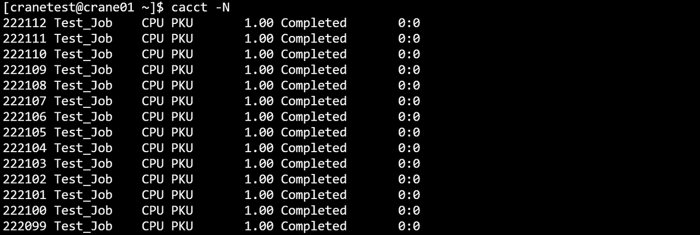
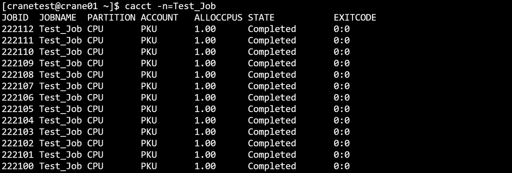
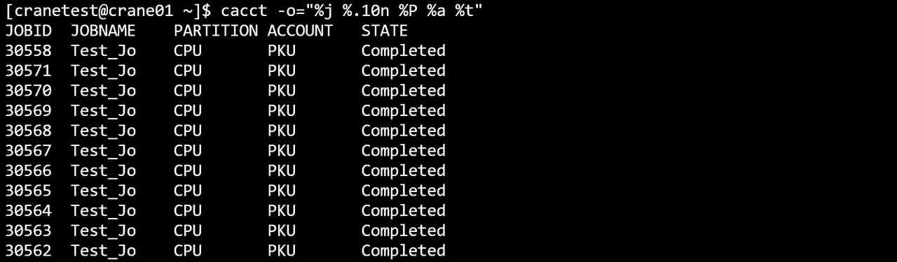
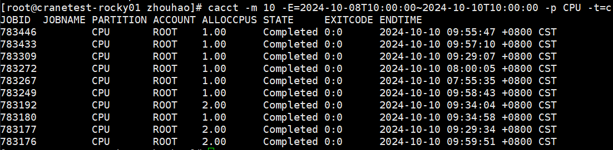

# cacct - View Job Accounting Information

cacct displays accounting information for jobs and steps in the cluster. It queries all job states including completed,
failed, and cancelled jobs. The output automatically includes both jobs and their associated steps.

View all job and step information in the cluster:

```bash
cacct
```

## Options

**-h, --help**

:   **Applies to:** `job`, `step`  
Display help information for cacct command.

**-v, --version**

:   **Applies to:** `job`, `step`  
Display cacct version information.

**-C, --config=&lt;path&gt;**

:   **Applies to:** `job`, `step`  
Path to configuration file. Default: "/etc/crane/config.yaml".

**-j, --job=&lt;jobid1,jobid2,...&gt;**

:   **Applies to:** `job`, `step`  
Specify job IDs to query (comma-separated list). For example, `-j=2,3,4`. When querying jobs, this filters by job ID.
The output will include matching jobs and their associated steps. Supports step ID format `jobid.stepid` to query
specific steps.

**-n, --name=&lt;name1,name2,...&gt;**

:   **Applies to:** `job`, `step`  
Specify job names to query (comma-separated list for multiple names).

**-u, --user=&lt;username1,username2,...&gt;**

:   **Applies to:** `job`, `step`  
Specify users whose jobs to query (comma-separated list for multiple users). Filters jobs and steps by the specified
usernames.

**-A, --account=&lt;account1,account2,...&gt;**

:   **Applies to:** `job`, `step`  
Specify accounts to query (comma-separated list for multiple accounts). Filters jobs and steps by the specified
accounts.

**-p, --partition=&lt;partition1,partition2,...&gt;**

:   **Applies to:** `job`, `step`  
Specify partitions to view (comma-separated list for multiple partitions). Default: all partitions.

**-q, --qos=&lt;qos1,qos2,...&gt;**

:   **Applies to:** `job`, `step`  
Specify QoS to view (comma-separated list for multiple QoS). Default: all QoS levels.

**-t, --state=&lt;state&gt;**

:   **Applies to:** `job`, `step`  
Specify job states to view. Supported states: 'pending' or 'p', 'running' or 'r', 'completed' or 'c', 'failed' or 'f', '
cancelled' or 'x', 'time-limit-exceeded' or 't', and 'all'. Default: 'all'. Multiple states can be specified as a
comma-separated list.

**-s, --submit-time=&lt;time_range&gt;**

:   **Applies to:** `job`, `step`  
Filter jobs by submission time range. Supports closed intervals (format: `2024-01-02T15:04:05~2024-01-11T11:12:41`) or
half-open intervals (format: `2024-01-02T15:04:05~` for after a specific time, or `~2024-01-11T11:12:41` for before a
specific time).

**-S, --start-time=&lt;time_range&gt;**

:   **Applies to:** `job`, `step`  
Filter jobs by start time range. Same format as submit-time.

**-E, --end-time=&lt;time_range&gt;**

:   **Applies to:** `job`, `step`  
Filter jobs by end time range. Same format as submit-time. For example, `~2023-03-14T10:00:00` filters jobs that ended
before the specified time.

**-w, --nodelist=&lt;node1,node2,...&gt;**

:   **Applies to:** `job`, `step`  
Specify node names to view (comma-separated list or patterns like node[1-10]). Default: all nodes.

**--type=&lt;type1,type2,...&gt;**

:   **Applies to:** `job`, `step`  
Specify task types to view (comma-separated list). Valid values: 'Interactive', 'Batch', 'Container'. Default: all
types.

**-F, --full**

:   **Applies to:** `job`, `step`  
Display full information without field truncation. By default, only 30 characters per cell are displayed.

**-N, --noheader**

:   **Applies to:** `job`, `step`  
Hide table header in output.

**-m, --max-lines=&lt;number&gt;**

:   **Applies to:** `job`, `step`  
Specify maximum number of output lines. For example, `-m=500` limits output to 500 lines. Default: 100 entries.

**--json**

:   **Applies to:** `job`, `step`  
Output command execution results in JSON format instead of table format.

**-o, --format=&lt;format_string&gt;**

:   **Applies to:** `job`, `step`  
Customize output format using format specifiers. Fields are identified by a percent sign (%) followed by a character or
string. Format specification syntax: `%[.]<size><type>`. Without size: field uses natural width. With size only (`%5j`):
minimum width, left-aligned. With dot and size (`%.5j`): minimum width, right-aligned. See Format Specifiers section
below for available identifiers.

## Default Output Fields

When displaying default format, the following fields are shown:

- **JobId**: Job or step identification (format: jobid for jobs, jobid.stepid for steps)
- **JobName**: Job or step name
- **Partition**: Partition where the job/step ran
- **Account**: Account charged for the job/step
- **AllocCPUs**: Number of allocated CPUs
- **State**: Job/step state (e.g., COMPLETED, FAILED, CANCELLED)
- **ExitCode**: Exit code (format: exitcode:signal, see [Exit Code reference](../reference/exit_code.md))

## Format Specifiers

The following format identifiers are supported (case-insensitive):

| Identifier            | Description                                |
|-----------------------|--------------------------------------------|
| %a / %Account         | Account associated with the job/step       |
| %C / %ReqCpus         | Number of requested CPUs                   |
| %c / %AllocCpus       | Number of allocated CPUs                   |
| %D / %ElapsedTime     | Elapsed time since job/step started        |
| %E / %EndTime         | End time of the job/step                   |
| %e / %ExitCode        | Exit code (format: exitcode:signal)        |
| %h / %Held            | Hold status of the job                     |
| %j / %JobID           | Job ID (or step ID in format jobid.stepid) |
| %K / %Wckey           | Workload characterization key              |
| %k / %Comment         | Comment for the job                        |
| %L / %NodeList        | List of nodes the job/step ran on          |
| %l / %TimeLimit       | Time limit for the job/step                |
| %M / %ReqMemPerNode   | Requested memory per node                  |
| %m / %AllocMemPerNode | Allocated memory per node                  |
| %N / %NodeNum         | Number of nodes                            |
| %n / %JobName         | Name of the job/step                       |
| %P / %Partition       | Partition associated with the job/step     |
| %p / %Priority        | Priority of the job                        |
| %q / %Qos             | Quality of Service level                   |
| %R / %Reason          | Reason for pending status                  |
| %r / %ReqNodes        | Requested nodes                            |
| %S / %StartTime       | Start time of the job/step                 |
| %s / %SubmitTime      | Submission time of the job                 |
| %t / %State           | Current state of the job/step              |
| %T / %JobType         | Job type (e.g., Batch, Interactive)        |
| %U / %UserName        | Username who submitted the job             |
| %u / %Uid             | User ID                                    |
| %x / %ExcludeNodes    | Nodes excluded from the job                |
| %X / %Exclusive       | Exclusive status of the job                |

## Usage Examples

### Basic Query

**View all jobs and steps:**

```bash
cacct
```


**Display help:**

```bash
cacct -h
```


**Hide table header:**

```bash
cacct -N
```



### Filtering by ID and Name

**Query specific job IDs:**

```bash
cacct -j=30618,30619,30620
```


**Query by job name:**

```bash
cacct -n=Test_Job
```



**Query by name pattern:**

```bash
cacct -n test
```


### Filtering by User and Account

**Query jobs by user:**

```bash
cacct -u=cranetest
```


**Query jobs by account:**

```bash
cacct -A=CraneTest
```


**Combine account and max-lines:**

```bash
cacct -A ROOT -m 10
```


### Filtering by Partition and QoS

**Query jobs in specific partition:**

```bash
cacct -p GPU
```


**Query by QoS:**

```bash
cacct -q test_qos
```


### Time Range Filtering

**Filter by start time range:**

```bash
cacct -S=2024-07-22T10:00:00~2024-07-24T10:00:00
```


**Filter by end time range:**

```bash
cacct -E=2024-07-22T10:00:00~2024-07-24T10:00:00
```


**Query jobs submitted in a time range:**

```bash
cacct -s=2024-01-01T00:00:00~2024-01-31T23:59:59
```

**Query jobs that started after a specific time:**

```bash
cacct -S=2024-01-15T00:00:00~
```

**Query jobs that ended before a specific time:**

```bash
cacct -E=~2024-01-31T23:59:59
```

### State Filtering

**View only completed jobs:**

```bash
cacct -t completed
```

**View failed and cancelled jobs:**

```bash
cacct -t failed,cancelled
```

**View jobs that exceeded time limit:**

```bash
cacct -t time-limit-exceeded
```

### Output Control

**Limit output to 10 lines:**

```bash
cacct -m=10
```


**JSON output:**

```bash
cacct --json -j 12345
```

### Custom Format Output

**Specify custom output format:**

```bash
cacct -o="%j %.10n %P %a %t"
```



**Natural width for all fields:**

```bash
cacct --format "%j %n %t"
```

**Left-aligned with minimum widths:**

```bash
cacct --format "%5j %20n %t"
```

**Right-aligned with minimum widths:**

```bash
cacct --format "%.5j %.20n %t"
```

**Mixed formatting with labels:**

```bash
cacct -o="%.8j %20n %-10P %.15U %t"
```

### Combined Filters

**Multiple filters with full output:**

```bash
cacct -m 10 -j 783925,783889 -t=c -F
```


**Complex combined query:**

```bash
cacct -m 10 -E=2024-10-08T10:00:00~2024-10-10T10:00:00 -p CPU -t c
```



## Related Commands

- [cqueue](cqueue.md) - View job queue (current/pending jobs and steps)
- [cbatch](cbatch.md) - Submit batch jobs
- [crun](crun.md) - Run interactive jobs and steps
- [ccancel](ccancel.md) - Cancel jobs and steps
- [ceff](ceff.md) - View job efficiency statistics
- [creport](creport.md) - Query job-related statistics