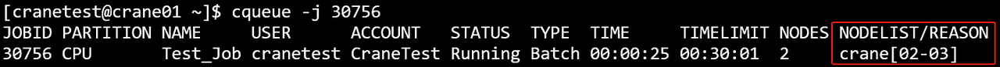
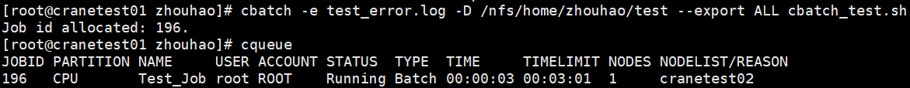
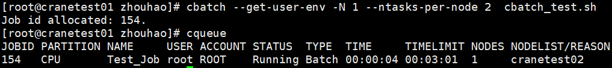

# cbatch - Submit Batch Job

**cbatch submits a batch script describing the entire computation process to the job scheduling system, assigns a job ID, and waits for the scheduler to allocate resources and execute it.**

The CraneSched system requires users and accounts before submitting jobs. Please refer to the [cacctmgr tutorial](cacctmgr.md) for adding users and accounts.

## Quick Start

Here's a simple single-node job example:

The following job requests one node, one CPU core, and runs `hostname` on the compute node before exiting:

```bash
#!/bin/bash
#CBATCH --ntasks-per-node 1
#CBATCH --nodes 1
#CBATCH -c 1
#CBATCH --mem 20M
#CBATCH --time 0:3:1
#CBATCH -o job.out
#CBATCH -p CPU
#CBATCH -J Test_Job

hostname
```

Assuming the job script is saved as `cbatch_test.sh`, submit it using:

```bash
cbatch cbatch_test.sh
```

**cbatch Execution Results**


## Command Line Options

### Resource Specifications
- **-N, --nodes uint32**: Number of nodes to run the job (default: 1)
- **-c, --cpus-per-task float**: Number of CPU cores required per task (default: 1)
- **--ntasks-per-node uint32**: Number of tasks to invoke on each node (default: 1)
- **--mem string**: Maximum amount of real memory. Supports GB (G, g), MB (M, m), KB (K, k) and Bytes (B), default unit is MB
- **--gres string**: Generic resources required per task, format: `gpu:a100:1` or `gpu:1`
- **--L, --licenses**: The licenses that the job requires to use, format: `lic1:2,lic2:4` or `lic1:2|lic2:4`

### Job Information
- **-J, --job-name string**: Name of the job
- **-A, --account string**: Account for job submission
- **-p, --partition string**: Requested partition
- **-q, --qos string**: Quality of Service (QoS) used for the job
- **-t, --time string**: Time limit, format: `[day-]hours:minutes:seconds` (e.g., `5-0:0:1` for 5 days and 1 second, or `10:1:2` for 10 hours, 1 minute, 2 seconds)
- **--comment string**: Comment for the job

### Node Selection
- **-w, --nodelist string**: Nodes to be allocated to the job (comma separated list)
- **-x, --exclude string**: Exclude specific nodes from allocation (comma separated list)

### I/O Redirection
- **-o, --output string**: Redirect script standard output path
- **-e, --error string**: Redirect script error log path
- **--open-mode string**: Mode for opening output and error files. Supported values: `append`, `truncate` (default)

### Environment Variables
- **--get-user-env**: Load user's login environment variables
- **--export string**: Propagate environment variables

### Scheduling Options
- **--begin string**: Start time for the job. Format: `YYYY-MM-DDTHH:MM:SS`
- **--exclusive**: Request exclusive node resources
- **-H, --hold**: Submit job in held state
- **-r, --reservation string**: Use reserved resources

### Email Notifications
- **--mail-type string**: Notify user by mail when certain events occur. Supported values: `NONE`, `BEGIN`, `END`, `FAIL`, `TIMELIMIT`, `ALL` (default: `NONE`)
- **--mail-user string**: Mail address of notification receiver

### Container Support
- **--container string**: Path to container image
- **--interpreter string**: Specify script interpreter (e.g., `/bin/bash`, `/usr/bin/python3`)

### Miscellaneous
- **-D, --chdir string**: Working directory of the job
- **--extra-attr string**: Extra attributes of the job (JSON format)
- **--repeat uint32**: Submit job multiple times (default: 1)
- **--wrap string**: Wrap command string in a shell script and submit
- **--json**: Output in JSON format
- **-C, --config string**: Path to configuration file (default: `/etc/crane/config.yaml`)
- **-h, --help**: Display help information
- **-v, --version**: Display cbatch version

## Usage Examples

### Basic Job Submission

Submit a batch script:
```bash
cbatch cbatch_test.sh
```


### Help Information

Display help:
```bash
cbatch -h
```


### Specify Account

Submit job with a specific account:
```bash
cbatch -A=acct-test cbatch_test.sh
```


### Node Exclusion

Exclude nodes from allocation:
```bash
cbatch -x crane01,crane02 cbatch_test.sh
```


### Job Name

Specify job name:
```bash
cbatch -J testjob01 cbatch_test.sh
```


### Node Selection

Request specific nodes:
```bash
cbatch -w crane01,crane03 cbatch_test.sh
```


### Partition Selection

Submit to specific partition:
```bash
cbatch -p GPU cbatch_test.sh
```


### Time Limit

Set time limit:
```bash
cbatch -t 00:25:25 cbatch_test.sh
```


### CPU Cores

Request specific number of CPU cores:
```bash
cbatch -c 2 cbatch_test.sh
```


### Memory Specification

Specify memory requirements:
```bash
cbatch --mem 123M cbatch_test.sh
```


### Multi-node Jobs

Request multiple nodes with tasks per node:
```bash
cbatch -N 2 --ntasks-per-node 2 cbatch_test.sh
```




### Working Directory

Specify working directory:
```bash
cbatch -D /path test.sh
```


### Error Log

Redirect error output:
```bash
cbatch -e error.log test.sh
```


### Environment Variables

Export all environment variables:
```bash
cbatch --export ALL test.sh
```


### User Environment

Load user's login environment:
```bash
cbatch --get-user-env test.sh
```


### Output Redirection

Redirect standard output:
```bash
cbatch -o output.out test.sh
```


### Quality of Service

Specify QoS:
```bash
cbatch -q qos_test test.sh
```


### Repeat Submission

Submit job multiple times:
```bash
cbatch --repeat 3 test.sh
```


## Environment Variables

Common environment variables available in batch scripts:

| Variable | Description |
|----------|-------------|
| **CRANE_JOB_NODELIST** | List of allocated nodes |
| **%j** | Job ID (for use in file patterns) |

## Multi-node Parallel Jobs

Here's an example of submitting a multi-node, multi-core job:

The following job runs on three nodes, using 4 CPU cores per node:

```bash
#!/bin/bash
#CBATCH -o crane_test%j.out
#CBATCH -p CPU
#CBATCH -J "crane_test"
#CBATCH --nodes 3
#CBATCH --ntasks-per-node 4
#CBATCH -c 4
#CBATCH --time 50:00:00

# Generate machine file from allocated nodes
echo "$CRANE_JOB_NODELIST" | tr ";" "\n" > crane.hosts

# Load MPI runtime environment
module load mpich/4.0 

# Execute cross-node parallel task
mpirun -n 13 -machinefile crane.hosts helloWorld > log
```

## Advanced Features

### Container Support

Submit a job that runs in a container:
```bash
cbatch --container /path/to/container.sif my_script.sh
```

### Delayed Start

Schedule a job to start at a specific time:
```bash
cbatch --begin 2024-12-31T23:00:00 my_script.sh
```

### Held Jobs

Submit a job in held state:
```bash
cbatch --hold my_script.sh
```

Release the held job using `ccontrol release <job_id>`.

### Email Notifications

Receive email notifications:
```bash
cbatch --mail-type=ALL --mail-user=user@example.com my_script.sh
```

### JSON Output

Get submission result in JSON format:
```bash
cbatch --json my_script.sh
```

### Wrap Command

Submit a simple command without creating a script file:
```bash
cbatch --wrap "echo Hello && sleep 10 && echo Done"
```

## See Also

- [cqueue](cqueue.md) - View job queue
- [ccancel](ccancel.md) - Cancel jobs
- [cacct](cacct.md) - View job accounting information
- [ccontrol](ccontrol.md) - Control jobs and system resources
