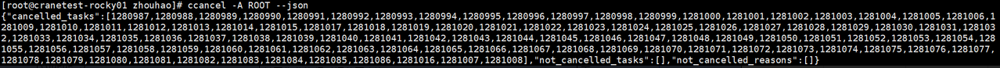
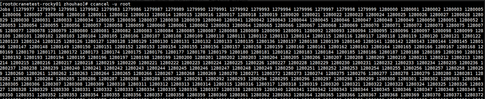
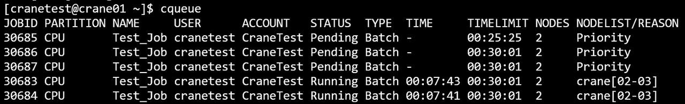

# ccancel - Cancel Jobs

**ccancel terminates running or pending jobs or individual steps within jobs.**

You can cancel jobs by job ID, cancel individual steps using the `jobid.stepid` format, or use filter conditions to cancel multiple jobs at once.

## Command Syntax

```bash
ccancel [job_id[.step_id][,job_id[.step_id]...]] [OPTIONS]
```

## Command Line Options

### Job Selection
- **job_id[.step_id][,job_id[.step_id]...]**: Job ID(s) or step ID(s) to cancel (comma-separated list).
  - Format for jobs: `<job_id>` or `<job_id>,<job_id>,<job_id>...`
  - Format for steps: `<job_id>.<step_id>` or `<job_id>.<step_id>,<job_id>.<step_id>...`
  - Mixed format: `<job_id>,<job_id>.<step_id>,<job_id>.<step_id>...`

### Filter Options
- **-n, --name string**: Cancel jobs with the specified job name
- **-u, --user string**: Cancel jobs submitted by the specified user
- **-A, --account string**: Cancel jobs under the specified account
- **-p, --partition string**: Cancel jobs in the specified partition
- **-t, --state string**: Cancel jobs in the specified state. Valid states: `PENDING` (P), `RUNNING` (R), `ALL` (case-insensitive)
- **-w, --nodes strings**: Cancel jobs running on the specified nodes (comma-separated list)

### Output Options
- **--json**: Output in JSON format

### Miscellaneous
- **-C, --config string**: Configuration file path (default: `/etc/crane/config.yaml`)
- **-h, --help**: Display help information
- **-v, --version**: Display version number

## Filter Rules

!!! important
    At least one condition must be provided: either job ID(s) or at least one filter option.

When using multiple filters, jobs matching **all** specified conditions will be cancelled (AND logic).

## Usage Examples

### Cancel by Job ID

Cancel a single job:
```bash
ccancel 30686
```

**Result:**


Cancel multiple jobs:
```bash
ccancel 30686,30687,30688
```

### Cancel by Job Name

Cancel all jobs named "test1":
```bash
ccancel -n test1
```

**Result:**


### Cancel by Partition

Cancel all jobs in GPU partition:
```bash
ccancel -p GPU
```

**Result:**


### Cancel by Node

Cancel all jobs running on crane02:
```bash
ccancel -w crane02
```


### Cancel by State

Cancel all pending jobs:
```bash
ccancel -t Pending
```


Cancel all running jobs:
```bash
ccancel -t Running
```

Cancel all jobs (pending and running):
```bash
ccancel -t All
```

### Cancel by Account

Cancel all jobs under PKU account:
```bash
ccancel -A PKU
```



### Cancel by User

Cancel all jobs submitted by user ROOT:
```bash
ccancel -u ROOT
```



### Combined Filters

Cancel all pending jobs in CPU partition:
```bash
ccancel -t Pending -p CPU
```

Cancel all jobs by user alice in GPU partition:
```bash
ccancel -u alice -p GPU
```

Cancel running jobs on specific nodes:
```bash
ccancel -t Running -w crane01,crane02
```

### JSON Output

Get cancellation results in JSON format:
```bash
ccancel 30686 --json
```

Cancel with filters and JSON output:
```bash
ccancel -p GPU -t Pending --json
```

## Examples Overview



## Canceling Job Steps

CraneSched supports canceling individual steps within a job using the step ID format `jobid.stepid`. This allows you to terminate specific steps while keeping the parent job and other steps running.

### Step Cancellation Syntax

**Cancel a specific step:**
```bash
ccancel 123.1      # Cancel step 1 of job 123
```

**Cancel multiple steps:**
```bash
ccancel 123.1,123.2,456.3
```

**Cancel entire job (all steps):**
```bash
ccancel 123        # Cancels job 123 and all its steps
```

### Step Cancellation Behavior

When canceling steps:

- **Single Step Cancellation**: Canceling a specific step (`jobid.stepid`) only affects that step
  - The parent job continues running
  - Other steps in the same job are not affected
  - Resources allocated to the step are released back to the parent job

- **Full Job Cancellation**: Canceling a job without specifying a step ID (`jobid`) cancels:
  - All steps within the job
  - The parent job itself
  - All allocated resources are released

### Step Cancellation Examples

**Cancel only step 2 of job 100:**
```bash
ccancel 100.2
```

**Cancel steps 1 and 2 of job 100 (step 3 continues if exists):**
```bash
ccancel 100.1,100.2
```

**Mixed cancellation - entire job 100 and step 3 of job 200:**
```bash
ccancel 100,200.3
```

**Query steps before canceling:**
```bash
# View all steps for a job
cqueue --step -j 123

# Cancel specific steps based on status
ccancel 123.2,123.4
```

### Step Cancellation Permissions

- **Regular Users**: Can only cancel steps belonging to their own jobs
- **Coordinators**: Can cancel steps within jobs under their account
- **Operators/Admins**: Can cancel any step in the system

## Behavior After Cancellation

After a job is cancelled:

1. **Process Termination**: If there are no other jobs from the user on the allocated nodes, the job scheduling system will terminate all user processes on those nodes

2. **SSH Access Revocation**: SSH access to the allocated nodes will be revoked for the user

3. **Resource Release**: All allocated resources (CPUs, memory, GPUs) are immediately released and become available for other jobs

4. **Job State Update**: The job state changes to `CANCELLED` in the job history

## Permission Requirements

- **Regular Users**: Can only cancel their own jobs
- **Coordinators**: Can cancel jobs within their account
- **Operators/Admins**: Can cancel any job in the system

## Important Notes

1. **Immediate Effect**: Job cancellation takes effect immediately. Running jobs are terminated without grace period by default

2. **Multiple Jobs**: You can cancel multiple jobs at once using comma-separated job IDs or filter conditions

3. **No Confirmation**: There is no confirmation prompt. Jobs are cancelled immediately upon command execution

4. **State Filtering**: Use `-t` to target specific job states to avoid accidentally cancelling jobs in unintended states

5. **Job/Step ID Format**: IDs must follow these formats with no spaces:
   - Jobs: `<job_id>` or `<job_id>,<job_id>,<job_id>...`
   - Steps: `<job_id>.<step_id>` or `<job_id>.<step_id>,<job_id>.<step_id>...`
   - Mixed: `<job_id>,<job_id>.<step_id>...`

## Error Handling

Common errors:

- **Invalid Job ID**: Returns error if job ID doesn't exist or you don't have permission to cancel it
- **No Matching Jobs**: If filter conditions match no jobs, returns success with zero jobs cancelled
- **Invalid State**: State must be one of: PENDING, RUNNING, ALL (case-insensitive)

## See Also

- [cbatch](cbatch.md) - Submit batch jobs
- [crun](crun.md) - Run interactive tasks
- [calloc](calloc.md) - Allocate interactive resources
- [cqueue](cqueue.md) - View job queue
- [cacct](cacct.md) - View job accounting information
- [ccontrol](ccontrol.md) - Control jobs and system resources
- [creport](creport.md) - Query job-related statistics
