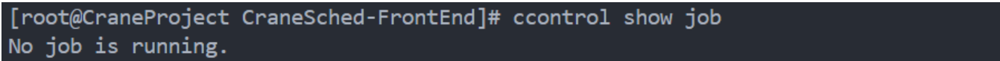
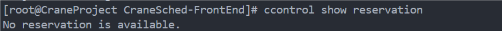
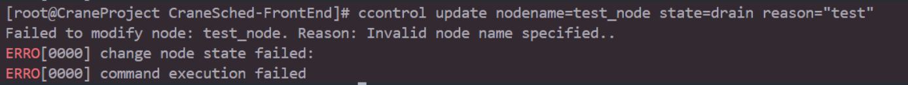
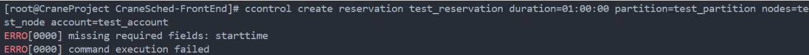

# ccontrol - Control Cluster Resources

**ccontrol is a command-line tool for managing and controlling CraneSched cluster resources.**

ccontrol provides SQL-style syntax for managing nodes, partitions, jobs, and reservations in a CraneSched cluster. The tool supports operations such as viewing status, updating configurations, holding/releasing jobs, and creating/deleting reservations.

## Command Structure

```
ccontrol <ACTION> <ENTITY> [OPTIONS]
```

### Actions

- **show** - Display information about entities
- **update** - Modify attributes of entities  
- **hold** - Hold entities (prevent jobs from starting)
- **release** - Release previously held entities
- **create** - Create new entities
- **delete** - Delete existing entities

### Entities

- **node** - Compute nodes
- **partition** - Node partitions
- **job** - Jobs/tasks
- **reservation** - Resource reservations

## Global Options

- **-h/--help**: Display help message
- **-v/--version**: Show version information
- **-J/--json**: Format output as JSON
- **-C/--config**: Specify alternative configuration file path (default: "/etc/crane/config.yaml")

## Command Reference

### Show Commands

#### Show Nodes

Display information about compute nodes.

```bash
# Show all nodes
ccontrol show node

# Show specific node
ccontrol show node <nodename>
```

**Example:**
```bash
ccontrol show node
ccontrol show node crane01
```


#### Show Partitions

Display information about partitions.

```bash
# Show all partitions
ccontrol show partition

# Show specific partition
ccontrol show partition <partition_name>
```

**Example:**
```bash
ccontrol show partition
ccontrol show partition CPU
```


#### Show Jobs

Display information about jobs.

```bash
# Show all jobs
ccontrol show job

# Show specific job
ccontrol show job <job_id>
```

**Example:**
```bash
ccontrol show job
ccontrol show job 12345
```



#### Show Reservations

Display information about reservations.

```bash
# Show all reservations
ccontrol show reservation

# Show specific reservation
ccontrol show reservation <reservation_name>
```

**Example:**
```bash
ccontrol show reservation
ccontrol show reservation my_reservation
```



### Update Commands

#### Update Node

Modify node attributes, typically to drain or resume nodes.

```bash
ccontrol update nodeName=<nodename> state=<state> [reason=<reason>]
```

**Parameters:**

- **nodeName** (required): Name of the node to update
- **state** (required): New state for the node
  - `drain` - Prevent new jobs from being scheduled on the node
  - `resume` - Make node available for scheduling again
- **reason** (required when draining): Reason for draining the node

**Examples:**
```bash
# Drain a node
ccontrol update nodename=crane01 state=drain reason="Maintenance"

# Resume a node
ccontrol update nodename=crane01 state=resume
```



#### Update Job

Modify job attributes including priority, time limit, comment, and email settings.

```bash
ccontrol update jobid=<job_id> [priority=<priority>] [timelimit=<timelimit>] [comment=<comment>] [mailuser=<email>] [mailtype=<type>]
```

**Parameters:**

- **jobid** (required): ID of the job to update
- **priority** (optional): New priority value (floating-point number)
- **timelimit** (optional): New time limit (format: HH:MM:SS or D-HH:MM:SS)
- **comment** (optional): New comment string for the job
- **mailuser** (optional): Email address for notifications
- **mailtype** (optional): Type of email notifications (NONE, BEGIN, END, FAIL, TIMELIMIT, ALL)

**Examples:**
```bash
# Update job priority
ccontrol update jobid=11 priority=100

# Update time limit
ccontrol update jobid=11 timelimit=01:00:00

# Update multiple attributes
ccontrol update jobid=11 priority=1 timelimit=01:00:00 comment="High priority job"

# Update email notifications
ccontrol update jobid=11 mailuser=user@example.com mailtype=END
```


#### Update Partition

Modify partition access control lists.

```bash
ccontrol update partitionName=<partition> [accounts=<accounts>] [deniedaccounts=<accounts>]
```

**Parameters:**

- **partitionName** (required): Name of the partition to update
- **accounts** (optional): Comma-separated list of accounts allowed to use the partition
- **deniedaccounts** (optional): Comma-separated list of accounts denied from using the partition

**Note:** When AllowedAccounts is set, DeniedAccounts will not take effect.

**Examples:**
```bash
# Allow specific accounts
ccontrol update partition=GPU accounts=research,staff

# Deny specific accounts
ccontrol update partition=CPU deniedaccounts=guest
```


### Hold and Release Commands

#### Hold Job

Hold specified job(s) to prevent them from starting.

```bash
ccontrol hold <job_id> [timelimit=<duration>]
```

**Parameters:**

- **job_id** (required): ID of the job to hold
- **timelimit** (optional): Duration to hold the job (format: HH:MM:SS)

**Examples:**
```bash
# Hold a job indefinitely
ccontrol hold 1

# Hold a job for 1 hour
ccontrol hold 1 timelimit=01:00:00
```


#### Release Job

Release a previously held job.

```bash
ccontrol release <job_id>
```

**Example:**
```bash
ccontrol release 1
```


### Create and Delete Commands

#### Create Reservation

Create a new resource reservation.

```bash
ccontrol create reservation <name> startTime=<time> duration=<duration> account=<account> [partition=<partition>] [nodes=<nodelist>] [nodeCnt=<count>] [user=<username>]
```

**Parameters:**

- **name** (required): Name of the reservation
- **startTime** (required): When the reservation starts (format: YYYY-MM-DDTHH:MM:SS)
- **duration** (required): Length of reservation (format: HH:MM:SS or D-HH:MM:SS)
- **account** (required): Account to associate with the reservation
- **partition** (optional): Partition to reserve resources from
- **nodes** (optional): Specific nodes to reserve (comma-separated list)
- **nodeCnt** (optional): Number of nodes to reserve (used when nodes is not specified)
- **user** (optional): User to associate with the reservation

**Examples:**
```bash
# Create a reservation with specific nodes
ccontrol create reservation my_reservation startTime=2024-12-01T10:00:00 duration=01:00:00 partition=CPU nodes=crane01,crane02 account=research

# Create a reservation with node count
ccontrol create reservation test_reservation startTime=2024-12-01T14:00:00 duration=02:00:00 partition=GPU nodeCnt=2 account=staff user=alice
```



#### Delete Reservation

Delete an existing reservation.

```bash
ccontrol delete reservation <name>
```

**Example:**
```bash
ccontrol delete reservation my_reservation
```


## JSON Output

All commands support JSON output format using the `--json` flag:

```bash
ccontrol --json show node
ccontrol --json show partition CPU
ccontrol --json show job 12345
```

This is useful for scripting and automation purposes.

## Permission Requirements

Different operations require different permission levels:

| Operation | Permission Required |
|-----------|-------------------|
| Show commands | User can view their own jobs; admin can view all |
| Update node | Administrator only |
| Update partition | Administrator only |
| Update job | Job owner or administrator |
| Hold/Release job | Job owner or administrator |
| Create reservation | Administrator or authorized user |
| Delete reservation | Reservation creator or administrator |

## Use Cases

### Node Maintenance

```bash
# Drain node for maintenance
ccontrol update nodename=crane01 state=drain reason="Hardware upgrade"

# After maintenance, resume node
ccontrol update nodename=crane01 state=resume
```

### Job Priority Management

```bash
# Increase priority for urgent job
ccontrol update jobid=1234 priority=1000

# Extend time limit for long-running job
ccontrol update jobid=1234 timelimit=10:00:00
```

### Resource Reservation

```bash
# Reserve nodes for scheduled maintenance window
ccontrol create reservation maint_window startTime=2024-12-15T02:00:00 duration=04:00:00 partition=ALL nodes=crane[01-10] account=admin

# Delete reservation when no longer needed
ccontrol delete reservation maint_window
```

## Related Commands

- [cinfo](cinfo.md) - View cluster resource status
- [cqueue](cqueue.md) - View job queue
- [cacctmgr](cacctmgr.md) - Manage accounts and users
- [cbatch](cbatch.md) - Submit batch jobs
- [ccancel](ccancel.md) - Cancel jobs
