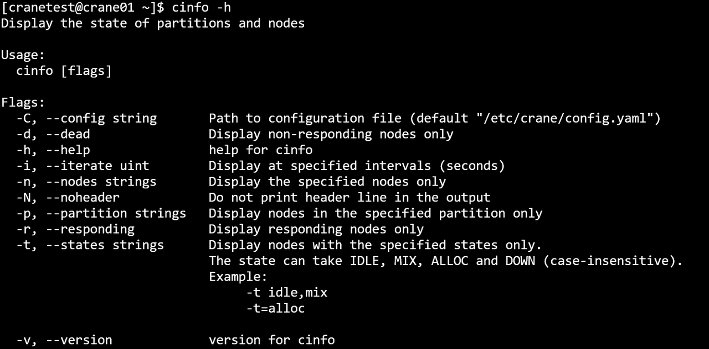
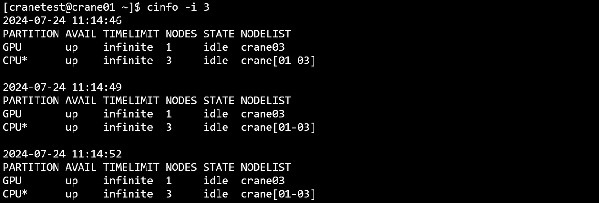
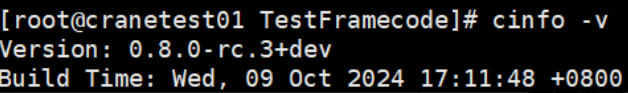

# cinfo - View Node and Partition Status

**cinfo queries resource information for partition nodes.**

View the status of partition nodes:
~~~bash
cinfo
~~~

**cinfo Output Example**


## Main Output Fields

- **PARTITION**: Partition name
- **AVAIL**: Partition availability status

  - up: Available
  - down: Unavailable

- **NODES**: Number of nodes
- **STATE**: Node states

  - **Resource state**

    - idle: Idle
    - mix: Some cores on node are available
    - alloc: Node is fully allocated
    - down: Node is unavailable

  - **Control state**

    - power_idle: Idle state. Counted as power_to_sleeping when scheduled to sleep; transitions to power_activate when there is a job.
    - power_activate: Active state, initial state. After a period of no jobs, some nodes will transition to power_idle.
    - power_sleeping: Sleeping state. Transitions to power_waking_up when scheduled to wake up; transitions to power_powering_off when scheduled to power off.
    - power_poweredoff: Powered off.
    - power_to_sleeping: Transitioning to sleep. Enters power_sleeping after a period of time.
    - power_waking_up: Waking up state. Transitions to power_idle after a period of time.
    - power_powering_on: Powering on. Transitions to power_idle after a period of time.
    - power_powering_off: Powering off. Transitions to power_powering_on when scheduled to power on.
    - failed: Control state unavailable.

- **NODELIST**: List of nodes

## Main Options

- **-h/--help**: Display help
- **-C/--config string**: Path to configuration file (default: "/etc/crane/config.yaml")
- **-d/--dead**: Display non-responding nodes only
- **-i/--iterate uint**: Refresh query results at specified intervals (seconds). For example, `-i=3` outputs results every 3 seconds
- **--json**: Output command execution results in JSON format
- **-n/--nodes string**: Display specified node information (comma-separated for multiple nodes). Example: `cinfo -n crane01,crane02`
- **-N/--noheader**: Hide table headers in output
- **-p/--partition string**: Display specified partition information (comma-separated for multiple partitions). Example: `cinfo -p CPU,GPU`
- **-r/--responding**: Display responding nodes only
- **-t/--states string**: Display nodes with specified resource states only. States can be (case-insensitive): IDLE, MIX, ALLOC, and DOWN. Examples:
  - `-t idle,mix`
  - `-t=alloc`
- **-v/--version**: Query version number

### Format Specifiers (-o/--format)

The `--format` option allows customized output formatting. Fields are identified by a percent sign (%) followed by a character or string. Use a dot (.) and a number between % and the format character or string to specify a minimum width for the field.

**Supported Format Identifiers** (case-insensitive):

| Identifier | Full Name | Description |
|------------|-----------|-------------|
| %p | Partition | Display all partitions in the current environment |
| %a | Avail | Display the availability state of the partition |
| %n | Nodes | Display the number of partition nodes |
| %s | State | Display the status of partition nodes |
| %l | NodeList | Display all node lists in the partition |

Each format specifier or string can be modified with a width specifier (e.g., "%.5j"). If the width is specified, the field will be formatted to at least that width. If the format is invalid or unrecognized, the program will terminate with an error message.

**Format Example:**
```bash
# Display partition name (min width 5), state (min width 6), and status
cinfo --format "%.5partition %.6a %s"
```

## Usage Examples

**Display all partitions and nodes:**
```bash
cinfo
```


**Common Node Control State Descriptions**
```bash
cinfo
```
The node has been scheduled to power off and is in sleep state, node resources are unavailable
```bash
[cranetest@crane01 ~]$ cinfo
PARTITION AVAIL NODES STATE                  NODELIST
CPU*      down  4     down[power_sleeping]   cn[06-09]
CPU*      down  5     down[power_poweredoff] cn[01, 03-05, 11]
GPU       down  4     down[power_sleeping]   cn[06-09]
GPU       down  5     down[power_poweredoff] cn[01, 03-05, 11]
```
The node is being woken up
```bash
[cranetest@crane01 ~]$ cinfo
PARTITION AVAIL NODES STATE                 NODELIST
GPU       down  3     idle[power_idle]      cn[03, 08-09]
GPU       down  5     mix[power_active]     cn[01, 04-07]
GPU       down  1     down[power_waking_up] cn11
CPU*      down  3     idle[power_idle]      cn[03, 08-09]
CPU*      down  5     mix[power_active]     cn[01, 04-07]
CPU*      down  1     down[power_waking_up] cn11
```

**Display help:**
```bash
cinfo -h
```


**Hide table header:**
```bash
cinfo -N
```


**Show only non-responding nodes:**
```bash
cinfo -d
```


**Auto-refresh every 3 seconds:**
```bash
cinfo -i 3
```


**Display specific nodes:**
```bash
cinfo -n crane01,crane02,crane03
```


**Display specific partitions:**
```bash
cinfo -p GPU,CPU
```


**Show only responding nodes:**
```bash
cinfo -r
```


**Filter by node state:**
```bash
cinfo -t IDLE
```


**Display version:**
```bash
cinfo -v
```


**JSON output:**
```bash
cinfo --json
```

## Node State Filtering

The `-t/--states` option allows filtering nodes by their states. Multiple states can be specified as a comma-separated list:

```bash
# Show idle and mixed nodes
cinfo -t idle,mix

# Show only allocated nodes
cinfo -t alloc

# Show only down nodes
cinfo -t down
```

**Note:** The `-t/--states`, `-r/--responding`, and `-d/--dead` options are mutually exclusive. Only one can be specified at a time.

## Related Commands

- [cqueue](cqueue.md) - View job queue
- [ccontrol](ccontrol.md) - Control cluster resources
- [cacctmgr](cacctmgr.md) - Manage accounts and partitions
