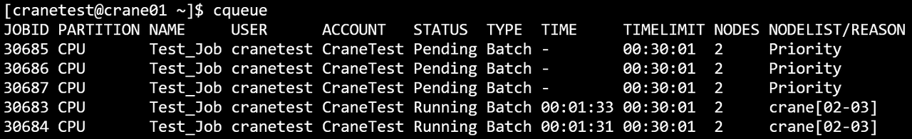
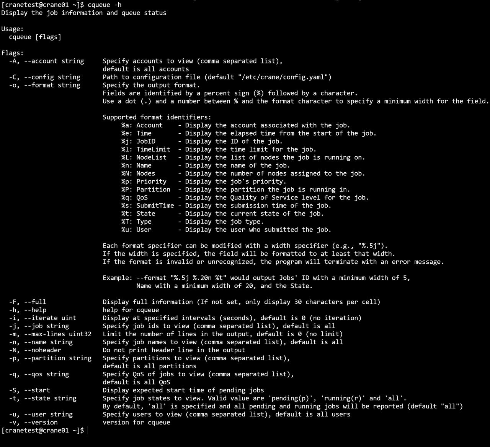
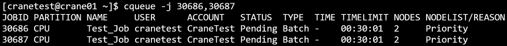
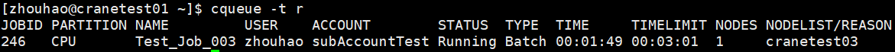
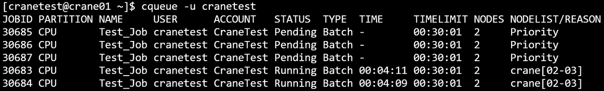
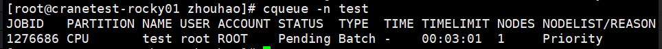

# cqueue - View Job Queue

cqueue displays information about jobs and steps in the queue. By default, it shows job information including pending,
running, and other states. Use the `-s/--step` option to query step information instead.

View all jobs in the cluster's queues:

```bash
cqueue
```

## Options

**-h, --help**

:   **Applies to:** `job`, `step`  
Display help information for cqueue command.

**-v, --version**

:   **Applies to:** `job`, `step`  
Display cqueue version information.

**-C, --config=&lt;path&gt;**

:   **Applies to:** `job`, `step`  
Path to configuration file. Default: "/etc/crane/config.yaml".

**-F, --full**

:   **Applies to:** `job`, `step`  
Display full content without truncation. By default, only 30 characters per cell are displayed.

**-N, --noheader**

:   **Applies to:** `job`, `step`  
Hide table headers in output.

**-m, --max-lines=&lt;number&gt;**

:   **Applies to:** `job`, `step`  
Specify maximum number of output lines. For example, `-m=500` limits output to 500 lines. By default, displays 100
entries.

**-i, --iterate=&lt;seconds&gt;**

:   **Applies to:** `job`, `step`  
Refresh query results at specified intervals (in seconds). For example, `-i=3` outputs results every 3 seconds.

**--json**

:   **Applies to:** `job`, `step`  
Output command execution results in JSON format instead of table format.

**-s, --step[=&lt;stepid1,stepid2,...&gt;]**

:   **Applies to:** `step`  
Query step information instead of job information. Accepts optional comma-separated list of step IDs in format
`jobid.stepid` (e.g., `123.1,123.2,456.3`). If no argument is provided, shows all steps. This option switches the query
mode from jobs to steps.

**-j, --job=&lt;jobid1,jobid2,...&gt;**

:   **Applies to:** `job`, `step`  
Specify job IDs to query (comma-separated list). For example, `-j=2,3,4`. When used with `--step`, filters steps
belonging to the specified jobs.

**-n, --name=&lt;name1,name2,...&gt;**

:   **Applies to:** `job`, `step`  
Specify job names to query (comma-separated list for multiple names).

**-t, --state=&lt;state&gt;**

:   **Applies to:** `job`, `step`  
Specify states to query. Valid values are 'pending(p)', 'running(r)' and 'all'. Default is 'all' (both pending and
running). For steps, valid states include 'running' and other step-specific states.

**-S, --start**

:   **Applies to:** `job`  
Display start time. For pending jobs, shows expected start time. For running jobs, shows actual start time.

**-u, --user=&lt;username1,username2,...&gt;**

:   **Applies to:** `job`, `step`  
Specify users to query (comma-separated list for multiple users). Filters jobs or steps by the specified usernames.

**-A, --account=&lt;account1,account2,...&gt;**

:   **Applies to:** `job`, `step`  
Specify accounts to query (comma-separated list for multiple accounts). Filters jobs or steps by the specified accounts.

**-p, --partition=&lt;partition1,partition2,...&gt;**

:   **Applies to:** `job`, `step`  
Specify partitions to query (comma-separated list for multiple partitions). Filters jobs or steps by the specified
partitions.

**-q, --qos=&lt;qos1,qos2,...&gt;**

:   **Applies to:** `job`, `step`  
Specify QoS to query (comma-separated list for multiple QoS). Filters jobs or steps by the specified Quality of Service
levels.

**--self**

:   **Applies to:** `job`, `step`  
View jobs or steps submitted by current user only.

**-o, --format=&lt;format_string&gt;**

:   **Applies to:** `job`, `step`  
Customize output format using format specifiers. Fields are identified by a percent sign (%) followed by a character.
Format specification syntax: `%[.]<size><type>`. Without size: field uses natural width. With size only (`%5j`): minimum
width, left-aligned. With dot and size (`%.5j`): minimum width, right-aligned. The available format specifiers differ
between job and step queries (see Format Specifiers sections below).

## Default Output Fields

When querying jobs (default mode), the following fields are displayed:

- **JobId**: Job identification number
- **Partition**: Partition where the job is running
- **Name**: Job name
- **User**: Username of job owner
- **Account**: Account charged for the job
- **Status**: Current job state (e.g., RUNNING, PENDING)
- **Type**: Job type (e.g., BATCH, INTERACTIVE)
- **TimeLimit**: Time limit for the job
- **Nodes**: Number of nodes allocated
- **NodeList**: Names of nodes where the job is running

When querying steps (using `--step`), the following fields are displayed:

- **StepId**: Step identification in format jobid.stepid
- **JobId**: Parent job identification number
- **Name**: Step name
- **Partition**: Partition (inherited from parent job)
- **User**: Username (inherited from parent job)
- **State**: Current step state
- **ElapsedTime**: Time elapsed since step started
- **NodeList**: Names of nodes where the step is running

## Job Format Specifiers

When querying jobs (default mode), the following format identifiers are supported (case-insensitive):

| Identifier | Full Name       | Description                                                 |
|------------|-----------------|-------------------------------------------------------------|
| %a         | Account         | Account associated with the job                             |
| %c         | AllocCpus       | CPUs allocated to the job                                   |
| %C         | ReqCpus         | Total CPUs requested by the job                             |
| %e         | ElapsedTime     | Elapsed time since job started                              |
| %h         | Held            | Hold state of the job                                       |
| %j         | JobID           | Job ID                                                      |
| %k         | Comment         | Comment of the job                                          |
| %l         | TimeLimit       | Time limit for the job                                      |
| %L         | NodeList        | List of nodes the job is running on (or reason for pending) |
| %m         | AllocMemPerNode | Allocated memory per node                                   |
| %M         | ReqMemPerNode   | Requested memory per node                                   |
| %n         | Name            | Job name                                                    |
| %N         | NodeNum         | Number of nodes requested by the job                        |
| %o         | Command         | Command line of the job                                     |
| %p         | Priority        | Priority of the job                                         |
| %P         | Partition       | Partition the job is running in                             |
| %q         | QoS             | Quality of Service level for the job                        |
| %Q         | ReqCpuPerNode   | Requested CPUs per node                                     |
| %r         | ReqNodes        | Requested nodes                                             |
| %R         | Reason          | Reason for pending status                                   |
| %s         | SubmitTime      | Submission time of the job                                  |
| %S         | StartTime       | Start time of the job                                       |
| %t         | State           | Current state of the job                                    |
| %T         | JobType         | Job type                                                    |
| %u         | User            | User who submitted the job                                  |
| %U         | Uid             | UID of the job                                              |
| %x         | ExcludeNodes    | Nodes excluded from the job                                 |
| %X         | Exclusive       | Exclusive status of the job                                 |

## Step Format Specifiers

When querying steps (using `--step`), the following format identifiers are supported (case-insensitive):

| Identifier | Full Name   | Description                                    |
|------------|-------------|------------------------------------------------|
| %i         | StepId      | Step ID in format jobid.stepid                 |
| %j         | JobId       | Parent job ID                                  |
| %n         | Name        | Step name                                      |
| %P         | Partition   | Partition (inherited from parent job)          |
| %u         | User        | Username (inherited from parent job)           |
| %U         | Uid         | User ID                                        |
| %e         | ElapsedTime | Elapsed time since step started                |
| %L         | NodeList    | List of nodes the step is running on           |
| %t         | State       | Current state of the step                      |
| %l         | TimeLimit   | Time limit for the step                        |
| %N         | NodeNum     | Number of nodes allocated to the step          |
| %a         | Account     | Account (inherited from parent job)            |
| %q         | QoS         | Quality of Service (inherited from parent job) |
| %o         | Command     | Command line of the step                       |

## Usage Examples

### Basic Job Queries

**View all jobs:**

```bash
cqueue
```



**Display help:**

```bash
cqueue -h
```



**Hide table header:**

```bash
cqueue -N
```


**Show start times:**

```bash
cqueue -S
```


### Filtering Jobs

**Query specific jobs:**

```bash
cqueue -j 30674,30675
```



**Filter by state (pending jobs):**

```bash
cqueue -t Pending
```


**Filter by state (running jobs, shorthand):**

```bash
cqueue -t r
```



**Query jobs for specific user:**

```bash
cqueue -u cranetest
```



**Show only current user's jobs:**

```bash
cqueue --self
```


**Query jobs for specific account:**

```bash
cqueue -A CraneTest
```


**Filter by partition:**

```bash
cqueue -p CPU
```


**Filter by job name:**

```bash
cqueue -n test
```



**Filter by QoS:**

```bash
cqueue -q test_qos
```


### Output Control

**Limit output to 3 lines:**

```bash
cqueue -m 3
```


**Auto-refresh every 3 seconds:**

```bash
cqueue -i 3
```


**JSON output:**

```bash
cqueue --json
```

### Custom Format Output

**Natural width for all fields:**

```bash
cqueue --format "%j %n %t"
```

**Left-aligned with minimum widths:**

```bash
cqueue --format "%5j %20n %t"
```

**Right-aligned with minimum widths:**

```bash
cqueue --format "%.5j %.20n %t"
```

**Mixed formatting with labels:**

```bash
cqueue --format "ID:%8j | Name:%.15n | State:%t"
```

**Complex custom format:**

```bash
cqueue -o="%n %u %.5j %.5t %.3T %.5T"
```


### Step Queries

**Query all steps:**

```bash
cqueue --step
```

**Query specific steps:**

```bash
cqueue --step 100.1,100.2,200.3
```

**Query steps for a specific job:**

```bash
cqueue --step -j 123
```

**Query steps with custom format:**

```bash
cqueue --step --format "%i %n %t %e %L"
```

**Query steps for specific user:**

```bash
cqueue --step -u username
```

**Right-aligned format for steps:**

```bash
cqueue --step --format "%.10i %.20n %.10t"
```

**Filter steps by state:**

```bash
cqueue --step -t running
```

**Query steps for multiple jobs:**

```bash
cqueue --step -j 100,200,300
```

## Related Commands

- [cbatch](cbatch.md) - Submit batch jobs
- [crun](crun.md) - Run interactive jobs and steps
- [calloc](calloc.md) - Allocate resources for interactive use
- [ccancel](ccancel.md) - Cancel jobs and steps
- [cacct](cacct.md) - Query completed jobs
- [ccontrol](ccontrol.md) - Control and query jobs/steps
- [creport](creport.md) - Query job-related statistics
