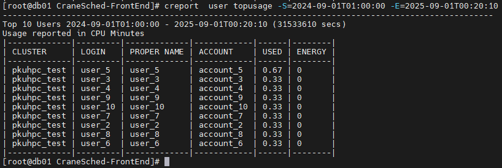
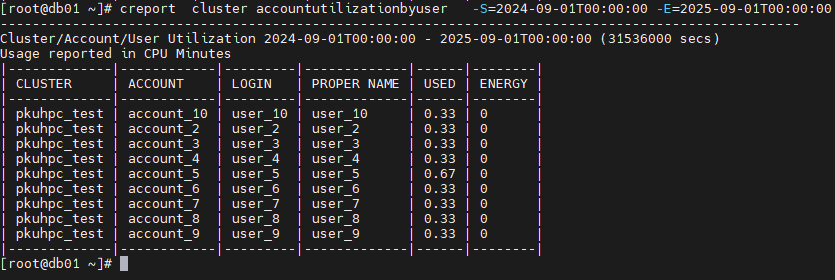
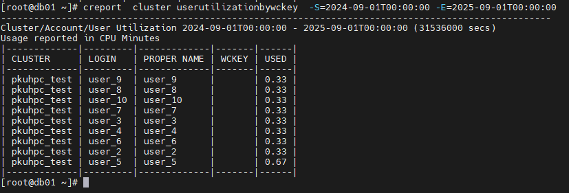
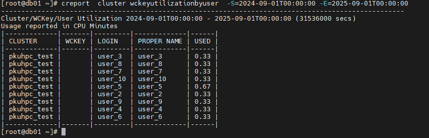
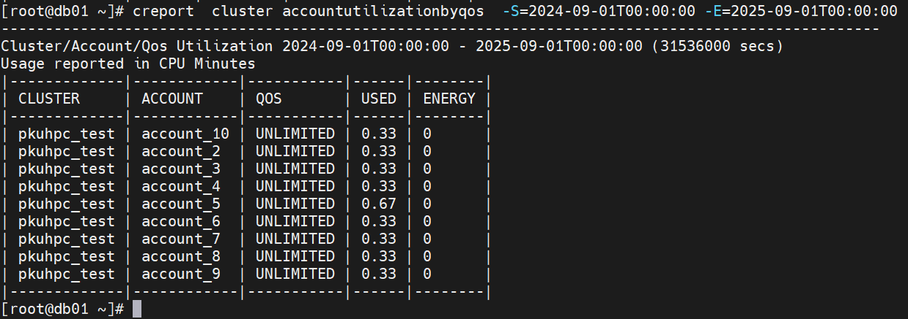
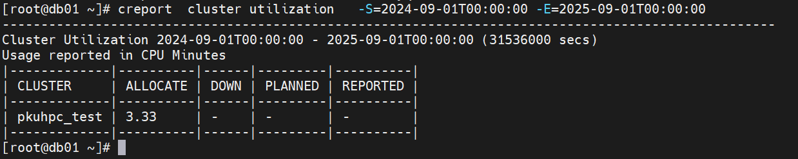
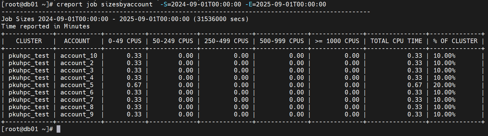
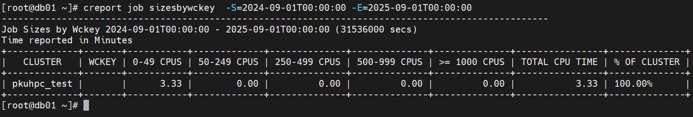
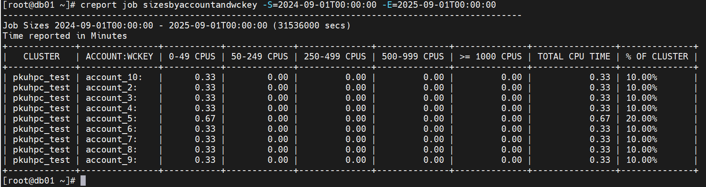

# creport - Query Job-Related Statistics

**creport is mainly used to query job statistics related to users and accounts within a specified time range in the cluster.**

```bash
creport [<OPTION>] [<COMMAND>]
```

## Display User Resource Consumption Ranking
```bash
creport user topusage [--start-time=...] [--end-time=...] [--account=...] ...
```
### Sample Output



### Output Fields

- **CLUSTER**: Cluster name
- **LOGIN**: Username
- **PROPER NAME**: Full Linux system name
- **ACCOUNT**: Account name
- **USED**: The sum of total CPUs * runtime for each job under the user

### Command Line Options

#### Filtering Options
- **-A, --account string**: Specify accounts to query, use commas to separate multiple accounts
- **-u, --user string**: Specify users to query, use commas to separate multiple users
- **--group bool**: Group all accounts of each user together (default is separate entries for each user-account reference)
- **-t, --time string**: Specify the time unit for output job data (default is minutes)
- **--topcount uint32**: Specify the number of output entries (default is 10)

#### Time Range Filtering
- **-S, --start-time string**: Specify the query start time (default is 00:00:00 of the previous day), format: `2023-03-14T10:00:00`
- **-E, --end-time string**: Specify the query end time (default is 23:59:59 of the previous day), format: `2023-03-14T10:00:00`

#### Other Options
- **-C, --config string**: Path to configuration file (default: `/etc/crane/config.yaml`)
- **-h, --help**: Show help information

## Display Account-User Resource Utilization
```bash
creport cluster accountutilizationbyuser [--start-time=...] [--end-time=...] [--account=...] ...
```
### Sample Output



### Output Fields

- **CLUSTER**: Cluster name
- **ACCOUNT**: Account name
- **LOGIN**: Username
- **PROPER NAME**: Full Linux system name
- **USED**: The sum of total CPUs * runtime for each job under the user
- **ENERGY**: Energy consumed by jobs

### Command Line Options

#### Filtering Options
- **-A, --account string**: Specify accounts to query, use commas to separate multiple accounts
- **-u, --user string**: Specify users to query, use commas to separate multiple users
- **-t, --time string**: Specify the time unit for output job data (default is minutes)

#### Time Range Filtering
- **-S, --start-time string**: Specify the query start time (default is 00:00:00 of the previous day), format: `2023-03-14T10:00:00`
- **-E, --end-time string**: Specify the query end time (default is 23:59:59 of the previous day), format: `2023-03-14T10:00:00`

#### Other Options
- **-C, --config string**: Path to configuration file (default: `/etc/crane/config.yaml`)
- **-h, --help**: Show help information

## Display User-Account Resource Utilization
```bash
creport cluster userutilizationbyaccount [--start-time=...] [--end-time=...] [--user=...] ...
```
### Sample Output


### Output Fields

- **CLUSTER**: Cluster name
- **LOGIN**: Username
- **PROPER NAME**: Full Linux system name
- **ACCOUNT**: Account name
- **USED**: The sum of total CPUs * runtime for each job under the user
- **ENERGY**: Energy consumed by jobs

### Command Line Options

#### Filtering Options
- **-A, --account string**: Specify accounts to query, use commas to separate multiple accounts
- **-u, --user string**: Specify users to query, use commas to separate multiple users
- **-t, --time string**: Specify the time unit for output job data (default is minutes)

#### Time Range Filtering
- **-S, --start-time string**: Specify the query start time (default is 00:00:00 of the previous day), format: `2023-03-14T10:00:00`
- **-E, --end-time string**: Specify the query end time (default is 23:59:59 of the previous day), format: `2023-03-14T10:00:00`

#### Other Options
- **-C, --config string**: Path to configuration file (default: `/etc/crane/config.yaml`)
- **-h, --help**: Show help information

## Display User-WCKEY Resource Utilization
```bash
creport cluster userutilizationbywckey [--start-time=...] [--end-time=...] [--user=...] ...
```
### Sample Output



### Output Fields

- **CLUSTER**: Cluster name
- **LOGIN**: Username
- **PROPER NAME**: Full Linux system name
- **WCKEY**: wckey name
- **USED**: The sum of total CPUs * runtime for each job under the user

### Command Line Options

#### Filtering Options
- **-u, --user string**: Specify users to query, use commas to separate multiple users
- **-t, --time string**: Specify the time unit for output job data (default is minutes)

#### Time Range Filtering
- **-S, --start-time string**: Specify the query start time (default is 00:00:00 of the previous day), format: `2023-03-14T10:00:00`
- **-E, --end-time string**: Specify the query end time (default is 23:59:59 of the previous day), format: `2023-03-14T10:00:00`

#### Other Options
- **-C, --config string**: Path to configuration file (default: `/etc/crane/config.yaml`)
- **-h, --help**: Show help information

## Display WCKEY-User Resource Utilization
```bash
creport cluster wckeyutilizationbyuser [--start-time=...] [--end-time=...] [--wckeys=...] ...
```
### Sample Output



### Output Fields

- **CLUSTER**: Cluster name
- **WCKEY**:wckey name
- **LOGIN**: Username
- **PROPER NAME**: Full Linux system name
- **USED**: The sum of total CPUs * runtime for each job under the user

### Command Line Options

#### Filtering Options
- **-w, --wckeys string**: Specify WCKEYs to query, use commas to separate multiple WCKEYs
- **-t, --time string**: Specify the time unit for output job data (default is minutes)

#### Time Range Filtering
- **-S, --start-time string**: Specify the query start time (default is 00:00:00 of the previous day), format: `2023-03-14T10:00:00`
- **-E, --end-time string**: Specify the query end time (default is 23:59:59 of the previous day), format: `2023-03-14T10:00:00`

#### Other Options
- **-C, --config string**: Path to configuration file (default: `/etc/crane/config.yaml`)
- **-h, --help**: Show help information

## Display Account-QOS Resource Utilization
```bash
creport cluster accountutilizationbyqos [--start-time=...] [--end-time=...] [--account=...] [--qos=...] ...
```
### Sample Output



### Output Fields

- **CLUSTER**: Cluster name
- **ACCOUNT**: Account name
- **QOS**: Qos name
- **USED**: The sum of total CPUs * runtime for each job under the user
- **ENERGY**: Energy consumed by jobs

### Command Line Options

#### Filtering Options
- **-A, --account string**: Specify accounts to query, use commas to separate multiple accounts
- **-q, --qos string**: Specify QOS to query, use commas to separate multiple QOS
- **-t, --time string**: Specify the time unit for output job data (default is minutes)

#### Time Range Filtering
- **-S, --start-time string**: Specify the query start time (default is 00:00:00 of the previous day), format: `2023-03-14T10:00:00`
- **-E, --end-time string**: Specify the query end time (default is 23:59:59 of the previous day), format: `2023-03-14T10:00:00`

#### Other Options
- **-C, --config string**: Path to configuration file (default: `/etc/crane/config.yaml`)
- **-h, --help**: Show help information

## Display Overall Cluster Utilization
```bash
creport cluster utilization [--start-time=...] [--end-time=...] ...
```
### Sample Output



### Output Fields

- **CLUSTER**: Cluster name
- **ALLOCATE**: Total resources actually allocated by all jobs during the statistics interval (CPU minutes), i.e., sum of allocated cores × runtime minutes
- **QOWN**: Total downtime caused by node failures, maintenance, etc. during the statistics interval (CPU minutes), i.e., sum of down cores × downtime minutes
- **PLANEED**: Time when jobs are queued but resources are not allocated (CPU minutes), usually indicates resource shortage or queue overflow
- **REPORTED**: Theoretical maximum available time for all resources during the statistics interval (CPU minutes), i.e., total cluster cores × time span

### Command Line Options

#### Filtering Options
- **-t, --time string**: Specify the time unit for output job data (default is minutes)

#### Time Range Filtering
- **-S, --start-time string**: Specify the query start time (default is 00:00:00 of the previous day), format: `2023-03-14T10:00:00`
- **-E, --end-time string**: Specify the query end time (default is 23:59:59 of the previous day), format: `2023-03-14T10:00:00`

#### Other Options
- **-C, --config string**: Path to configuration file (default: `/etc/crane/config.yaml`)
- **-h, --help**: Show help information

## Display Job Size Distribution Grouped by Account
```bash
creport job sizesbyaccount [--start-time=...] [--end-time=...] [--account=...] ...
```
### Sample Output



### Output Fields

- **CLUSTER**: Cluster name
- **ACCOUNT**: Account name
- **0-49 CPUs**: CPU minutes in the 0-49 CPUs range
- **50-249 CPUs**: CPU minutes in the 50-249 CPUs range
- **250-499 CPUs**:CPU minutes in the 250-499 CPUs range
- **500-999 CPUs**: CPU minutes in the 500-999 CPUs range
- **>= 1000 CPUs**: CPU minutes in the ≥1000 CPUs range
- **TOTAL CPU TIME**: Total CPU minutes for all jobs under the specific account
- **% OF CLUSTER**: Percentage of total cluster job CPU minutes occupied

### Command Line Options

#### Filtering Options
- **-A, --account string**: Specify accounts to query, use commas to separate multiple accounts
- **--gid string**: Specify the gid to query, use commas to separate multiple gids
- **--grouping string**: Comma-separated list of size groupings (default: 50,100,250,500,1000)
- **--printjobcount bool**: Report will print the number of jobs in the range instead of the used time
- **-j, --jobs string**: Specify job IDs to query, use commas to separate multiple IDs (e.g., -j=2,3,4)
- **-n, --nodes string**: Specify node names to query, use commas to separate multiple nodes
- **-p, --partition string**: Specify partitions to query, use commas to separate multiple partitions
- **-t, --time string**: Specify the time unit for output job data (default is minutes)

#### Time Range Filtering
- **-S, --start-time string**: Specify the query start time (default is 00:00:00 of the previous day), format: `2023-03-14T10:00:00`
- **-E, --end-time string**: Specify the query end time (default is 23:59:59 of the previous day), format: `2023-03-14T10:00:00`

#### Other Options
- **-C, --config string**: Path to configuration file (default: `/etc/crane/config.yaml`)
- **-h, --help**: Show help information

## Display Job Size Distribution Grouped by WCKEY
```bash
creport job sizesbywckey [--start-time=...] [--end-time=...] [--wckeys=...] ...
```
### Sample Output



### Output Fields

- **CLUSTER**: Cluster name
- **ACCOUNT**: Account name
- **0-49 CPUs**: CPU minutes in the 0-49 CPUs range
- **50-249 CPUs**: CPU minutes in the 50-249 CPUs range
- **250-499 CPUs**:CPU minutes in the 250-499 CPUs range
- **500-999 CPUs**: CPU minutes in the 500-999 CPUs range
- **>= 1000 CPUs**: CPU minutes in the ≥1000 CPUs range
- **TOTAL CPU TIME**: Total CPU minutes for all jobs under the specific account
- **% OF CLUSTER**: Percentage of total cluster job CPU minutes occupied

### Command Line Options

#### Filtering Options
- **-w --wckeys string**: Specify WCKEYs to query, use commas to separate multiple WCKEYs
- **--gid string**: Specify the gid to query, use commas to separate multiple gids
- **--grouping string**: Comma-separated list of size groupings (default: 50,100,250,500,1000)
- **--printjobcount bool**: Report will print the number of jobs in the range instead of the used time
- **-j, --jobs string**: Specify job IDs to query, use commas to separate multiple IDs (e.g., -j=2,3,4)
- **-n, --nodes string**: Specify node names to query, use commas to separate multiple nodes
- **-p, --partition string**: Specify partitions to query, use commas to separate multiple partitions
- **-t, --time string**: Specify the time unit for output job data (default is minutes)

#### Time Range Filtering
- **-S, --start-time string**: Specify the query start time (default is 00:00:00 of the previous day), format: `2023-03-14T10:00:00`
- **-E, --end-time string**: Specify the query end time (default is 23:59:59 of the previous day), format: `2023-03-14T10:00:00`

#### Other Options
- **-C, --config string**: Path to configuration file (default: `/etc/crane/config.yaml`)
- **-h, --help**: Show help information

## Display Job Size Distribution Grouped by WCKEY and Account
```bash
creport job sizesbyaccountandwckey [--start-time=...] [--end-time=...] [--wckeys=...] ...
```
### Sample Output



### Output Fields

- **CLUSTER**: Cluster name
- **ACCOUNT**: Account name
- **0-49 CPUs**: CPU minutes in the 0-49 CPUs range
- **50-249 CPUs**: CPU minutes in the 50-249 CPUs range
- **250-499 CPUs**:CPU minutes in the 250-499 CPUs range
- **500-999 CPUs**: CPU minutes in the 500-999 CPUs range
- **>= 1000 CPUs**: CPU minutes in the ≥1000 CPUs range
- **TOTAL CPU TIME**: Total CPU minutes for all jobs under the specific account
- **% OF CLUSTER**: Percentage of total cluster job CPU minutes occupied

### Command Line Options

#### Filtering Options
- **-A, --account string**: Specify accounts to query, use commas to separate multiple accounts
- **-w, --wckeys string**: Specify WCKEYs to query, use commas to separate multiple WCKEYs
- **--gid string**: Specify the gid to query, use commas to separate multiple gids
- **--grouping string**: Comma-separated list of size groupings (default: 50,100,250,500,1000)
- **--printjobcount bool**: Report will print the number of jobs in the range instead of the used time
- **-j, --jobs string**: Specify job IDs to query, use commas to separate multiple IDs (e.g., -j=2,3,4)
- **-n, --nodes string**: Specify node names to query, use commas to separate multiple nodes
- **-p, --partition string**: Specify partitions to query, use commas to separate multiple partitions
- **-t, --time string**: Specify the time unit for output job data (default is minutes)

#### Time Range Filtering
- **-S, --start-time string**: Specify the query start time (default is 00:00:00 of the previous day), format: `2023-03-14T10:00:00`
- **-E, --end-time string**: Specify the query end time (default is 23:59:59 of the previous day), format: `2023-03-14T10:00:00`

#### Other Options
- **-C, --config string**: Path to configuration file (default: `/etc/crane/config.yaml`)
- **-h, --help**: Show help information

## Manually Trigger Data Aggregation

**Used to manually trigger data aggregation. Only the root user is allowed to perform this operation.**

```bash
creport active
```

## Related Commands

- [cqueue](cqueue.md) - View job queue (current/pending jobs)
- [cbatch](cbatch.md) - Submit batch jobs
- [ccancel](ccancel.md) - Cancel jobs
- [ceff](ceff.md) - View job efficiency statistics
- [cacct](cacct.md) - Query completed jobs
