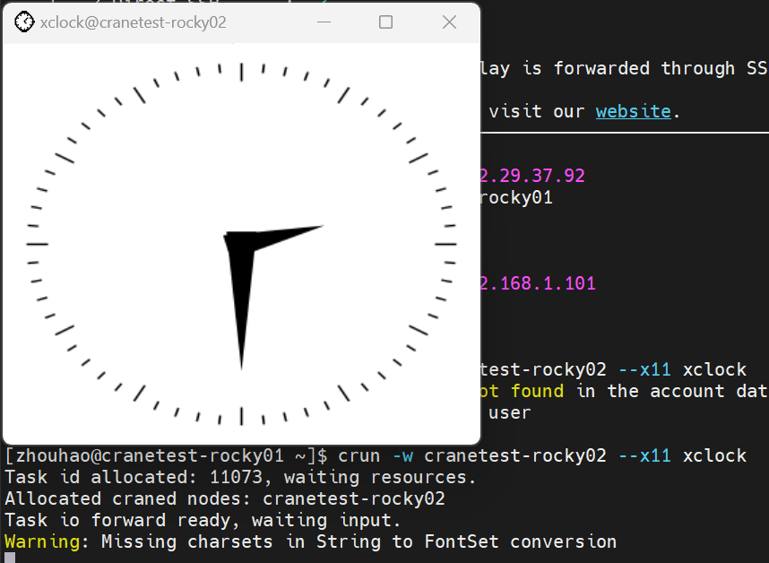

# crun - Submit Interactive Task

crun allocates resources based on command-line parameters and starts the specified task on compute nodes. User input is forwarded to the corresponding task on compute nodes, and task output is forwarded back to the user terminal. crun must be started on nodes where cfored is running.

crun only supports request parameters via command line. Supported command-line options:

## Main Options

- **-h/--help**: Display help
- **-A/--account string**: Account for job submission
- **-D/--chdir string**: Working directory for the task
- **-C/--config string**: Path to configuration file (default: "/etc/crane/config.yaml")
- **-c/--cpus-per-task float**: Number of CPUs required per task (default: 1)
- **--comment string**: Comment for the job
- **--debug-level string**: Available debug levels: trace, debug, info (default: "info")
- **-x/--exclude string**: Exclude specific nodes from allocation (comma-separated list)
- **--exclusive**: Exclusive node resources
- **--export string**: Propagate environment variables
- **--extra-attr string**: Extra attributes of the job (in JSON format)
- **--get-user-env**: Load user's login environment variables
- **--gres string**: Generic resources required per task, format: "gpu:a100:1" or "gpu:1"
- **-H/--hold**: Hold the job until it is released
- **-i/--input string**: Source and destination of stdin redirection (default: "all")
- **-J/--job-name string**: Job name
- **--mail-type string**: Notify user by mail when certain events occur. Supported values: NONE, BEGIN, END, FAIL, TIMELIMIT, ALL (default: NONE)
- **--mail-user string**: Mail address of the notification receiver
- **--mem string**: Maximum amount of real memory. Supports GB(G, g), MB(M, m), KB(K, k) and Bytes(B). Default unit is MB
- **-w/--nodelist string**: Nodes to be allocated to the job (comma-separated list)
- **-N/--nodes uint32**: Number of nodes to run on (format: N = min[-max], default: 1)
- **--ntasks-per-node uint32**: Number of tasks to invoke on each node (default: 1)
- **-p/--partition string**: Requested partition
- **--pty**: Run with a pseudo-terminal
- **-q/--qos string**: QoS used for the job
- **-r/--reservation string**: Use reserved resources
- **-t/--time string**: Time limit, format: "day-hours:minutes:seconds" (e.g., 5-0:0:1 for 5 days, 1 second) or "hours:minutes:seconds" (e.g., 10:1:2 for 10 hours, 1 minute, 2 seconds)
- **-v/--version**: crun version
- **--x11**: Enable X11 support, default is false. If not used with --x11-forwarding, direct X11 is used (insecure)
- **--x11-forwarding**: Enable X11 forwarding by CraneSched (secure), default is false
- **--L/--licenses**: The licenses that the job requires to use

## Usage Examples

**Allocate resources and run bash:**

Request 2 nodes, 1 CPU core, 200M memory in CPU partition, and run bash:
```bash
crun -c 1 --mem 200M -p CPU -N 2 /usr/bin/bash
```


**Exclude specific nodes:**

Request 1 node, exclude crane01 and crane02, set job name to testjob, time limit 0:25:25, and run bash:
```bash
crun -N 1 -x crane01,crane02 -J testjob -t 0:25:25 /usr/bin/bash
```


**Specify node list:**

Request 1 node and 200M memory in GPU partition, nodes must be chosen from crane02 or crane03, and run bash:
```bash
crun -p GPU --mem 200M -w crane02,crane03 /usr/bin/bash
```


**Nested execution within calloc:**

crun can also be started nested within a calloc task and will automatically inherit all resources from the calloc task. No need to specify parameters other than the program to run:


**Advanced options:**

```bash
# With account, QoS, and environment settings
crun -A ROOT -J test_crun -x cranetest03 --get-user-env --ntasks-per-node 2 -q test_qos -t 00:20:00 /usr/bin/bash
```


```bash
# With working directory and debug level
crun -D /path --debug-level trace --export ALL /usr/bin/bash
```


```bash
# Run on specific node
crun -w cranetest04 /usr/bin/bash
```


**X11 forwarding:**

```bash
# Run X11 applications
crun --x11 xclock
```



## Passing Arguments to Programs

Pass arguments to your program launched by crun:

```bash
# Using double dash
crun -c 1 -- your_program --your_args

# Using quotes
crun -c 1 "your_program --your_args"
```

## New Features

### Exclusive Mode (--exclusive)

Request exclusive access to allocated nodes, preventing other jobs from sharing:
```bash
crun --exclusive -N 2 /usr/bin/bash
```

### Hold Mode (-H/--hold)

Submit the job in held state, preventing it from starting until manually released:
```bash
crun --hold -c 4 /usr/bin/bash
# Release later with: ccontrol release <job_id>
```

### Reservation (-r/--reservation)

Use pre-reserved resources for the job:
```bash
crun -r my_reservation /usr/bin/bash
```

### Email Notifications (--mail-type/--mail-user)

Receive email notifications for job events:
```bash
crun --mail-type=END --mail-user=user@example.com -c 4 /usr/bin/bash
```

Supported mail types:
- **NONE**: No notifications (default)
- **BEGIN**: Job started
- **END**: Job completed
- **FAIL**: Job failed
- **TIMELIMIT**: Job reached time limit
- **ALL**: All events above

### Job Comments (--comment)

Add descriptive comments to your jobs:
```bash
crun --comment "Testing new algorithm" -c 8 /usr/bin/python script.py
```

### Standard Input Redirection (-i/--input)

Control stdin redirection behavior:
```bash
# Default: all tasks receive stdin
crun -i all /usr/bin/bash

# No stdin redirection
crun -i none /usr/bin/bash
```

## Related Commands

- [calloc](calloc.md) - Allocate resources for interactive use
- [cbatch](cbatch.md) - Submit batch jobs
- [ccancel](ccancel.md) - Cancel jobs
- [cqueue](cqueue.md) - View job queue
