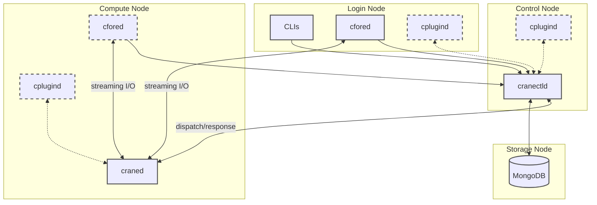

# CraneSched Deployment Guide

Welcome to the CraneSched deployment documentation. This guide will walk you through setting up a high-performance computing cluster with CraneSched's job scheduling system.

!!! tip "Recommended OS"
    We strongly recommend **Rocky Linux 9** for production deployments due to its stability, long-term support, and modern system components.

## What You'll Deploy

CraneSched consists of three main components:

| Component | Description | Location |
|-----------|-------------|----------|
| **Backend** | `cranectld` (scheduler) + `craned` (Node daemon) | Control & Compute nodes |
| **Frontend** | CLI (`cbatch`, `cqueue`, etc.) + other services (`cfored`, `cplugind`) | As needed |
| **Database** | MongoDB for storing jobs, accounts, and usage data | Control/Storage node |

The diagram below shows a typical placement of CraneSched components across node types (dashed borders indicate optional components).

!!! tip "Optional Components"
    - **cplugind**: Only required on nodes that need plugin functionality.
    - **cfored**: Only required on nodes where interactive jobs (e.g., `calloc` / `crun`) need to be submitted.

## Quick Start

For a simple single-node test environment:

1. Install backend: Follow [Rocky Linux 9 Guide](./backend/Rocky9.md)
2. Install frontend: Follow [Frontend Deployment Guide](./frontend/frontend.md)
3. Setup database: Follow [Database Configuration Guide](./configuration/database.md)
4. Configure cluster: Edit `/etc/crane/config.yaml` (see [Configuration Guide](./configuration/config.md))
5. Start services: `systemctl start cranectld craned` (And other frontend services as needed)

**For production multi-node clusters**, follow the complete deployment workflow below.

---

## Deployment Workflow

### Step 1: Build Backend Components

Choose your operating system and follow the corresponding guide:

- :material-flag: **[RHEL 8+ / Fedora 37+](./backend/Rocky9.md)**

    ---
    
    Recommended for production. Includes environment setup, toolchain installation, and building from source.

- :material-flag-outline: **[Debian 11+ / Ubuntu 20.04+](./backend/Ubuntu.md)**

    ---
    
    Supported but not officially recommended.

- :material-alert-circle: **[CentOS 7](./backend/CentOS7.md)**

    ---
    
    Legacy support (End of Life). Use only for existing deployments.

All guides cover system preparation, dependencies, and compilation. After building:

- **[Packaging Guide](./packaging.md)** - Create RPM/DEB packages for easier distribution across nodes

### Step 2: Setup Database

MongoDB stores job history, user accounts, and resource usage data.

- **[Database Configuration](./configuration/database.md)**

Install MongoDB on the control node, configure authentication, and connect CraneSched.

### Step 3: Configure Cluster

Define your cluster topology, node resources, and scheduling policies.

- **[Cluster Configuration](./configuration/config.md)**

Learn how to edit `/etc/crane/config.yaml` to configure:

- Cluster name and control machine
- Node definitions (CPU, memory, GPUs)
- Partitions and scheduling priorities
- Network settings and advanced options

### Step 4: Deploy to Nodes

For multi-node clusters, distribute binaries and configurations efficiently.

- **[Multi-node Deployment](./configuration/multi-node.md)**

Use SCP, PDSH, or package managers to deploy CraneSched across your cluster.

### Step 5: Install Frontend Tools

Deploy user-facing tools and services for job submission and management.

- **[Frontend Deployment](./frontend/frontend.md)**

Install Go-based frontend components: `cbatch`, `cqueue`, `cinfo`, `cacct`, and supporting daemons.

---

## Optional Features

### Plugin System

Extend CraneSched with plugins for monitoring, notifications, and more.

- **[Plugins Guide](./frontend/plugins.md)** - Email notifications, resource monitoring, energy tracking

### Access Control

Restrict SSH access to compute nodes for authorized jobs only.

- **[PAM Module](./configuration/pam.md)** - Configure PAM-based access control

### Advanced Device Management

Enable GPU and device isolation with eBPF on systems using cgroup v2.

- **[eBPF Support](./backend/eBPF.md)** - GRES support with eBPF device control

---

## Getting Help

- Check individual guides for troubleshooting sections
- Review configuration examples in the [Rocky 9](./backend/Rocky9.md) and [Config](./configuration/config.md) guides
- Verify services are running: `systemctl status cranectld craned`
- Check logs: `/var/log/crane/` or `journalctl -u cranectld`
