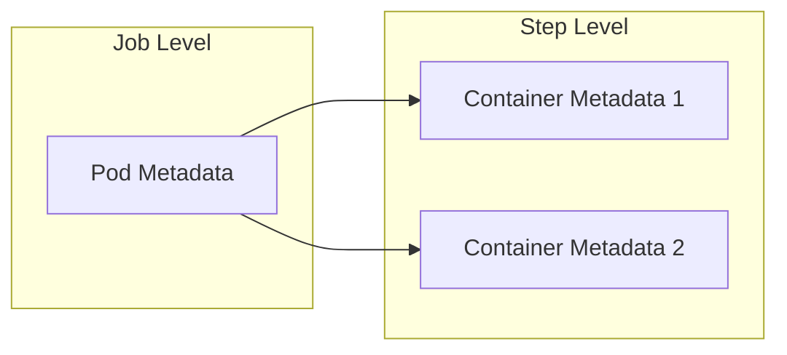
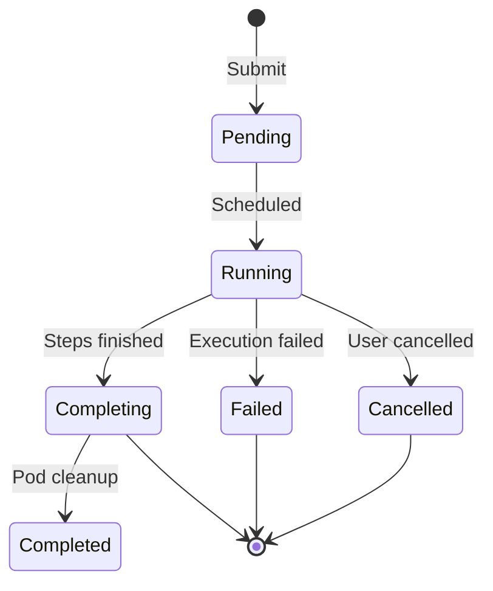
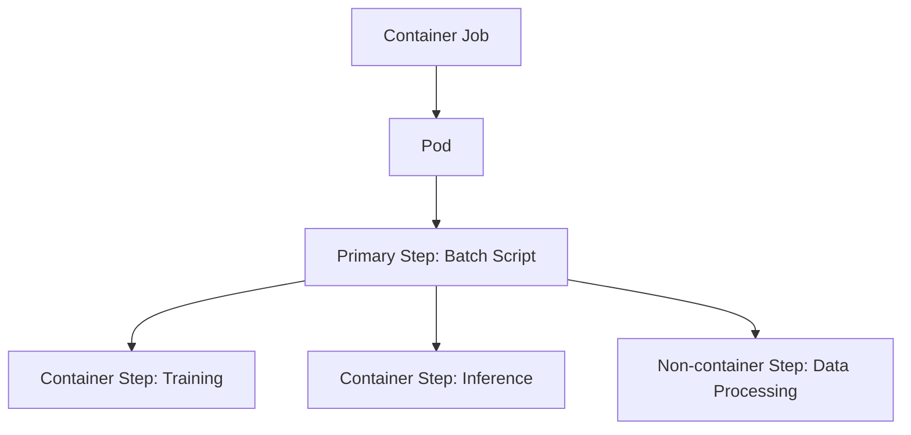
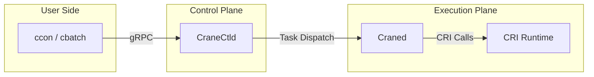

# Core Concepts

This page introduces the object model and lifecycle of CraneSched Container Support. After reading, you will understand the relationship between container jobs and container steps, the roles of Pod and container metadata, and resource allocation and inheritance mechanisms.

## Quick Reference

| Term | Description |
| --- | --- |
| Container Job | A job with `TaskType=Container`, creates a Pod at startup, hosts container and non-container steps |
| Container Step | A step executed within a container job, carries container metadata, corresponds to a container in the Pod |
| Pod Metadata | Job-level configuration defining Pod name, namespace options, port mappings, etc. |
| Container Metadata | Step-level configuration defining image, command, environment variables, mounts, etc. |
| CRI | Container Runtime Interface, Craned interacts with runtimes like containerd via CRI |

---

## Container Job

A **Container Job** is the resource allocation unit for CraneSched Container Support. After submitting a container job, the scheduler completes resource allocation, and the node creates and maintains the Pod until the job ends.

Container jobs have the following characteristics:

- **Resource Hosting**: Job-level requests for CPU, memory, GPU, etc.; subsequent steps run within this allocation.
- **Pod Lifecycle**: Pod is created when the job starts and destroyed when it ends.
- **Mixed Steps**: Container jobs can include both container steps and non-container steps (e.g., batch scripts, interactive commands).

### Creation Methods

=== "cbatch --pod"

    Uses a batch script as the entry point. Pod is automatically created when the job starts, and the script runs as the Primary Step. Use `ccon run` within the script to append container steps, or `crun` for non-container steps.

    ```bash
    cbatch --pod job.sh
    ```

=== "ccon run"

    Uses a container step directly as the Primary Step. Suitable for simple jobs containing only container steps.

    ```bash
    ccon -p CPU run ubuntu:22.04 /bin/bash -c 'echo hello'
    ```

---

## Container Step

A **Container Step** is the execution unit within a container job, corresponding to a container in the Pod. Each container step carries independent container metadata and can specify different images, commands, and mount configurations.

Container steps follow the general step types:

| Type | Step ID | Description |
| --- | --- | --- |
| Primary Step | 1 | The first step produced by the job entry |
| Common Step | ≥2 | Appended steps, can be dynamically created during job execution |

### Appending Container Steps

Within a container job's script or interactive environment, use `ccon run` to append container steps:

```bash
# Within a cbatch --pod script
ccon run python:3.11 python train.py --epochs 100

# Run in background
ccon run -d nginx:latest
```

Appended container steps reuse the job's allocated resources without re-scheduling.

---

## Pod Metadata and Container Metadata

CraneSched Container Support separates configuration into two layers:



### Pod Metadata

Pod Metadata is **job-level** configuration specified when submitting a container job, defining the Pod's overall runtime environment.

| Field | Description |
| --- | --- |
| `name` | Pod name, used to generate container hostname |
| `namespace` | Namespace options (network, PID, IPC, etc.) |
| `userns` | Whether to enable user namespace (Fake Root) |
| `run_as_user` / `run_as_group` | User/Group ID to run containers as |
| `ports` | Port mapping configuration |

### Container Metadata

Container Metadata is **step-level** configuration specified when submitting a container step, defining the container's specific runtime behavior.

| Field | Description |
| --- | --- |
| `image` | Container image and pull policy |
| `command` / `args` | Container startup command and arguments |
| `workdir` | Working directory inside the container |
| `env` | Environment variables |
| `mounts` | Directory mount mappings |
| `tty` / `stdin` | Terminal and stdin configuration |
| `detached` | Whether to run in background |

### Configuration Timing

| Entry Point | Pod Metadata | Container Metadata |
| --- | --- | --- |
| `cbatch --pod` | Specified at job submission | Not needed for Primary Step; specified when appending steps |
| `ccon run` (new job) | Specified at job submission | Specified at job submission |
| `ccon run` (append step) | Inherited from job | Specified at step submission |

---

## Resource Model

Container jobs follow a "job-level allocation, step-level inheritance" resource model, consistent with non-container jobs.

### Job-Level Allocation

When submitting a container job, request resources using these parameters:

- Node count (`-N`)
- CPU (`-c` / `--cpus-per-task`)
- Memory (`--mem`)
- GPU and other devices (`--gres`)
- Time limit (`-t`)

The scheduler allocates resources based on partition, account, QoS, and other policies.

### Step-Level Inheritance

When appending container steps, resource handling follows these rules:

| Scenario | Behavior |
| --- | --- |
| Resources not specified | Inherit job-level request |
| Resource subset specified | Use specified values, must not exceed job allocation |
| Node list specified | Must be within the job's allocated node set |

### Constraints

- Container step resource requests must not exceed job allocation (returns `ERR_STEP_RES_BEYOND`)
- Node selection must be within job allocation range (returns `ERR_NO_ENOUGH_NODE`)
- Container steps must maintain the same user identity as the job

---

## Lifecycle

The container job lifecycle includes the following phases:



### Phase Description

1. **Pending**: Job enters queue awaiting scheduling.
2. **Running**: Resource allocation complete, Pod created on node, Primary Step begins execution.
3. **Completing**: All steps finished, awaiting Pod cleanup.
4. **Completed / Failed / Cancelled**: Job terminal states.

### Pod and Step Relationship

- Pod is created when the job enters Running state and destroyed when the job ends.
- Container steps run within the Pod, sharing Pod network and namespace configuration.
- Appended container steps can be dynamically created during Primary Step execution.

---

## Runtime Interaction

Container steps support runtime interaction operations:

| Operation | Command | Description |
| --- | --- | --- |
| Attach | `ccon attach JOBID.STEPID` | Connect to container's stdin/stdout |
| Exec | `ccon exec JOBID.STEPID COMMAND` | Execute command inside container |
| Logs | `ccon logs JOBID.STEPID` | View container logs |

These operations are forwarded through CraneCtld to the Craned node running the container, which then interacts with the container runtime via CRI.

---

## Mixed Steps

Container jobs allow mixing different types of steps within the same job:



Use cases:

- Run core computation in containers while using host environment for pre/post-processing
- Complete containerized training and bare-metal debugging within the same resource allocation
- Use scripts to orchestrate the execution order of multiple container tasks

---

## Architecture Overview

Container Support is implemented through coordination between the scheduling control plane and node execution plane:



| Component | Responsibility |
| --- | --- |
| CraneCtld | Receives submission requests, schedules resources, validates permissions and parameters |
| Craned | Node-side agent, creates Pods and containers, manages lifecycle |
| CRI Runtime | Container runtime (e.g., containerd), executes container operations |

---

## Related Documentation

- [Container Support Overview](index.md)
- [Quick Start](quickstart.md)
- [Examples](examples.md)
- [Troubleshooting](troubleshooting.md)
