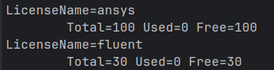

# License Usage Guide

Crane helps manage software licenses by allocating available licenses to jobs during scheduling.  
If a license is not available, the job will remain in the queue until one becomes available.  
In Crane, licenses are essentially shared resources, meaning they are **not** bound to any specific host,  
but are instead associated with the entire cluster.

Crane currently supports configuring licenses in the following way:

* **Local licenses**: Licenses configured in a specific `/etc/crane/config.yaml`, which are only valid within the cluster that uses that configuration file.


## Local Licenses

Local licenses are defined in `/etc/crane/config.yaml` using the `Licenses` option.

```yaml
Licenses:
  - name: fluent
    quantity: 30
  - name: ansys
    quantity: 100
```

You can use the ccontrol command to view the configured licenses.
```bash
ccontrol show lic
```


Use the `-L` or `--licenses` submission option to request licenses.
Multiple licenses can be requested at the same time.

```bash
cbatch -L fluent:2 script.sh
# AND relationship: all conditions must be satisfied for the job to run
cbatch -L fluent:2,ansys:1 script.sh 
# OR relationship: the job may run if any condition is satisfied.
# The scheduler will first try to match the first license listed.
# If it is unavailable, it will try the second one, and so on.
cbatch -L fluent:2|ansys:1 script.sh
```