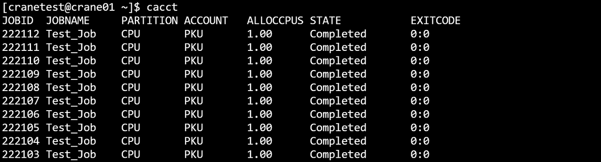
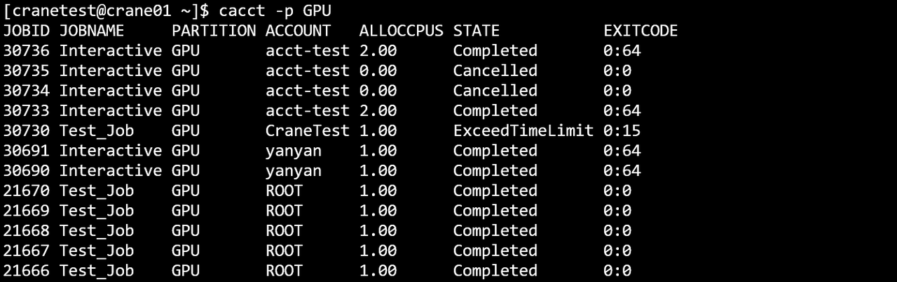

# cacct 查看作业统计信息

cacct显示集群中作业和作业步的统计信息。它查询所有作业状态，包括已完成、失败和取消的作业。输出会自动包含作业及其相关的作业步。

查看集群中所有作业和作业步信息：

```bash
cacct
```

## 选项

**-h, --help**

:   **适用于：** `作业`, `作业步`  
显示cacct命令的帮助信息。

**-v, --version**

:   **适用于：** `作业`, `作业步`  
显示cacct版本信息。

**-C, --config=&lt;path&gt;**

:   **适用于：** `作业`, `作业步`  
配置文件路径。默认值："/etc/crane/config.yaml"。

**-j, --job=&lt;jobid1,jobid2,...&gt;**

:   **适用于：** `作业`, `作业步`  
指定查询的作业ID（逗号分隔列表）。例如，`-j=2,3,4`。查询作业时，会按作业ID过滤。输出将包含匹配的作业及其相关的作业步。支持使用作业步ID格式
`jobid.stepid`查询特定作业步。

**-n, --name=&lt;name1,name2,...&gt;**

:   **适用于：** `作业`, `作业步`  
指定查询的作业名（逗号分隔列表，用于多个名称）。

**-u, --user=&lt;username1,username2,...&gt;**

:   **适用于：** `作业`, `作业步`  
指定查询的用户（逗号分隔列表，用于多个用户）。按指定的用户名过滤作业和作业步。

**-A, --account=&lt;account1,account2,...&gt;**

:   **适用于：** `作业`, `作业步`  
指定查询的账户（逗号分隔列表，用于多个账户）。按指定的账户过滤作业和作业步。

**-p, --partition=&lt;partition1,partition2,...&gt;**

:   **适用于：** `作业`, `作业步`  
指定要查看的分区（逗号分隔列表，用于多个分区）。默认：所有分区。

**-q, --qos=&lt;qos1,qos2,...&gt;**

:   **适用于：** `作业`, `作业步`  
指定要查看的QoS（逗号分隔列表，用于多个QoS）。默认：所有QoS级别。

**-t, --state=&lt;state&gt;**

:   **适用于：** `作业`, `作业步`  
指定要查看的作业状态。支持的状态：'pending'或'p'、'running'或'r'、'completed'或'c'、'failed'或'f'、'cancelled'或'x'
、'time-limit-exceeded'或't'以及'all'。默认：'all'。可以以逗号分隔列表的形式指定多个状态。

**-s, --submit-time=&lt;time_range&gt;**

:   **适用于：** `作业`, `作业步`  
按提交时间范围过滤作业。支持闭区间（格式：`2024-01-02T15:04:05~2024-01-11T11:12:41`）或半开区间（格式：
`2024-01-02T15:04:05~`  
表示特定时间之后，或 `~2024-01-11T11:12:41` 表示特定时间之前）。

**-S, --start-time=&lt;time_range&gt;**

:   **适用于：** `作业`, `作业步`  
按开始时间范围过滤作业。格式同submit-time。

**-E, --end-time=&lt;time_range&gt;**

:   **适用于：** `作业`, `作业步`  
按结束时间范围过滤作业。格式同submit-time。例如，`~2023-03-14T10:00:00` 过滤在指定时间之前结束的作业。

**-w, --nodelist=&lt;node1,node2,...&gt;**

:   **适用于：** `作业`, `作业步`  
指定要查看的节点名称（逗号分隔列表或模式，如node[1-10]）。默认：所有节点。

**--type=&lt;type1,type2,...&gt;**

:   **适用于：** `作业`, `作业步`  
指定要查看的任务类型（逗号分隔列表）。有效值：'Interactive'、'Batch'、'Container'。默认：所有类型。

**-F, --full**

:   **适用于：** `作业`, `作业步`  
显示完整信息，不截断字段。默认情况下，每个单元格仅显示30个字符。

**-N, --noheader**

:   **适用于：** `作业`, `作业步`  
输出时隐藏表头。

**-m, --max-lines=&lt;number&gt;**

:   **适用于：** `作业`, `作业步`  
指定输出结果的最大条数。例如，`-m=500` 将输出限制为500行。默认：100条。

**--json**

:   **适用于：** `作业`, `作业步`  
以JSON格式输出命令执行结果，而不是表格格式。

**-o, --format=&lt;format_string&gt;**

:   **适用于：** `作业`, `作业步`  
使用格式说明符自定义输出格式。字段由百分号(%)后跟字符或字符串标识。格式规范语法：`%[.]<size><type>`。不带大小：字段使用自然宽度。仅带大小（
`%5j`）：最小宽度，左对齐。带点和大小（`%.5j`）：最小宽度，右对齐。可用的格式标识符请参见下面的格式说明符部分。

## 默认输出字段

显示默认格式时，会显示以下字段：

- **JobId**：作业或作业步标识（格式：作业为jobid，作业步为jobid.stepid）
- **JobName**：作业或作业步名称
- **Partition**：作业/作业步运行的分区
- **Account**：作业/作业步计费的账户
- **AllocCPUs**：分配的CPU数量
- **State**：作业/作业步状态（如COMPLETED、FAILED、CANCELLED）
- **ExitCode**：退出码（格式：exitcode:signal，见[退出码参考](../reference/exit_code.md)）

## 格式说明符

支持以下格式标识符（不区分大小写）：

| 标识符                   | 描述                           |
|-----------------------|------------------------------|
| %a / %Account         | 与作业/作业步关联的账户                 |
| %C / %ReqCpus         | 请求的CPU数量                     |
| %c / %AllocCpus       | 分配的CPU数量                     |
| %D / %ElapsedTime     | 作业/作业步启动以来的经过时间              |
| %E / %EndTime         | 作业/作业步的结束时间                  |
| %e / %ExitCode        | 退出码（格式：exitcode:signal）      |
| %h / %Held            | 作业的保持状态                      |
| %j / %JobID           | 作业ID（或作业步ID，格式为jobid.stepid） |
| %K / %Wckey           | 工作负载特征键                      |
| %k / %Comment         | 作业的备注                        |
| %L / %NodeList        | 作业/作业步运行的节点列表                |
| %l / %TimeLimit       | 作业/作业步的时间限制                  |
| %M / %ReqMemPerNode   | 每个节点请求的内存                    |
| %m / %AllocMemPerNode | 每个节点分配的内存                    |
| %N / %NodeNum         | 节点数量                         |
| %n / %JobName         | 作业/作业步的名称                    |
| %P / %Partition       | 与作业/作业步关联的分区                 |
| %p / %Priority        | 作业的优先级                       |
| %q / %Qos             | 服务质量级别                       |
| %R / %Reason          | pending状态的原因                 |
| %r / %ReqNodes        | 请求的节点                        |
| %S / %StartTime       | 作业/作业步的开始时间                  |
| %s / %SubmitTime      | 作业的提交时间                      |
| %t / %State           | 作业/作业步的当前状态                  |
| %T / %JobType         | 作业类型（如Batch、Interactive）     |
| %U / %UserName        | 提交作业的用户名                     |
| %u / %Uid             | 用户ID                         |
| %x / %ExcludeNodes    | 从作业中排除的节点                    |
| %X / %Exclusive       | 作业的独占状态                      |

## 使用示例

### 基本查询

**查看所有作业和作业步：**

```bash
cacct
```



**显示帮助：**

```bash
cacct -h
```


**隐藏表头：**

```bash
cacct -N
```


### 按ID和名称过滤

**查询特定作业ID：**

```bash
cacct -j=30618,30619,30620
```


**按作业名查询：**

```bash
cacct -n=Test_Job
```


**按名称模式查询：**

```bash
cacct -n test
```


### 按用户和账户过滤

**按用户查询作业：**

```bash
cacct -u=cranetest
```


**按账户查询作业：**

```bash
cacct -A=CraneTest
```


**组合账户和最大行数：**

```bash
cacct -A ROOT -m 10
```


### 按分区和QoS过滤

**查询特定分区的作业：**

```bash
cacct -p GPU
```



**按QoS查询：**

```bash
cacct -q test_qos
```


### 时间范围过滤

**按开始时间范围过滤：**

```bash
cacct -S=2024-07-22T10:00:00~2024-07-24T10:00:00
```


**按结束时间范围过滤：**

```bash
cacct -E=2024-07-22T10:00:00~2024-07-24T10:00:00
```


**查询在时间范围内提交的作业：**

```bash
cacct -s=2024-01-01T00:00:00~2024-01-31T23:59:59
```

**查询在特定时间之后开始的作业：**

```bash
cacct -S=2024-01-15T00:00:00~
```

**查询在特定时间之前结束的作业：**

```bash
cacct -E=~2024-01-31T23:59:59
```

### 状态过滤

**仅查看已完成的作业：**

```bash
cacct -t completed
```

**查看失败和取消的作业：**

```bash
cacct -t failed,cancelled
```

**查看超时的作业：**

```bash
cacct -t time-limit-exceeded
```

**按作业类型过滤：**

```bash
# 仅查看容器作业
cacct --type Container

# 查看批处理作业
cacct --type Batch

# 查看交互式作业
cacct --type Interactive
```

!!! tip "容器作业管理"
    除基本查询外，更多容器专用操作参见 [ccon 命令手册](ccon.md)。

### 输出控制

**限制输出到10行：**

```bash
cacct -m=10
```


**JSON输出：**

```bash
cacct --json -j 12345
```

### 自定义格式输出

**指定自定义输出格式：**

```bash
cacct -o="%j %.10n %P %a %t"
```


**所有字段使用自然宽度：**

```bash
cacct --format "%j %n %t"
```

**左对齐，带最小宽度：**

```bash
cacct --format "%5j %20n %t"
```

**右对齐，带最小宽度：**

```bash
cacct --format "%.5j %.20n %t"
```

**带标签的混合格式：**

```bash
cacct -o="%.8j %20n %-10P %.15U %t"
```

### 组合过滤

**多个过滤器与完整输出：**

```bash
cacct -m 10 -j 783925,783889 -t=c -F
```


**复杂组合查询：**

```bash
cacct -m 10 -E=2024-10-08T10:00:00~2024-10-10T10:00:00 -p CPU -t c
```


## 相关命令

- [cqueue](cqueue.md) - 查看作业队列（当前/挂起的作业和作业步）
- [cbatch](cbatch.md) - 提交批处理作业
- [crun](crun.md) - 运行交互式作业和作业步
- [ccancel](ccancel.md) - 取消作业和作业步
- [ceff](ceff.md) - 查看作业效率统计
- [ccon](ccon.md) - 容器作业管理
- [creport](creport.md) - 查询作业相关统计信息
