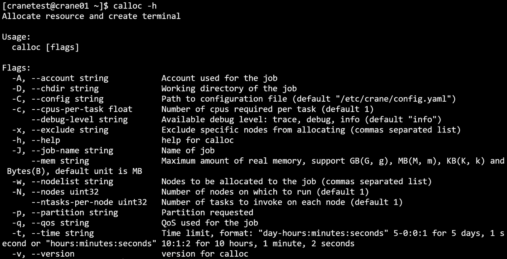
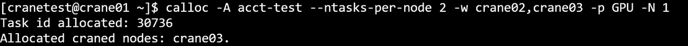
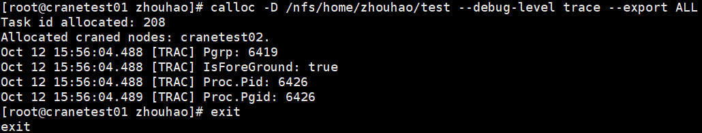

# calloc - 分配资源并创建交互式 Shell

**calloc 使用命令行指定的参数申请资源，并在分配的计算节点上创建一个新的交互式 shell。**

calloc 必须在运行 `cfored` 的节点上启动。当任务启动时，会进入一个新的用户终端，您可以直接在计算节点上工作。

!!! tip
    退出 calloc shell 将终止分配并释放资源。

## 命令行选项

### 资源规格
- **-N, --nodes uint32**: 要分配的节点数量（默认：1）
- **-c, --cpus-per-task float**: 每个任务的 CPU 核心数（默认：1）
- **--ntasks-per-node uint32**: 每个节点的任务数量（默认：1）
- **--mem string**: 每个节点的最大内存。支持 GB（G，g）、MB（M，m）、KB（K，k）和字节（B），默认单位是 MB
- **--gres string**: 每个任务所需的通用资源，格式：`gpu:a100:1` 或 `gpu:1`

### 作业信息
- **-J, --job-name string**: 作业名称
- **-A, --account string**: 提交作业的账户
- **-p, --partition string**: 请求的分区
- **-q, --qos string**: 作业使用的服务质量（QoS）
- **-t, --time string**: 时间限制，格式：`day-hours:minutes:seconds`（如 `5-0:0:1` 表示 5 天 1 秒）或 `hours:minutes:seconds`（如 `10:1:2` 表示 10 小时 1 分钟 2 秒）
- **--comment string**: 作业注释

### 节点选择
- **-w, --nodelist string**: 要分配的节点（逗号分隔的列表）
- **-x, --exclude string**: 从分配中排除特定节点（逗号分隔的列表）

### 环境变量
- **--get-user-env**: 加载用户的登录环境变量
- **--export string**: 传播环境变量

### 调度选项
- **--exclusive**: 请求独占节点资源
- **-H, --hold**: 以挂起状态提交作业
- **-r, --reservation string**: 使用预留资源

### 邮件通知
- **--mail-type string**: 当特定事件发生时，向用户发送邮件通知。支持的值：`NONE`、`BEGIN`、`END`、`FAIL`、`TIMELIMIT`、`ALL`（默认：`NONE`）
- **--mail-user string**: 通知接收者的邮件地址

### 其他选项
- **-D, --chdir string**: 作业的工作目录
- **--extra-attr string**: 作业的额外属性（JSON 格式）
- **--debug-level string**: 调试级别：`trace`、`debug`、`info`（默认：`info`）
- **-C, --config string**: 配置文件路径（默认：`/etc/crane/config.yaml`）
- **-h, --help**: 显示帮助信息
- **-v, --version**: 显示 calloc 版本

## 使用示例

### 帮助信息

显示帮助：
```bash
calloc -h
```


### 基本资源分配

在 CPU 分区分配 2 个节点，每个节点 1 个 CPU 核心和 200M 内存：
```bash
calloc -c 1 --mem 200M -p CPU -N 2
```

**运行结果：**


### 指定账户和节点列表

在 GPU 分区分配 1 个节点，每个节点 2 个任务，使用特定账户和节点列表：
```bash
calloc -A acct-test --ntasks-per-node 2 -w crane02,crane03 -p GPU -N 1
```

**运行结果：**




### 时间限制和 QoS

使用时间限制和特定 QoS 分配资源：
```bash
calloc --mem 200M -p CPU -q test-qos -t 00:25:25
```


### 工作目录

指定工作目录：
```bash
calloc -D /path
```


### 调试级别

设置调试级别为 trace：
```bash
calloc --debug-level trace
```



### 排除节点

从分配中排除特定节点：
```bash
calloc -x cranetest02
```


### 用户环境

加载用户的登录环境：
```bash
calloc --get-user-env
```


### 作业名称

指定作业名称：
```bash
calloc -J job_name
```


## 高级功能

### 独占节点

请求独占访问节点：
```bash
calloc --exclusive -N 2 -p CPU
```

### 挂起作业

以挂起状态提交作业（需要手动释放）：
```bash
calloc --hold -N 1 -p GPU
```

稍后使用 `ccontrol release <job_id>` 释放作业。

### 使用预留

从预留资源分配：
```bash
calloc -r my_reservation -N 2
```

### 邮件通知

接收作业事件的电子邮件通知：
```bash
calloc --mail-type=ALL --mail-user=user@example.com -N 1 -p CPU
```

### GPU 分配

分配 GPU 资源：
```bash
calloc --gres=gpu:a100:2 -N 1 -p GPU
```

## 交互式使用

一旦 calloc 分配了资源，您将进入分配的计算节点上的新 shell。您可以：

1. **直接在计算节点上运行命令**
2. **通过 SSH 访问所有分配的节点**
3. **使用环境变量** `CRANE_JOB_NODELIST` 查看分配的节点
4. **在分配的节点上运行并行任务**

**示例会话：**
```bash
# 开始分配
$ calloc -N 2 -c 4 -p CPU

# 现在在分配的 shell 中
$ hostname
crane01

$ echo $CRANE_JOB_NODELIST
crane01;crane02

# 在所有节点上运行命令
$ for node in crane01 crane02; do ssh $node hostname; done
crane01
crane02

# 退出以释放资源
$ exit
```

## 重要说明

1. **cfored 要求**：calloc 必须在运行 `cfored` 的节点上运行

2. **资源释放**：退出 calloc shell 将自动终止作业并释放所有分配的资源

3. **交互性质**：与 `cbatch` 不同，calloc 提供用于即时工作的交互式 shell

4. **节点访问**：在分配期间，您可以通过 SSH 访问所有分配的节点

5. **嵌套执行**：您可以在 calloc 分配中运行 `crun` 以继承其资源

## 与其他命令的比较

| 命令 | 类型 | 用途 |
|------|------|------|
| **calloc** | 交互式分配 | 在计算节点上获取 shell |
| **crun** | 交互式执行 | 交互式运行特定程序 |
| **cbatch** | 批处理提交 | 提交脚本以供稍后执行 |

## 另请参阅

- [crun](crun.md) - 运行交互式任务
- [cbatch](cbatch.md) - 提交批处理作业
- [cqueue](cqueue.md) - 查看作业队列
- [ccancel](ccancel.md) - 取消作业
