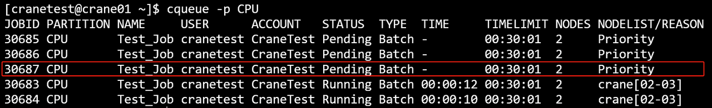
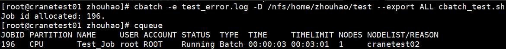
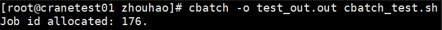

# cbatch - 提交批处理作业

**cbatch 主要是将用户描述整个计算过程的脚本传递给作业调度系统，并为作业分配作业号，等待作业调度系统为其分配资源并执行。**

鹤思系统中必须有用户和账号才能提交作业，添加用户和账户请参考 [cacctmgr 教程](cacctmgr.md)。

## 快速开始

首先介绍一个简单的单节点作业的例子：

下列作业将申请一个节点，一个 CPU 核心，并在计算节点上运行 `hostname` 并退出

```bash
#!/bin/bash
#CBATCH --ntasks-per-node 1
#CBATCH --nodes 1
#CBATCH -c 1
#CBATCH --mem 20M
#CBATCH --time 0:3:1
#CBATCH -o job.out
#CBATCH -p CPU
#CBATCH -J Test_Job

hostname
```

假设上面作业脚本的文件名为 `cbatch_test.sh`，通过 cbatch 命令提交：

```bash
cbatch cbatch_test.sh
```

**cbatch 运行结果展示**




## 命令行选项

### 资源规格
- **-N, --nodes uint32**: 作业要运行的节点数量（默认值：1）
- **-c, --cpus-per-task float**: 每个任务所需的 CPU 核心数（默认值：1）
- **--ntasks-per-node uint32**: 每个节点要调用的任务数量（默认值：1）
- **--mem string**: 最大实际内存量，支持 GB（G，g）、MB（M，m）、KB（K，k）和字节（B），默认单位是 MB
- **--gres string**: 每个任务所需的通用资源，格式：`gpu:a100:1` 或 `gpu:1`
- **--L, --licenses**: 作业要使用的许可证，格式：`lic1:2,lic2:4`或`lic1:2|lic2:4`

### 作业信息
- **-J, --job-name string**: 作业名称
- **-A, --account string**: 提交作业的账户
- **-p, --partition string**: 请求的分区
- **-q, --qos string**: 作业使用的服务质量（QoS）
- **-t, --time string**: 时间限制，格式：`[day-]hours:minutes:seconds`（如 `5-0:0:1` 表示 5 天 1 秒，或 `10:1:2` 表示 10 小时 1 分钟 2 秒）
- **--comment string**: 作业注释

### 节点选择
- **-w, --nodelist string**: 要分配给作业的节点（逗号分隔的列表）
- **-x, --exclude string**: 从分配中排除特定节点（逗号分隔的列表）

### I/O 重定向
- **-o, --output string**: 脚本标准输出的重定向路径
- **-e, --error string**: 脚本错误日志的重定向路径
- **--open-mode string**: 打开输出和错误文件的模式。支持的值：`append`（追加）、`truncate`（截断，默认）

### 环境变量
- **--get-user-env**: 加载用户的登录环境变量
- **--export string**: 传播环境变量

### 调度选项
- **--begin string**: 作业的开始时间。格式：`YYYY-MM-DDTHH:MM:SS`
- **-d, --dependency string**: 作业依赖关系。格式：`<type>:<job_id>[+<delay>][:<job_id>][,<type>:<job_id>[:<job_id>]]` 或 `<type>:<job_id>[:<job_id>][?<type>:<job_id>[:<job_id>]]`。支持的类型：`after`、`afterok`、`afternotok`、`afterany`。**注意**：`<delay>` 必须使用带单位的时间格式（如 `10s`、`5m`、`2h`），不要使用 `HH:MM:SS` 格式，因为 `:` 是作业 ID 分隔符。详见 [作业依赖](../reference/job_dependency.md)
- **--exclusive**: 请求独占节点资源
- **-H, --hold**: 以挂起状态提交作业
- **-r, --reservation string**: 使用预留资源

### 邮件通知
- **--mail-type string**: 当特定事件发生时，向用户发送邮件通知。支持的值：`NONE`、`BEGIN`、`END`、`FAIL`、`TIMELIMIT`、`ALL`（默认：`NONE`）
- **--mail-user string**: 通知接收者的邮件地址

### 容器支持

容器相关选项用于创建支持容器运行的 Pod 作业。详细使用方法参见 [ccon 命令手册](ccon.md) 和 [容器快速上手](../reference/container/quickstart.md)。

- **--pod**: 启用容器模式，将作业创建为 Pod 作业。启用后可在脚本中使用 `ccon run` 启动容器
- **--pod-name string**: Pod 名称（默认使用作业名）
- **--pod-port string**: Pod 端口映射，格式：`HOST:CONTAINER` 或 `PORT`。可多次使用
- **--pod-user string**: 以指定 UID[:GID] 运行 Pod（默认：当 `--pod-userns=false` 时使用当前用户）
- **--pod-userns**: 启用 Pod 用户命名空间（默认：`true`，容器内用户映射为 root）
- **--pod-host-network**: 使用宿主机网络命名空间（默认：`false`）
- **--pod-dns**: 为 Pod 设置 DNS 服务器（仅支持 IPv4）。指定的 DNS server 会被添加到系统默认 DNS 之前（优先级更高，默认使用配置文件 `Container.Dns.Servers`）

### 其他选项
- **--interpreter string**: 指定脚本解释器（如 `/bin/bash`、`/usr/bin/python3`）
- **-D, --chdir string**: 作业的工作目录
- **--extra-attr string**: 作业的额外属性（JSON 格式）
- **--repeat uint32**: 多次提交作业（默认值：1）
- **--wrap string**: 将命令字符串包装到 shell 脚本中并提交
- **--json**: 以 JSON 格式输出
- **-C, --config string**: 配置文件路径（默认：`/etc/crane/config.yaml`）
- **-h, --help**: 显示帮助信息
- **-v, --version**: 显示 cbatch 版本

## 使用示例

### 基本作业提交

提交批处理脚本：
```bash
cbatch cbatch_test.sh
```


### 帮助信息

显示帮助：
```bash
cbatch -h
```


### 指定账户

使用特定账户提交作业：
```bash
cbatch -A=acct-test cbatch_test.sh
```


### 节点排除

从分配中排除节点：
```bash
cbatch -x crane01,crane02 cbatch_test.sh
```


### 作业名称

指定作业名称：
```bash
cbatch -J testjob01 cbatch_test.sh
```


### 节点选择

请求特定节点：
```bash
cbatch -w crane01,crane03 cbatch_test.sh
```


### 分区选择

提交到特定分区：
```bash
cbatch -p GPU cbatch_test.sh
```


### 时间限制

设置时间限制：
```bash
cbatch -t 00:25:25 cbatch_test.sh
```


### CPU 核心

请求特定数量的 CPU 核心：
```bash
cbatch -c 2 cbatch_test.sh
```


### 内存规格

指定内存需求：
```bash
cbatch --mem 123M cbatch_test.sh
```


### 多节点作业

请求多个节点并指定每个节点的任务数：
```bash
cbatch -N 2 --ntasks-per-node 2 cbatch_test.sh
```


### 工作目录

指定工作目录：
```bash
cbatch -D /path test.sh
```


### 错误日志

重定向错误输出：
```bash
cbatch -e error.log test.sh
```


### 环境变量

导出所有环境变量：
```bash
cbatch --export ALL test.sh
```


### 用户环境

加载用户的登录环境：
```bash
cbatch --get-user-env test.sh
```


### 输出重定向

重定向标准输出：
```bash
cbatch -o output.out test.sh
```


### 服务质量

指定 QoS：
```bash
cbatch -q qos_test test.sh
```


### 重复提交

多次提交作业：
```bash
cbatch --repeat 3 test.sh
```


## 环境变量

批处理脚本中可用的常用环境变量：

| 变量 | 说明 |
|------|------|
| **CRANE_JOB_NODELIST** | 作业分配的节点列表 |
| **%j** | 作业号（用于文件模式） |

## 多节点并行作业

下面介绍提交一个跨节点多核心的例子：

下列作业将在三个节点上运行，每个节点使用 4 个 CPU 核心：

```bash
#!/bin/bash
#CBATCH -o crane_test%j.out
#CBATCH -p CPU
#CBATCH -J "crane_test"
#CBATCH --nodes 3
#CBATCH --ntasks-per-node 4
#CBATCH -c 4
#CBATCH --time 50:00:00

# 生成作业分配的节点的 machinefile
echo "$CRANE_JOB_NODELIST" | tr ";" "\n" > crane.hosts

# 加载 MPI 运行环境
module load mpich/4.0 

# 执行跨节点并行任务
mpirun -n 13 -machinefile crane.hosts helloWorld > log
```

## 高级功能

### 延迟启动

将作业调度到特定时间启动：
```bash
cbatch --begin 2024-12-31T23:00:00 my_script.sh
```

### 挂起作业

以挂起状态提交作业：
```bash
cbatch --hold my_script.sh
```

使用 `ccontrol release <job_id>` 释放挂起的作业。

### 邮件通知

接收电子邮件通知：
```bash
cbatch --mail-type=ALL --mail-user=user@example.com my_script.sh
```

### JSON 输出

以 JSON 格式获取提交结果：
```bash
cbatch --json my_script.sh
```

### 包装命令

提交简单命令而无需创建脚本文件：
```bash
cbatch --wrap "echo Hello && sleep 10 && echo Done"
```

### 容器作业

使用 `--pod` 选项创建支持容器的 Pod 作业：

```bash
#!/bin/bash
#CBATCH --pod
#CBATCH -N 2
#CBATCH -c 4
#CBATCH --mem 8G
#CBATCH -p GPU
#CBATCH --gres gpu:1
#CBATCH -J container_training

# 在 Pod 内启动容器
ccon run -d -v /data:/data pytorch/pytorch:latest -- python /data/train.py

# 等待所有容器完成
ccon wait
```

或通过命令行指定容器选项：

```bash
cbatch --pod --pod-name my-training --pod-host-network train_job.sh
```

更多容器使用示例，参见 [容器使用示例](../reference/container/examples.md)。

## 另请参阅

- [cqueue](cqueue.md) - 查看作业队列
- [ccancel](ccancel.md) - 取消作业
- [cacct](cacct.md) - 查看作业统计信息
- [ccontrol](ccontrol.md) - 控制作业和系统资源
- [ccon](ccon.md) - 容器作业管理
- [容器功能概览](../reference/container/index.md) - 容器功能介绍
