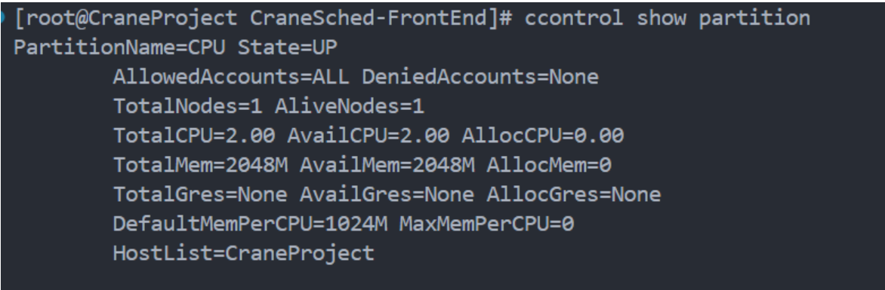
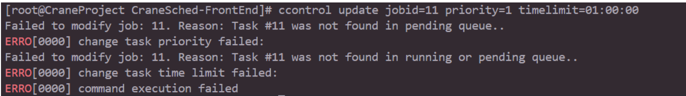

# ccontrol 控制集群资源

**ccontrol是用于管理和控制CraneSched集群资源的命令行工具。**

ccontrol提供SQL风格的语法来管理CraneSched集群中的节点、分区、作业和预留资源。该工具支持查看状态、更新配置、暂挂/释放作业以及创建/删除预留资源等操作。

## 命令结构

```
ccontrol <操作> <实体> [选项]
```

### 操作类型

- **show** - 显示实体信息
- **update** - 修改实体属性
- **hold** - 暂挂实体（阻止作业启动）
- **release** - 释放先前暂挂的实体
- **create** - 创建新实体
- **delete** - 删除现有实体

### 实体类型

- **node** - 计算节点
- **partition** - 节点分区
- **job** - 作业/任务
- **reservation** - 资源预留

## 全局选项

- **-h/--help**: 显示帮助信息
- **-v/--version**: 显示版本信息
- **-J/--json**: 以JSON格式输出结果
- **-C/--config**: 指定配置文件路径（默认："/etc/crane/config.yaml"）

## 命令参考

### Show 命令

#### 显示节点

显示计算节点的信息。

```bash
# 显示所有节点
ccontrol show node

# 显示特定节点
ccontrol show node <节点名>
```

**示例：**
```bash
ccontrol show node
ccontrol show node crane01
```


#### 显示分区

显示分区的信息。

```bash
# 显示所有分区
ccontrol show partition

# 显示特定分区
ccontrol show partition <分区名>
```

**示例：**
```bash
ccontrol show partition
ccontrol show partition CPU
```



#### 显示作业

显示作业的信息。

```bash
# 显示所有作业
ccontrol show job

# 显示特定作业
ccontrol show job <作业ID>
```

**示例：**
```bash
ccontrol show job
ccontrol show job 12345
```


#### 显示预留

显示预留资源的信息。

```bash
# 显示所有预留
ccontrol show reservation

# 显示特定预留
ccontrol show reservation <预留名称>
```

**示例：**
```bash
ccontrol show reservation
ccontrol show reservation my_reservation
```


### Update 命令

#### 更新节点

修改节点属性，通常用于排空或恢复节点。

```bash
ccontrol update nodeName=<节点名> state=<状态> [reason=<原因>]
```

**参数：**
- **nodeName**（必需）：要更新的节点名称
- **state**（必需）：节点的新状态
  - `drain` - 阻止在该节点上调度新作业
  - `resume` - 使节点再次可用于调度
- **reason**（排空时必需）：排空节点的原因

**示例：**
```bash
# 排空节点
ccontrol update nodename=crane01 state=drain reason="维护"

# 恢复节点
ccontrol update nodename=crane01 state=resume
```


#### 更新作业

修改作业属性，包括优先级、时间限制、备注和邮件设置。

```bash
ccontrol update jobid=<作业ID> [priority=<优先级>] [timelimit=<时间限制>] [comment=<备注>] [mailuser=<邮箱>] [mailtype=<类型>]
```

**参数：**
- **jobid**（必需）：要更新的作业ID
- **priority**（可选）：新的优先级值（浮点数）
- **timelimit**（可选）：新的时间限制（格式：HH:MM:SS 或 D-HH:MM:SS）
- **comment**（可选）：作业的新备注字符串
- **mailuser**（可选）：接收通知的邮箱地址
- **mailtype**（可选）：邮件通知类型（NONE, BEGIN, END, FAIL, TIMELIMIT, ALL）

**示例：**
```bash
# 更新作业优先级
ccontrol update jobid=11 priority=100

# 更新时间限制
ccontrol update jobid=11 timelimit=01:00:00

# 更新多个属性
ccontrol update jobid=11 priority=1 timelimit=01:00:00 comment="高优先级作业"

# 更新邮件通知
ccontrol update jobid=11 mailuser=user@example.com mailtype=END
```



#### 更新分区

修改分区访问控制列表。

```bash
ccontrol update partitionName=<分区> [accounts=<账户列表>] [deniedaccounts=<账户列表>]
```

**参数：**
- **partitionName**（必需）：要更新的分区名称
- **accounts**（可选）：允许使用分区的账户列表（逗号分隔）
- **deniedaccounts**（可选）：禁止使用分区的账户列表（逗号分隔）

**注意：** 当设置了AllowedAccounts时，DeniedAccounts将不会生效。

**示例：**
```bash
# 允许特定账户
ccontrol update partition=GPU accounts=research,staff

# 禁止特定账户
ccontrol update partition=CPU deniedaccounts=guest
```


### Hold 和 Release 命令

#### 暂挂作业

暂挂指定作业以阻止其启动。

```bash
ccontrol hold <作业ID> [timelimit=<时长>]
```

**参数：**
- **作业ID**（必需）：要暂挂的作业ID
- **timelimit**（可选）：暂挂作业的时长（格式：HH:MM:SS）

**示例：**
```bash
# 无限期暂挂作业
ccontrol hold 1

# 暂挂作业1小时
ccontrol hold 1 timelimit=01:00:00
```


#### 释放作业

释放先前暂挂的作业。

```bash
ccontrol release <作业ID>
```

**示例：**
```bash
ccontrol release 1
```


### Create 和 Delete 命令

#### 创建预留

创建新的资源预留。

```bash
ccontrol create reservation <名称> startTime=<时间> duration=<时长> account=<账户> [partition=<分区>] [nodes=<节点列表>] [nodeCnt=<数量>] [user=<用户名>]
```

**参数：**
- **名称**（必需）：预留的名称
- **startTime**（必需）：预留开始时间（格式：YYYY-MM-DDTHH:MM:SS）
- **duration**（必需）：预留时长（格式：HH:MM:SS 或 D-HH:MM:SS）
- **account**（必需）：与预留关联的账户
- **partition**（可选）：从哪个分区预留资源
- **nodes**（可选）：要预留的特定节点（逗号分隔列表）
- **nodeCnt**（可选）：要预留的节点数量（在未指定nodes时使用）
- **user**（可选）：与预留关联的用户

**示例：**
```bash
# 使用特定节点创建预留
ccontrol create reservation my_reservation startTime=2024-12-01T10:00:00 duration=01:00:00 partition=CPU nodes=crane01,crane02 account=research

# 使用节点数量创建预留
ccontrol create reservation test_reservation startTime=2024-12-01T14:00:00 duration=02:00:00 partition=GPU nodeCnt=2 account=staff user=alice
```


#### 删除预留

删除现有预留。

```bash
ccontrol delete reservation <名称>
```

**示例：**
```bash
ccontrol delete reservation my_reservation
```


## JSON 输出

所有命令都支持使用 `--json` 标志输出JSON格式：

```bash
ccontrol --json show node
ccontrol --json show partition CPU
ccontrol --json show job 12345
```

这对脚本编写和自动化非常有用。

## 权限要求

不同操作需要不同的权限级别：

| 操作 | 所需权限 |
|------|---------|
| Show 命令 | 用户可查看自己的作业；管理员可查看所有 |
| Update node | 仅管理员 |
| Update partition | 仅管理员 |
| Update job | 作业所有者或管理员 |
| Hold/Release job | 作业所有者或管理员 |
| Create reservation | 管理员或授权用户 |
| Delete reservation | 预留创建者或管理员 |

## 使用场景

### 节点维护

```bash
# 排空节点进行维护
ccontrol update nodename=crane01 state=drain reason="硬件升级"

# 维护后恢复节点
ccontrol update nodename=crane01 state=resume
```

### 作业优先级管理

```bash
# 提高紧急作业的优先级
ccontrol update jobid=1234 priority=1000

# 延长长时间运行作业的时间限制
ccontrol update jobid=1234 timelimit=10:00:00
```

### 资源预留

```bash
# 为计划的维护窗口预留节点
ccontrol create reservation maint_window startTime=2024-12-15T02:00:00 duration=04:00:00 partition=ALL nodes=crane[01-10] account=admin

# 不再需要时删除预留
ccontrol delete reservation maint_window
```

## 相关命令

- [cinfo](cinfo.zh.md) - 查看集群资源状态
- [cqueue](cqueue.zh.md) - 查看作业队列
- [cacctmgr](cacctmgr.zh.md) - 管理账户和用户
- [cbatch](cbatch.zh.md) - 提交批处理作业
- [ccancel](ccancel.zh.md) - 取消作业
