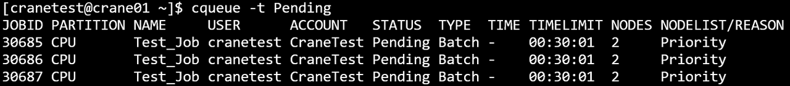
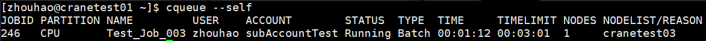
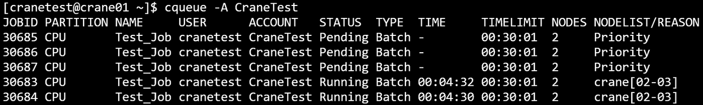
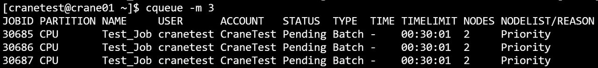

# cqueue 查看作业队列

cqueue显示队列中的作业和作业步信息。默认情况下，它显示作业信息，包括pending、running和其他状态。使用`-s/--step`选项可以查询作业步信息。

查看集群中所有队列的作业信息：

```bash
cqueue
```

## 选项

**-h, --help**

:   **适用于：** `作业`, `作业步`  
显示cqueue命令的帮助信息。

**-v, --version**

:   **适用于：** `作业`, `作业步`  
显示cqueue版本信息。

**-C, --config=&lt;path&gt;**

:   **适用于：** `作业`, `作业步`  
配置文件路径。默认值："/etc/crane/config.yaml"。

**-F, --full**

:   **适用于：** `作业`, `作业步`  
显示完整的内容而不截断。默认情况下，每项输出30个字符。

**-N, --noheader**

:   **适用于：** `作业`, `作业步`  
输出时隐藏表头。

**-m, --max-lines=&lt;number&gt;**

:   **适用于：** `作业`, `作业步`  
指定输出结果的最大条数。例如，`-m=500`将输出限制为500行。默认显示100条。

**-i, --iterate=&lt;seconds&gt;**

:   **适用于：** `作业`, `作业步`  
指定间隔秒数刷新查询结果。例如，`-i=3`表示每隔3秒输出一次查询结果。

**--json**

:   **适用于：** `作业`, `作业步`  
以JSON格式输出命令执行结果，而不是表格格式。

**-s, --step[=&lt;stepid1,stepid2,...&gt;]**

:   **适用于：** `作业步`    
查询作业步信息而非作业信息。接受可选的逗号分隔的作业步ID列表，格式为`jobid.stepid`（如`123.1,123.2,456.3`
）。如果不提供参数，则显示所有作业步。此选项将查询模式从作业切换到作业步。

**-j, --job=&lt;jobid1,jobid2,...&gt;**

:   **适用于：** `作业`, `作业步`  
指定查询的作业ID（逗号分隔列表）。例如，`-j=2,3,4`。与`--step`一起使用时，过滤属于指定作业的作业步。

**-n, --name=&lt;name1,name2,...&gt;**

:   **适用于：** `作业`, `作业步`  
指定查询的作业名（逗号分隔列表，用于多个名称）。

**-t, --state=&lt;state&gt;**

:   **适用于：** `作业`, `作业步`  
指定查询的状态。有效值为'pending(p)'、'running(r)'和'all'。默认为'all'
（显示所有pending和running）。对于作业步，有效状态包括'running'和其他作业步特定状态。

**-S, --start**

:   **适用于：** `作业`  
显示开始时间。对于pending作业，显示预期开始时间。对于running作业，显示实际开始时间。

**-u, --user=&lt;username1,username2,...&gt;**

:   **适用于：** `作业`, `作业步`  
指定查询的用户（逗号分隔列表，用于多个用户）。按指定的用户名过滤作业或作业步。

**-A, --account=&lt;account1,account2,...&gt;**

:   **适用于：** `作业`, `作业步`  
指定查询的账户（逗号分隔列表，用于多个账户）。按指定的账户过滤作业或作业步。

**-p, --partition=&lt;partition1,partition2,...&gt;**

:   **适用于：** `作业`, `作业步`  
指定查询的分区（逗号分隔列表，用于多个分区）。按指定的分区过滤作业或作业步。

**-q, --qos=&lt;qos1,qos2,...&gt;**

:   **适用于：** `作业`, `作业步`  
指定查询的QoS（逗号分隔列表，用于多个QoS）。按指定的服务质量级别过滤作业或作业步。

**--self**

:   **适用于：** `作业`, `作业步`  
仅查看当前用户提交的作业或作业步。

**-o, --format=&lt;format_string&gt;**

:   **适用于：** `作业`, `作业步`  
使用格式说明符自定义输出格式。字段由百分号(%)后跟字符标识。格式规范语法：`%[.]<size><type>`。不带大小：字段使用自然宽度。仅带大小（
`%5j`）：最小宽度，左对齐。带点和大小（`%.5j`）：最小宽度，右对齐。作业查询和作业步查询可用的格式说明符不同（见下面的格式说明符部分）。

## 默认输出字段

查询作业时（默认模式），显示以下字段：

- **JobId**：作业标识号
- **Partition**：作业运行的分区
- **Name**：作业名
- **User**：作业所有者的用户名
- **Account**：作业计费的账户
- **Status**：当前作业状态（如RUNNING、PENDING）
- **Type**：作业类型（如BATCH、INTERACTIVE）
- **TimeLimit**：作业的时间限制
- **Nodes**：分配的节点数
- **NodeList**：作业运行的节点名称

查询作业步时（使用`--step`），显示以下字段：

- **StepId**：作业步标识，格式为jobid.stepid
- **JobId**：父作业标识号
- **Name**：作业步名称
- **Partition**：分区（从父作业继承）
- **User**：用户名（从父作业继承）
- **State**：当前作业步状态
- **ElapsedTime**：作业步启动以来的经过时间
- **NodeList**：作业步运行的节点名称

## 作业格式说明符

查询作业时（默认模式），支持以下格式标识符（不区分大小写）：

| 标识符 | 全名              | 描述                    |
|-----|-----------------|-----------------------|
| %a  | Account         | 与作业关联的账户              |
| %c  | AllocCpus       | 分配给作业的CPU             |
| %C  | ReqCpus         | 作业请求的总CPU数            |
| %e  | ElapsedTime     | 作业启动以来的经过时间           |
| %h  | Held            | 作业的保持状态               |
| %j  | JobID           | 作业ID                  |
| %k  | Comment         | 作业的备注                 |
| %l  | TimeLimit       | 作业的时间限制               |
| %L  | NodeList        | 作业运行的节点列表（或pending原因） |
| %m  | AllocMemPerNode | 每个节点分配的内存             |
| %M  | ReqMemPerNode   | 每个节点请求的内存             |
| %n  | Name            | 作业名                   |
| %N  | NodeNum         | 作业请求的节点数              |
| %o  | Command         | 作业的命令行                |
| %p  | Priority        | 作业的优先级                |
| %P  | Partition       | 作业运行的分区               |
| %q  | QoS             | 作业的服务质量级别             |
| %Q  | ReqCpuPerNode   | 每个节点请求的CPU数           |
| %r  | ReqNodes        | 请求的节点                 |
| %R  | Reason          | pending状态的原因          |
| %s  | SubmitTime      | 作业的提交时间               |
| %S  | StartTime       | 作业的开始时间               |
| %t  | State           | 作业的当前状态               |
| %T  | JobType         | 作业类型                  |
| %u  | User            | 提交作业的用户               |
| %U  | Uid             | 作业的UID                |
| %x  | ExcludeNodes    | 从作业中排除的节点             |
| %X  | Exclusive       | 作业的独占状态               |

## 作业步格式说明符

查询作业步时（使用`--step`），支持以下格式标识符（不区分大小写）：

| 标识符 | 全名          | 描述                    |
|-----|-------------|-----------------------|
| %i  | StepId      | 作业步ID，格式为jobid.stepid |
| %j  | JobId       | 父作业ID                 |
| %n  | Name        | 作业步名称                 |
| %P  | Partition   | 分区（从父作业继承）            |
| %u  | User        | 用户名（从父作业继承）           |
| %U  | Uid         | 用户ID                  |
| %e  | ElapsedTime | 作业步启动以来的经过时间          |
| %L  | NodeList    | 作业步运行的节点列表            |
| %t  | State       | 作业步的当前状态              |
| %l  | TimeLimit   | 作业步的时间限制              |
| %N  | NodeNum     | 分配给作业步的节点数            |
| %a  | Account     | 账户（从父作业继承）            |
| %q  | QoS         | 服务质量（从父作业继承）          |
| %o  | Command     | 作业步的命令行               |

## 使用示例

### 基本作业查询

**查看所有作业：**

```bash
cqueue
```


**显示帮助：**

```bash
cqueue -h
```


**隐藏表头：**

```bash
cqueue -N
```


**显示开始时间：**

```bash
cqueue -S
```


### 过滤作业

**查询特定作业：**

```bash
cqueue -j 30674,30675
```


**按状态过滤（pending作业）：**

```bash
cqueue -t Pending
```



**按状态过滤（running作业，简写）：**

```bash
cqueue -t r
```


**查询特定用户的作业：**

```bash
cqueue -u cranetest
```


**仅显示当前用户的作业：**

```bash
cqueue --self
```



**查询特定账户的作业：**

```bash
cqueue -A CraneTest
```



**按分区过滤：**

```bash
cqueue -p CPU
```


**按作业名过滤：**

```bash
cqueue -n test
```


**按QoS过滤：**

```bash
cqueue -q test_qos
```


### 输出控制

**限制输出到3行：**

```bash
cqueue -m 3
```



**每3秒自动刷新：**

```bash
cqueue -i 3
```


**JSON输出：**

```bash
cqueue --json
```

### 自定义格式输出

**所有字段使用自然宽度：**

```bash
cqueue --format "%j %n %t"
```

**左对齐，带最小宽度：**

```bash
cqueue --format "%5j %20n %t"
```

**右对齐，带最小宽度：**

```bash
cqueue --format "%.5j %.20n %t"
```

**带标签的混合格式：**

```bash
cqueue --format "ID:%8j | Name:%.15n | State:%t"
```

**复杂自定义格式：**

```bash
cqueue -o="%n %u %.5j %.5t %.3T %.5T"
```


### 作业步查询

**查询所有作业步：**

```bash
cqueue --step
```

**查询特定作业步：**

```bash
cqueue --step 100.1,100.2,200.3
```

**查询特定作业的作业步：**

```bash
cqueue --step -j 123
```

**使用自定义格式查询作业步：**

```bash
cqueue --step --format "%i %n %t %e %L"
```

**查询特定用户的作业步：**

```bash
cqueue --step -u username
```

**作业步右对齐格式：**

```bash
cqueue --step --format "%.10i %.20n %.10t"
```

**按状态过滤作业步：**

```bash
cqueue --step -t running
```

**查询多个作业的作业步：**

```bash
cqueue --step -j 100,200,300
```

## 相关命令

- [cbatch](cbatch.md) - 提交批处理作业
- [crun](crun.md) - 运行交互式作业和作业步
- [calloc](calloc.md) - 分配资源供交互式使用
- [ccancel](ccancel.md) - 取消作业和作业步
- [cacct](cacct.md) - 查询已完成的作业
- [ccontrol](ccontrol.md) - 控制和查询作业/作业步
- [creport](creport.md) - 查询作业相关统计信息
