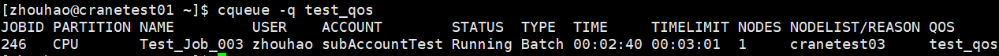

# cqueue 查看作业队列

**cqueue可以查看队列中的作业信息。**

查看集群中所有队列的作业信息（包括状态pending、running、cancelled），默认输出100条信息。

~~~bash
cqueue
~~~

**cqueue运行结果展示**


## 主要输出项

- **JobId**：作业号
- **Partition**：作业所在分区
- **Name**: 作业名
- **User**：作业所属用户
- **Account**：作业所属账户
- **Status**：作业状态
- **Type**： 作业类型
- **TimeLimit**：作业时间限制
- **Nodes**：作业所分配节点数
- **NodeList**： 作业运行的节点名

## 主要参数

- **-A/--account string**：指定查询作业所属账户，指定多个账户时用逗号隔开
- **-C/--config string**：配置文件路径（默认"/etc/crane/config.yaml"）
- **-F/--full**: 显示完整的内容，如果未指定，默认每项输出30个字符
- **-h/--help**: 显示帮助
- **-i/--iterate uint**：指定间隔秒数刷新查询结果。如 `-i=3` 表示每隔三秒输出一次查询结果
- **-j/--job string**：指定查询作业号，指定多个作业号时用逗号隔开。如 `-j=2,3,4`
- **--json**：JSON格式输出命令执行结果
- **-m/--max-lines uint32**：指定输出结果的最大条数。如 `-m=500` 表示最多输出500行查询结果
- **-n/--name string**：指定查询作业名，指定多个作业名时用逗号隔开
- **-N/--noheader**：输出隐藏表头
- **-p/--partition string**：指定查询作业所在分区，指定多个分区时用逗号隔开
- **-q/--qos string**：指定查询作业的QoS，指定多个QoS时用逗号隔开
- **--self**：查看当前用户提交的作业
- **-S/--start**：显示作业的开始时间（pending作业显示预期开始时间）
- **-t/--state string**：指定查询作业状态。有效值为 'pending(p)'、'running(r)' 和 'all'。默认为 'all'（显示所有pending和running作业）
- **-u/--user string**：指定查询作业所属用户，指定多个用户时用逗号隔开
- **-v/--version**：查询版本号

### 格式说明符 (-o/--format)

`--format` 选项允许自定义输出格式。字段由百分号（%）后接一个字符或字符串标识。

**格式规范语法：**
- `%[.]<size><type>` - 可选宽度和对齐方式的格式化字段
  - 不指定宽度：字段使用自然宽度
  - 仅指定宽度（`%5j`）：最小宽度，左对齐（右侧填充）
  - 指定点和宽度（`%.5j`）：最小宽度，右对齐（左侧填充）

**支持的格式标识符**（不区分大小写）：

| 标识符 | 完整名称 | 描述 |
|--------|----------|------|
| %a | Account | 作业关联的账户 |
| %c | AllocCpus | 作业已分配的CPU数量 |
| %C | ReqCpus | 作业请求的总CPU数量 |
| %e | ElapsedTime | 作业启动以来的已用时间 |
| %h | Held | 作业的暂挂状态 |
| %j | JobID | 作业ID |
| %k | Comment | 作业的备注 |
| %l | TimeLimit | 作业的时间限制 |
| %L | NodeList | 作业正在运行的节点列表（或挂起原因） |
| %m | AllocMemPerNode | 每个节点已分配的内存 |
| %M | ReqMemPerNode | 每个节点请求的内存 |
| %n | Name | 作业名称 |
| %N | NodeNum | 作业请求的节点数量 |
| %o | Command | 作业的命令行 |
| %p | Priority | 作业的优先级 |
| %P | Partition | 作业运行的分区 |
| %q | QoS | 作业的服务质量级别 |
| %Q | ReqCpuPerNode | 每个节点请求的CPU数量 |
| %r | ReqNodes | 请求的节点 |
| %R | Reason | 挂起状态的原因 |
| %s | SubmitTime | 作业的提交时间 |
| %S | StartTime | 作业的开始时间 |
| %t | State | 作业的当前状态 |
| %T | JobType | 作业类型 |
| %u | User | 提交作业的用户 |
| %U | Uid | 作业的UID |
| %x | ExcludeNodes | 作业排除的节点 |
| %X | Exclusive | 作业的独占状态 |

**格式示例：**

```bash
# 所有字段使用自然宽度
cqueue --format "%j %n %t"

# 左对齐，指定最小宽度
cqueue --format "%5j %20n %t"

# 右对齐，指定最小宽度
cqueue --format "%.5j %.20n %t"

# 混合格式，带标签
cqueue --format "ID:%8j | Name:%.15n | State:%t"
```

**注意：** 如果格式无效或无法识别，程序将报错并终止。

## 使用示例

**显示帮助：**
```bash
cqueue -h
```


**隐藏表头：**
```bash
cqueue -N
```


**显示开始时间：**
```bash
cqueue -S
```


**查询特定作业：**
```bash
cqueue -j 30674,30675
```


**按状态过滤（挂起的作业）：**
```bash
cqueue -t Pending
```


**按状态过滤（运行中的作业，简写）：**
```bash
cqueue -t r
```


**查询特定用户的作业：**
```bash
cqueue -u cranetest
```


**查询特定账户的作业：**
```bash
cqueue -A CraneTest
```


**每3秒自动刷新：**
```bash
cqueue -i 3
```


**按分区过滤：**
```bash
cqueue -p CPU
```


**限制输出为3行：**
```bash
cqueue -m 3
```


**自定义格式输出：**
```bash
cqueue -o="%n %u %.5j %.5t %.3T %.5T"
```


**按作业名过滤：**
```bash
cqueue -n test
```


**按QoS过滤：**
```bash
cqueue -q test_qos
```


**仅显示当前用户的作业：**
```bash
cqueue --self
```


**JSON输出：**
```bash
cqueue --json
```

## 相关命令

- [cbatch](cbatch.zh.md) - 提交批处理作业
- [crun](crun.zh.md) - 运行交互式作业
- [calloc](calloc.zh.md) - 分配资源
- [ccancel](ccancel.zh.md) - 取消作业
- [cacct](cacct.zh.md) - 查询已完成作业
