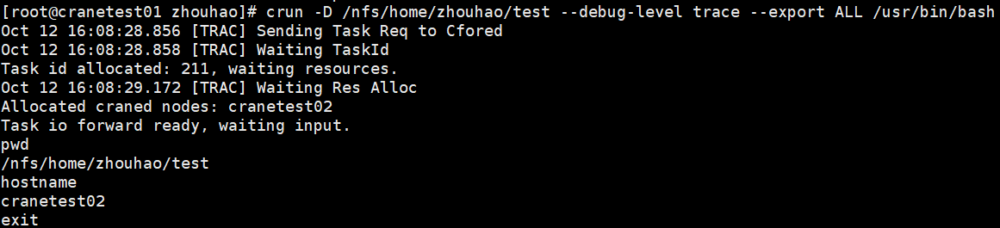
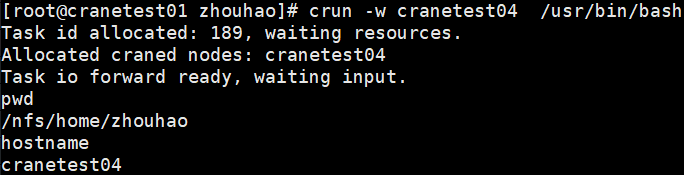

# crun 提交交互式任务

crun使用命令行指定的参数申请资源并在计算节点启动指定的任务，用户的输入将被转发到计算节点上对应的任务，任务的输出将被转发回用户终端。crun需要在有cfored运行的节点上启动。

crun只支持通过命令行指定请求参数，支持的命令行选项：

## 主要参数

- **-h/--help**: 显示帮助
- **-A/--account string**: 提交作业的账户
- **-D/--chdir string**: 任务工作路径
- **-C/--config string**: 配置文件路径（默认"/etc/crane/config.yaml"）
- **-c/--cpus-per-task float**: 每个任务所需的CPU数量（默认值为1）
- **--comment string**: 作业的备注
- **--debug-level string**: 可用的调试级别：trace、debug、info（默认值为"info"）
- **-x/--exclude string**: 从分配中排除特定节点（以逗号分隔的列表）
- **--exclusive**: 独占节点资源
- **--export string**: 传播环境变量
- **--extra-attr string**: 作业的额外属性（JSON格式）
- **--get-user-env**: 加载用户的登录环境变量
- **--gres string**: 每个任务所需的通用资源，格式："gpu:a100:1" 或 "gpu:1"
- **-H/--hold**: 暂挂作业直到被手动释放
- **-i/--input string**: 标准输入重定向的源和目标（默认："all"）
- **-J/--job-name string**: 作业名称
- **--mail-type string**: 当特定事件发生时通过邮件通知用户，支持的值：NONE、BEGIN、END、FAIL、TIMELIMIT、ALL（默认值为NONE）
- **--mail-user string**: 通知接收者的邮件地址
- **--mem string**: 最大实际内存量，支持GB(G, g)、MB(M, m)、KB(K, k) 和 Bytes(B)，默认单位是MB
- **-w/--nodelist string**: 要分配给作业的节点（以逗号分隔的列表）
- **-N/--nodes uint32**: 要在其上运行作业的节点数量（格式为 N = min[-max]，默认值为1）
- **--ntasks-per-node uint32**: 每个节点上要调用的任务数量（默认值为1）
- **-p/--partition string**: 请求的分区
- **--pty**: 使用伪终端运行
- **-q/--qos string**: 作业使用的服务质量（QoS）
- **-r/--reservation string**: 使用预留资源
- **-t/--time string**: 时间限制，格式："[day-]hours:minutes:seconds"（如 5-0:0:1 表示5天1秒，或 10:1:2 表示10小时1分钟2秒）
- **-v/--version**: crun的版本
- **--x11**: 启用X11支持，默认值为false。如果未配合 --x11-forwarding 使用，则直接使用X11（不安全）
- **--x11-forwarding**: 由鹤思启用X11转发（安全），默认值为false
- **-L/--licenses**: 作业要使用的许可证，格式：`lic1:2,lic2:4`或`lic1:2|lic2:4`
## 使用示例

**分配资源并运行bash：**

在CPU分区，申请两个节点，一个CPU核心，200M内存，并运行bash程序：
```bash
crun -c 1 --mem 200M -p CPU -N 2 /usr/bin/bash
```


**排除特定节点：**

申请一个节点，且节点不能是crane01、crane02，任务名称为testjob，运行时间限制为0:25:25，并运行bash程序：
```bash
crun -N 1 -x crane01,crane02 -J testjob -t 0:25:25 /usr/bin/bash
```


**指定节点列表：**

在GPU分区申请一个节点和200M运行内存，节点只能在crane02、crane03中选择，并运行bash程序：
```bash
crun -p GPU --mem 200M -w crane02,crane03 /usr/bin/bash
```


**在calloc任务内嵌套启动：**

crun还可以在calloc任务内嵌套启动，将自动继承calloc任务的所有资源。不需要指定除需要运行的程序外其他参数：


**高级选项：**

```bash
# 带账户、QoS和环境设置
crun -A ROOT -J test_crun -x cranetest03 --get-user-env --ntasks-per-node 2 -q test_qos -t 00:20:00 /usr/bin/bash
```


```bash
# 带工作目录和调试级别
crun -D /path --debug-level trace --export ALL /usr/bin/bash
```



```bash
# 在特定节点上运行
crun -w cranetest04 /usr/bin/bash
```



**X11转发：**

```bash
# 运行X11应用程序
crun --x11 xclock
```


## 向程序传递参数

向crun启动的程序传递参数：

```bash
# 使用双破折号
crun -c 1 -- your_program --your_args

# 使用引号
crun -c 1 "your_program --your_args"
```

## 新增功能

### 独占模式 (--exclusive)

请求对分配节点的独占访问，防止其他作业共享：
```bash
crun --exclusive -N 2 /usr/bin/bash
```

### 暂挂模式 (-H/--hold)

以暂挂状态提交作业，防止其在手动释放前启动：
```bash
crun --hold -c 4 /usr/bin/bash
# 稍后使用以下命令释放: ccontrol release <job_id>
```

### 预留资源 (-r/--reservation)

使用预留资源运行作业：
```bash
crun -r my_reservation /usr/bin/bash
```

### 邮件通知 (--mail-type/--mail-user)

接收作业事件的邮件通知：
```bash
crun --mail-type=END --mail-user=user@example.com -c 4 /usr/bin/bash
```

支持的邮件类型：
- **NONE**: 无通知（默认）
- **BEGIN**: 作业开始
- **END**: 作业完成
- **FAIL**: 作业失败
- **TIMELIMIT**: 作业达到时间限制
- **ALL**: 以上所有事件

### 作业备注 (--comment)

为作业添加描述性备注：
```bash
crun --comment "测试新算法" -c 8 /usr/bin/python script.py
```

### 标准输入重定向 (-i/--input)

控制标准输入重定向行为：
```bash
# 默认：所有任务接收标准输入
crun -i all /usr/bin/bash

# 不进行标准输入重定向
crun -i none /usr/bin/bash
```

## 作为作业步骤运行

当`crun`在现有作业分配内执行时（例如在`calloc`会话中），它会自动作为**步骤**运行，而不是创建新作业。系统通过检查`CRANE_JOB_ID`环境变量来检测这一点。

### 步骤模式行为

**自动检测：**
- 如果设置了`CRANE_JOB_ID` → 作为该作业内的步骤运行
- 如果未设置`CRANE_JOB_ID` → 作为新的独立作业运行

**资源分配：**
- 步骤使用父作业分配的资源
- 可以指定节点子集、不同的CPU数量等
- 资源必须在父作业的分配范围内可用

**继承的属性：**

步骤自动从父作业继承：
- 分区
- 账户
- QoS
- 用户/组

**步骤模式下不支持的选项：**

以下选项在作为步骤运行时将被忽略（它们从父作业继承）：
- `-p/--partition`
- `-A/--account`
- `-q/--qos`
- `--exclusive`
- `-H/--hold`
- `-r/--reservation`

### 步骤使用示例

**基本步骤执行：**
```bash
# 首先分配资源
calloc -N 2 -c 8 -p CPU -A myaccount

# 在分配内运行步骤（无需指定分区/账户）
crun -N 1 -c 4 ./task1
crun -N 1 -c 4 ./task2
crun -N 2 -c 2 ./task3
```

**多个并发步骤：**
```bash
# 在calloc分配中
crun -N 1 ./long_running_task &
crun -N 1 ./another_task &
wait
```

**具有特定资源的步骤：**
```bash
# 在具有4个节点的calloc分配内
crun -N 2 -c 8 --mem 4G ./memory_intensive_task
crun -w crane01,crane02 ./specific_node_task
```

**监控步骤：**
```bash
# 在另一个终端中
cqueue --step -j $CRANE_JOB_ID
ccontrol show step $CRANE_JOB_ID.2
```

## 相关命令

- [calloc](calloc.md) - 分配资源供交互式使用
- [cbatch](cbatch.md) - 提交批处理作业
- [ccancel](ccancel.md) - 取消作业
- [cqueue](cqueue.md) - 查看作业队列
