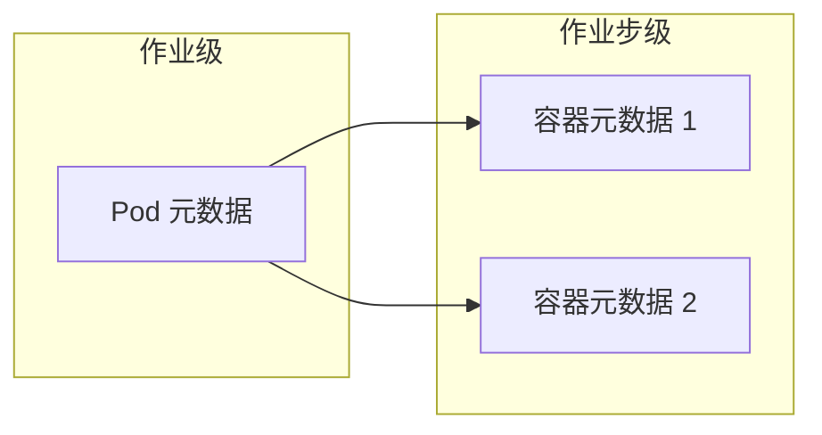
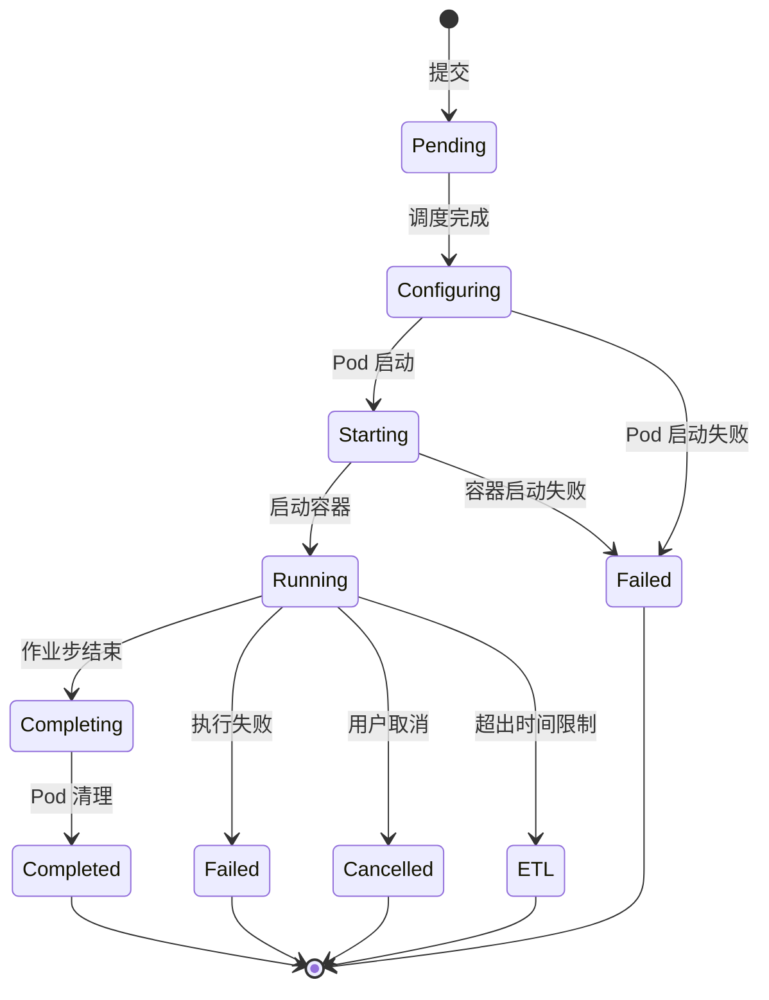
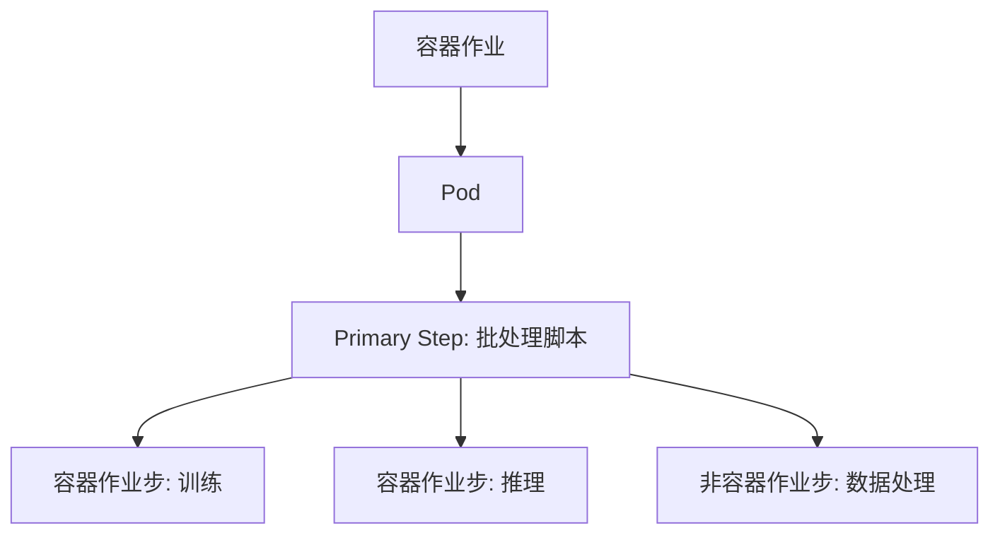
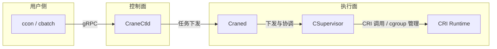

# 核心概念

本页介绍鹤思容器功能的对象模型与生命周期。阅读本文后，你将理解容器作业与容器作业步的关系、Pod 与容器元数据的职责，以及资源分配与继承机制。

## 基本术语

| 术语 | 说明 |
| --- | --- |
| 容器作业 | `TaskType=Container` 的作业，启动时创建 Pod，承载容器与非容器作业步 |
| 容器作业步 | 在容器作业内执行的作业步，携带容器元数据，对应 Pod 中的容器 |
| Pod 元数据 | 作业级配置，定义 Pod 名称、命名空间选项、端口映射等 |
| 容器元数据 | 作业步级配置，定义镜像、命令、环境变量、挂载等 |
| CRI | 容器运行时接口，鹤思通过 CRI 与 containerd 等运行时交互 |
| CNI | 容器网络接口，鹤思通过 CNI 插件配置容器网络 |

---

## 容器作业

**容器作业**是鹤思容器功能的资源分配单元。提交容器作业后，调度器完成资源分配，节点侧创建并保持 Pod 运行，直到作业结束。

容器作业具有以下特征：

- **资源承载**：作业级申请 CPU、内存、GPU 等资源，后续作业步在此范围内运行。
- **Pod 生命周期**：作业开始时创建 Pod，作业结束时销毁 Pod。Pod 内运行所有容器作业步。
- **混合作业步**：容器作业内可同时包含容器作业步与非容器作业步（如批处理脚本、交互式命令）。

在创建容器作业时，可以通过 ccon 提交一个容器作业步作为 Primary Step，也可以使用 cbatch --pod 提交一个批处理脚本作为 Primary Step，后续在脚本中使用 ccon 追加容器作业步。

!!! note "作业类型识别"
    容器作业的类型显示为 `Container`。其他类型的作业中不允许调用 ccon 提交容器作业步。

---

## 容器作业步

**容器作业步**是容器作业内的执行单元，对应于 Pod 中的容器。每个容器作业步携带独立的容器元数据，可指定不同的镜像、命令和挂载配置。

容器作业步和 crun 提交的交互式作业步类似，如果您在提交时指定了多个节点，则每个节点都会创建对应的容器作业步实例。

容器作业步遵循作业步的通用类型：

| 类型 | Step ID | 说明 |
| --- | --- | --- |
| Daemon Step | 0 | 守护进程作业步，创建 Pod 并持续运行 |
| Primary Step | 1 | 作业入口产生的第一个作业步 |
| Common Step | ≥2 | 追加的作业步，可在作业运行期间动态创建 |

!!! note "Pod 的作用"
    - Pod 在作业启动时的 Daemon Step 创建，并在作业结束时销毁。
    - Pod 的作用是为容器提供统一的网络命名空间、资源隔离环境，并不进行任何实际计算任务。
    - 用户不需要也无法直接操作 Pod。

---

## 容器相关元数据

鹤思容器功能将配置分为两层：

### Pod 元数据

Pod 元数据是**作业级**配置，在提交容器作业时指定，定义 Pod 的整体运行环境。

| 配置项 | 说明 |
| --- | --- |
| `name` | Pod 名称，用于生成容器主机名 |
| `namespace` | 命名空间选项（网络、PID、IPC 等） |
| `userns` | 是否启用用户命名空间（Fake Root） |
| `run_as_user` / `run_as_group` | 容器内运行的用户/组 ID |
| `ports` | 端口映射配置 |

### 容器元数据

容器元数据是**作业步级**配置，在提交容器作业步时指定，定义容器的具体运行行为。

| 配置项 | 说明 |
| --- | --- |
| `image` | 容器镜像及拉取策略 |
| `command` / `args` | 容器启动命令与参数 |
| `workdir` | 容器内工作目录 |
| `env` | 环境变量 |
| `mounts` | 目录挂载映射 |
| `tty` / `stdin` | 终端与标准输入配置 |
| `detached` | 是否后台运行 |

### 配置时机

| 入口 | Pod 元数据 | 容器元数据 |
| --- | --- | --- |
| `cbatch --pod` | 作业提交时指定 | Primary Step 不需要；追加作业步时指定 |
| `ccon run`（新作业） | 作业提交时指定 | 作业提交时指定 |
| `ccon run`（追加作业步） | 继承自作业 | 作业步提交时指定 |

---

## 资源模型

容器作业遵循"作业级分配、作业步级继承"的资源模型，与非容器作业保持一致。

### 作业级分配

提交容器作业时，通过以下参数申请资源：

- 节点数（`-N`）
- CPU（`-c` / `--cpus-per-task`）
- 内存（`--mem`）
- GPU 及其他设备（`--gres`）
- 时间限制（`-t`）

调度器根据分区、账户、QoS 等策略分配资源。

### 作业步级继承

追加容器作业步时，资源处理规则如下：

| 情况 | 行为 |
| --- | --- |
| 未指定资源 | 继承作业级请求 |
| 指定资源子集 | 使用指定值，不得超过作业分配 |
| 指定节点列表 | 必须落在作业已分配的节点集合内 |

### 约束条件

- 容器作业步的资源请求不得超过作业分配（否则返回 `ERR_STEP_RES_BEYOND`）
- 节点选择必须在作业分配范围内（否则返回 `ERR_NO_ENOUGH_NODE`）
- 容器作业步必须与作业保持同一用户身份

---

## 生命周期

容器作业的生命周期包含以下阶段：

**生命周期各阶段说明：**

1. **Pending**：作业进入队列等待调度。
2. **Configuring**：调度完成，节点侧正在创建 Pod 并进行必要配置（网络、挂载、命名空间等）。
3. **Starting**：Pod 已创建，容器运行时正在拉取镜像并启动容器；镜像拉取可能需要一定时间。
4. **Running**：资源分配完成，容器启动并开始执行，Primary Step 开始运行。
5. **Completing**：所有作业步执行完毕，等待 Pod 清理。
6. **Completed / Failed / Cancelled / ExceedTimeLimit**：作业终态。

---

## 运行期交互

容器作业步支持运行期交互操作：

| 操作 | 命令 | 说明 |
| --- | --- | --- |
| Attach | `ccon attach JOBID.STEPID` | 连接到容器的标准输入/输出 |
| Exec | `ccon exec JOBID.STEPID COMMAND` | 在容器内执行命令 |
| Logs | `ccon logs JOBID.STEPID` | 查看容器日志 |

这些操作通过 CraneCtld 转发到运行容器的 Craned 节点，再由 Craned 通过 CRI 与容器运行时交互。

---

## 混合作业步

容器作业允许在同一作业内混合使用不同类型的作业步：

适用场景：

- 在容器中运行核心计算，但前后处理使用主机环境
- 同一资源分配内完成容器化训练与裸机调试
- 使用脚本编排多个容器任务的执行顺序

---

## 架构概览

容器功能由调度控制面与节点执行面协同完成：

| 组件 | 职责 |
| --- | --- |
| CraneCtld | 接收提交请求、调度资源、校验权限与参数 |
| Craned | 节点侧代理，负责接收任务下发并与 CSupervisor 协作，管理节点级资源与 CSupervisor 的创建 |
| CSupervisor | 运行在节点上的监控与管理组件，监控每个 Step 的生命周期与 CGroup，并与 CRI 通信执行容器相关操作 |
| CRI Runtime | 容器运行时（如 containerd），在 CSupervisor 的调用下执行容器操作 |

---

## 相关文档

- [容器功能概览](index.md)
- [快速上手](quickstart.md)
- [使用示例](examples.md)
- [运行期操作与排错](troubleshooting.md)
